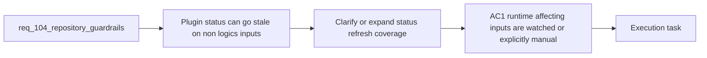

## item_187_clarify_or_expand_plugin_refresh_coverage_for_non_logics_runtime_inputs - Clarify or expand plugin refresh coverage for non-logics runtime inputs
> From version: 1.16.0
> Schema version: 1.0
> Status: Done
> Understanding: 96%
> Confidence: 93%
> Progress: 100%
> Complexity: Medium
> Theme: Runtime-status freshness, watcher scope, and manual refresh contract
> Reminder: Update status/understanding/confidence/progress and linked task references when you edit this doc.

# Problem
- The plugin refresh surface currently focuses on `logics/**/*` inputs even though operator-visible runtime status also depends on non-`logics/` sources such as Claude-bridge detection and global-kit inspection.
- That gap can leave status surfaces stale until a manual refresh, but the supported contract is not explicit.
- The repository should either watch the material non-`logics/` inputs that affect runtime health or clearly state where manual refresh is the intended behavior.

# Scope
- In:
  - identifying the non-`logics/` inputs that materially affect runtime or environment status
  - deciding whether those inputs should be watched directly or treated as manual-refresh-only
  - implementing the chosen refresh behavior or documenting the explicit manual-refresh contract
  - adding validation or coverage for the selected status-refresh model
- Out:
  - redesigning runtime-status semantics themselves
  - broad plugin-shell UX changes outside what status freshness needs
  - unrelated packaging or release-helper work

# Acceptance criteria
- AC1: The repository identifies the non-`logics/` inputs that materially affect environment or runtime status surfaces.
- AC2: Those inputs are either watched through the plugin refresh model or explicitly documented as manual-refresh-only by supported contract.
- AC3: Validation or regression coverage proves the selected status-refresh behavior for at least one non-`logics/` runtime input path.

# AC Traceability
- req104-AC5 -> This backlog slice. Proof: the item expands or clarifies refresh coverage for runtime-affecting non-`logics/` inputs.
- req104-AC7 -> Partial support from this slice. Proof: validation is required for the selected refresh contract.

# Decision framing
- Product framing: Helpful
- Product signals: operator trust, status freshness
- Product follow-up: Reuse current plugin operator framing; no new brief is required unless status refresh behavior changes the broader interaction model.
- Architecture framing: Helpful
- Architecture signals: watcher boundaries, runtime inspection ownership, plugin thin-client behavior
- Architecture follow-up: Reuse `adr_012`; no new ADR is required unless watcher ownership moves across layers.

# Links
- Product brief(s): `prod_002_plugin_hybrid_assist_runtime_visibility_and_action_ux`
- Architecture decision(s): `adr_012_keep_the_vs_code_plugin_as_a_thin_client_over_shared_hybrid_runtime_commands`
- Request: `req_104_harden_repository_maintenance_guardrails_revealed_by_project_audit`
- Primary task(s): `task_106_orchestration_delivery_for_req_104_to_req_106_repository_guardrails_hybrid_insights_refinement_and_local_first_assist_expansion`

# AI Context
- Summary: Decide and enforce whether non-logics runtime-status inputs should trigger automatic refresh or remain explicitly manual in the plugin contract.
- Keywords: refresh, watcher, runtime status, plugin, claude bridge, environment, manual refresh
- Use when: Use when implementing or reviewing status freshness behavior for runtime-affecting inputs outside `logics/`.
- Skip when: Skip when the work is about workflow-doc governance, package contents, or Hybrid Insights layout.

# References
- `logics/request/req_104_harden_repository_maintenance_guardrails_revealed_by_project_audit.md`
- `src/extension.ts`
- `src/logicsEnvironment.ts`
- `src/logicsViewProvider.ts`
- `logics/product/prod_002_plugin_hybrid_assist_runtime_visibility_and_action_ux.md`

# Priority
- Impact:
- Urgency:

# Notes
- Derived from request `req_104_harden_repository_maintenance_guardrails_revealed_by_project_audit`.
- Source file: `logics/request/req_104_harden_repository_maintenance_guardrails_revealed_by_project_audit.md`.
- Task `task_106_orchestration_delivery_for_req_104_to_req_106_repository_guardrails_hybrid_insights_refinement_and_local_first_assist_expansion` was synchronized to `Done` on 2026-03-27 after confirming the delivered `1.6.0` runtime and documentation surface.
