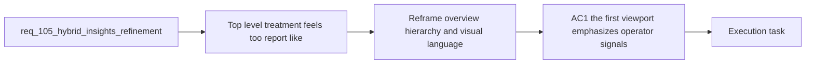

## item_188_reframe_hybrid_insights_overview_and_tool_native_visual_language - Reframe Hybrid Insights overview and tool-native visual language
> From version: 1.16.0
> Schema version: 1.0
> Status: Ready
> Understanding: 97%
> Confidence: 94%
> Progress: 0%
> Complexity: Medium
> Theme: Hybrid Insights overview hierarchy and grounded plugin visual language
> Reminder: Update status/understanding/confidence/progress and linked task references when you edit this doc.

# Problem
- The current Hybrid Insights screen uses a report-like hero treatment and decorative surface language that make the panel feel less like a practical VS Code tool and more like an editorial summary page.
- The first viewport also spends too much attention on secondary metadata before operators reach the core health and risk signals.
- This weakens the usefulness of the screen even though the underlying runtime data is already strong.

# Scope
- In:
  - simplifying the Hybrid Insights top area
  - making the visual language calmer and more tool-native
  - reducing the dominance of decorative hero treatments, oversized metadata, and report-page cues
  - keeping measured operational signals visually primary from the first viewport
- Out:
  - changing shared runtime report semantics
  - deep redesign of lower drill-down sections beyond what overview hierarchy needs
  - adding new hybrid assist features unrelated to the current screen

# Acceptance criteria
- AC1: The first viewport emphasizes the main operational health and risk signals before secondary metadata.
- AC2: Typography, spacing, surfaces, radii, and action styling shift toward a grounded internal-tool presentation rather than a report or hero page treatment.
- AC3: Secondary metadata such as generated time, paths, and report-window detail moves to a less dominant placement without becoming inaccessible.

# AC Traceability
- req105-AC1 -> This backlog slice. Proof: the item re-prioritizes the first viewport around main operational signals.
- req105-AC2 -> This backlog slice. Proof: the item refines typography, spacing, surfaces, and action styling toward a more tool-native visual language.
- req105-AC3 -> Partial support from this slice. Proof: overview hierarchy becomes the first stage of a clearer page sequence.

# Decision framing
- Product framing: Helpful
- Product signals: operator scan speed, trust, discoverability
- Product follow-up: Reuse `prod_002`; no new product brief is required for this screen refinement slice.
- Architecture framing: Not needed
- Architecture signals: UI hierarchy within existing thin-client boundaries
- Architecture follow-up: Reuse `adr_012`; no new ADR is required because runtime ownership stays unchanged.

# Links
- Product brief(s): `prod_002_plugin_hybrid_assist_runtime_visibility_and_action_ux`
- Architecture decision(s): `adr_012_keep_the_vs_code_plugin_as_a_thin_client_over_shared_hybrid_runtime_commands`
- Request: `req_105_refine_hybrid_insights_ux_ui_information_hierarchy`
- Primary task(s): `task_106_orchestration_delivery_for_req_104_to_req_106_repository_guardrails_hybrid_insights_refinement_and_local_first_assist_expansion`

# AI Context
- Summary: Simplify the Hybrid Insights top area and visual language so the screen feels like a practical plugin tool and highlights operator signals immediately.
- Keywords: hybrid insights, overview, hierarchy, visual language, plugin, operator surface
- Use when: Use when redesigning the first viewport, top-level hierarchy, or stylistic treatment of Hybrid Insights.
- Skip when: Skip when the work is only about drill-down details, runtime semantics, or new assist flows.

# References
- `logics/request/req_105_refine_hybrid_insights_ux_ui_information_hierarchy.md`
- `logics/product/prod_002_plugin_hybrid_assist_runtime_visibility_and_action_ux.md`
- `src/logicsHybridInsightsHtml.ts`
- `src/logicsViewProvider.ts`

# Priority
- Impact:
- Urgency:

# Notes
- Derived from request `req_105_refine_hybrid_insights_ux_ui_information_hierarchy`.
- Source file: `logics/request/req_105_refine_hybrid_insights_ux_ui_information_hierarchy.md`.
