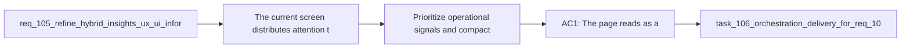

## item_189_prioritize_operational_signals_and_compact_hybrid_insights_flow_diagnostics - Prioritize operational signals and compact Hybrid Insights flow diagnostics
> From version: 1.16.0
> Schema version: 1.0
> Status: Done
> Understanding: 97%
> Confidence: 94%
> Progress: 100%
> Complexity: Medium
> Theme: Signal salience, section hierarchy, and compact flow diagnostics
> Reminder: Update status/understanding/confidence/progress and linked task references when you edit this doc.

# Problem
- The current screen distributes attention too evenly across measured, derived, estimated, and per-flow sections, so the page repeats similar stories instead of guiding operators through one strong scan path.
- Negative or action-driving signals such as fallback, degraded, and review-heavy outcomes are not emphasized enough relative to neutral counters.
- The flow drill-down cards are informative but still too list-heavy to work as compact diagnostics.

# Scope
- In:
  - clarifying the main section order around overview, breakdown, and secondary estimates
  - increasing the salience of fallback, degraded, and review-recommended outcomes
  - redesigning flow diagnostics into more compact summaries that still preserve run volume, backend split, and pressure signals
  - keeping estimated metrics explicitly secondary to measured facts
- Out:
  - redesigning recent-run interaction details beyond what the main hierarchy needs
  - changing runtime aggregation semantics
  - adding synthetic charts that overstate uncertain data

# Acceptance criteria
- AC1: The page reads as a coherent operator scan path such as overview, breakdown, recent runs, and secondary estimates rather than several equally weighted metric blocks.
- AC2: Negative or action-driving signals become easier to compare and more visually legible than neutral counters.
- AC3: Per-flow drill-down becomes more compact while still communicating run volume, backend split, and the main source of pressure for each flow.
- AC4: Estimated ROI proxies remain visually and semantically secondary to measured facts.

# AC Traceability
- req105-AC3 -> This backlog slice. Proof: the item clarifies the page sequence and reduces overlapping section weight.
- req105-AC4 -> This backlog slice. Proof: the item increases the salience of fallback, degraded, and review-heavy outcomes.
- req105-AC5 -> This backlog slice. Proof: the item redesigns flow drill-down into more compact diagnostics.
- req105-AC7 -> This backlog slice. Proof: the item keeps estimates explicitly secondary to measured facts.

# Decision framing
- Product framing: Helpful
- Product signals: operator scan speed, anomaly detection, trust
- Product follow-up: Reuse `prod_002`; no new product brief is required for this hierarchy refinement slice.
- Architecture framing: Not needed
- Architecture signals: UI hierarchy over shared runtime data
- Architecture follow-up: Reuse `adr_012`; runtime ownership remains unchanged.

# Links
- Product brief(s): `prod_002_plugin_hybrid_assist_runtime_visibility_and_action_ux`
- Architecture decision(s): `adr_012_keep_the_vs_code_plugin_as_a_thin_client_over_shared_hybrid_runtime_commands`
- Request: `req_105_refine_hybrid_insights_ux_ui_information_hierarchy`
- Primary task(s): `task_106_orchestration_delivery_for_req_104_to_req_106_repository_guardrails_hybrid_insights_refinement_and_local_first_assist_expansion`

# AI Context
- Summary: Reorder Hybrid Insights around the most important signals, make risk states more legible, and compact per-flow diagnostics without overstating estimates.
- Keywords: hybrid insights, risk signals, hierarchy, flow diagnostics, estimates, observability
- Use when: Use when redesigning the main information architecture or diagnostic density of Hybrid Insights.
- Skip when: Skip when the work is only about the top hero style or only about mobile drill-down behavior.

# References
- `logics/request/req_105_refine_hybrid_insights_ux_ui_information_hierarchy.md`
- `logics/backlog/item_166_add_a_plugin_hybrid_assist_roi_dispatch_insights_surface_with_recent_audit_drill_down.md`
- `src/logicsHybridInsightsHtml.ts`
- `src/logicsViewProvider.ts`

# Priority
- Impact:
- Urgency:

# Notes
- Derived from request `req_105_refine_hybrid_insights_ux_ui_information_hierarchy`.
- Source file: `logics/request/req_105_refine_hybrid_insights_ux_ui_information_hierarchy.md`.
- Task `task_106_orchestration_delivery_for_req_104_to_req_106_repository_guardrails_hybrid_insights_refinement_and_local_first_assist_expansion` was synchronized to `Done` on 2026-03-27 after confirming the delivered `1.6.0` runtime and documentation surface.
