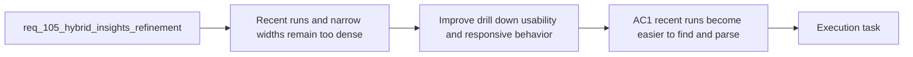

## item_190_improve_hybrid_insights_recent_run_drill_down_and_narrow_width_usability - Improve Hybrid Insights recent-run drill-down and narrow-width usability
> From version: 1.16.0
> Schema version: 1.0
> Status: Ready
> Understanding: 97%
> Confidence: 94%
> Progress: 0%
> Complexity: Medium
> Theme: Recent-run usability, responsive behavior, and UI verification
> Reminder: Update status/understanding/confidence/progress and linked task references when you edit this doc.

# Problem
- `Recent Audit Drill-Down` is one of the most actionable parts of the screen, but it currently arrives too late and exposes dense rows before a clean operator summary.
- On narrow widths, the page becomes a long stack of visually similar cards, which weakens hierarchy and increases reading fatigue.
- The request needs an intentionally designed responsive and drill-down behavior, not only CSS collapse.

# Scope
- In:
  - improving the visibility and scan path of the recent-run section
  - making recent-run entries easier to parse for status, provenance, and next action
  - keeping low-level detail or JSON secondary to the default reading state
  - redesigning narrow-width behavior so the page retains hierarchy and discoverability
  - adding UI-oriented regression or validation coverage for recent-run and narrow-width states
- Out:
  - changing shared runtime data sources
  - broad plugin-shell responsive work outside what Hybrid Insights needs
  - replacing diagnostic details with oversimplified summaries that hide provenance

# Acceptance criteria
- AC1: The recent-run drill-down becomes easier to find from the main page scan path and each entry exposes status and provenance more clearly.
- AC2: Low-level detail remains available without dominating the default reading state.
- AC3: Narrow-width behavior preserves hierarchy and discoverability instead of collapsing into a long stack of near-identical cards.
- AC4: UI-oriented verification covers at least one narrow-width path and one recent-run drill-down path.

# AC Traceability
- req105-AC6 -> This backlog slice. Proof: the item improves discovery and readability of recent-run entries while keeping deeper detail secondary.
- req105-AC8 -> This backlog slice. Proof: the item redesigns narrow-width behavior intentionally rather than relying on uniform card stacking.
- req105-AC9 -> This backlog slice. Proof: the item requires UI-oriented verification for recent-run and responsive states.

# Decision framing
- Product framing: Helpful
- Product signals: drill-down clarity, mobile usability, operator confidence
- Product follow-up: Reuse `prod_002`; no new product brief is required unless responsive behavior changes the broader plugin information architecture.
- Architecture framing: Not needed
- Architecture signals: UI refinement within existing thin-client boundaries
- Architecture follow-up: Reuse `adr_012`; no new ADR is required.

# Links
- Product brief(s): `prod_002_plugin_hybrid_assist_runtime_visibility_and_action_ux`
- Architecture decision(s): `adr_012_keep_the_vs_code_plugin_as_a_thin_client_over_shared_hybrid_runtime_commands`
- Request: `req_105_refine_hybrid_insights_ux_ui_information_hierarchy`
- Primary task(s): `task_106_orchestration_delivery_for_req_104_to_req_106_repository_guardrails_hybrid_insights_refinement_and_local_first_assist_expansion`

# AI Context
- Summary: Make recent-run drill-down easier to scan and redesign narrow-width behavior so Hybrid Insights stays useful on constrained layouts.
- Keywords: hybrid insights, recent runs, drill down, responsive, narrow width, mobile, verification
- Use when: Use when refining Hybrid Insights recent-run presentation, collapse behavior, or responsive layout strategy.
- Skip when: Skip when the work is only about overall metric hierarchy or runtime data semantics.

# References
- `logics/request/req_105_refine_hybrid_insights_ux_ui_information_hierarchy.md`
- `logics/tasks/task_102_orchestration_delivery_for_req_098_hybrid_assist_roi_dispatch_reporting_and_plugin_insights.md`
- `src/logicsHybridInsightsHtml.ts`
- `src/logicsViewProvider.ts`

# Priority
- Impact:
- Urgency:

# Notes
- Derived from request `req_105_refine_hybrid_insights_ux_ui_information_hierarchy`.
- Source file: `logics/request/req_105_refine_hybrid_insights_ux_ui_information_hierarchy.md`.
