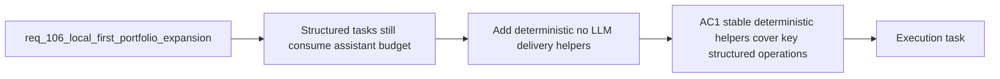

## item_191_add_deterministic_delivery_helpers_for_structured_repo_and_workflow_operations - Add deterministic delivery helpers for structured repo and workflow operations
> From version: 1.16.0
> Schema version: 1.0
> Status: Done
> Understanding: 97%
> Confidence: 94%
> Progress: 100%
> Complexity: High
> Theme: Deterministic automation, structured repo state, and zero-LLM operator support
> Reminder: Update status/understanding/confidence/progress and linked task references when you edit this doc.

# Problem
- Some repetitive operator tasks still push users toward Codex or Ollama even though the repository already has enough structured state to solve them deterministically.
- If those opportunities remain model-backed, the platform pays complexity and token cost without a real need.
- The next wave should therefore move the strongest structured repo and workflow operations into explicit no-LLM helpers first.

# Scope
- In:
  - identifying and implementing high-value deterministic helpers for structured repo or workflow operations
  - prioritizing opportunities such as workflow summaries, changed-surface extraction, release or changelog resolution, relationship summaries, or equivalent compact preprocessing
  - keeping deterministic outputs stable, reviewable, and testable from direct command surfaces
  - distinguishing deterministic outputs clearly from model-backed assists in reporting
- Out:
  - wrapping deterministic work inside hidden model prompts
  - direct repository mutation beyond the current safe automation contract
  - broad plugin redesign unrelated to exposing the chosen helpers

# Acceptance criteria
- AC1: The platform adds deterministic helpers for a practical set of repetitive structured operations that previously still encouraged assistant usage.
- AC2: Deterministic outputs are available through direct command surfaces and are tested through fixtures or direct assertions rather than prompt-based heuristics.
- AC3: Reporting and runtime metadata keep deterministic helper execution distinguishable from model-backed hybrid flows.

# AC Traceability
- req106-AC1 -> Partial support from this slice. Proof: the item establishes the deterministic half of the two-bucket local-first portfolio.
- req106-AC2 -> This backlog slice. Proof: the item expands no-LLM coverage for structured repo and workflow operations.
- req106-AC5 -> Partial support from this slice. Proof: the item reinforces the boundary that some work should stay deterministic rather than model-backed.
- req106-AC7 -> Partial support from this slice. Proof: deterministic execution remains distinguishable in observability output.
- req106-AC8 -> Partial support from this slice. Proof: deterministic helpers are tested directly through command or fixture assertions.

# Decision framing
- Product framing: Helpful
- Product signals: token savings, operator speed, predictability
- Product follow-up: Reuse `prod_001`; no new product brief is required unless the deterministic portfolio materially changes user-facing workflow entrypoints.
- Architecture framing: Required
- Architecture signals: command contracts, runtime categorization, deterministic versus model-backed boundaries
- Architecture follow-up: Reuse `adr_011`; add no new ADR unless deterministic helper classes become a durable platform taxonomy.

# Links
- Product brief(s): `prod_001_hybrid_assist_operator_experience_for_repetitive_logics_delivery_flows`
- Architecture decision(s): `adr_011_keep_hybrid_assist_runtime_contracts_shared_backend_agnostic_and_safely_bounded`
- Request: `req_106_expand_deterministic_and_ollama_first_delivery_assist_to_reduce_codex_usage`
- Primary task(s): `task_106_orchestration_delivery_for_req_104_to_req_106_repository_guardrails_hybrid_insights_refinement_and_local_first_assist_expansion`

# AI Context
- Summary: Expand no-LLM delivery helpers for structured repo and workflow operations so obvious deterministic work stops consuming model budget.
- Keywords: deterministic, local first, no LLM, workflow summary, diff extraction, changelog, release, reporting
- Use when: Use when implementing or reviewing deterministic command surfaces for repetitive structured delivery work.
- Skip when: Skip when the work is mainly about bounded local-model suggestions or plugin presentation.

# References
- `logics/request/req_106_expand_deterministic_and_ollama_first_delivery_assist_to_reduce_codex_usage.md`
- `logics/request/req_088_add_a_local_llm_dispatcher_for_deterministic_logics_flow_orchestration.md`
- `logics/skills/logics-flow-manager/scripts/logics_flow.py`
- `logics/skills/logics-flow-manager/scripts/logics_flow_hybrid.py`
- `README.md`

# Priority
- Impact:
- Urgency:

# Notes
- Derived from request `req_106_expand_deterministic_and_ollama_first_delivery_assist_to_reduce_codex_usage`.
- Source file: `logics/request/req_106_expand_deterministic_and_ollama_first_delivery_assist_to_reduce_codex_usage.md`.
- Task `task_106_orchestration_delivery_for_req_104_to_req_106_repository_guardrails_hybrid_insights_refinement_and_local_first_assist_expansion` was synchronized to `Done` on 2026-03-27 after confirming the delivered `1.6.0` runtime and documentation surface.
