## item_192_add_bounded_ollama_first_suggestion_flows_for_high_frequency_delivery_tasks - Add bounded Ollama-first suggestion flows for high-frequency delivery tasks
> From version: 1.16.0
> Schema version: 1.0
> Status: Done
> Understanding: 97%
> Confidence: 94%
> Progress: 100%
> Complexity: High
> Theme: Bounded local-model suggestions, contract design, and safe fallback
> Reminder: Update status/understanding/confidence/progress and linked task references when you edit this doc.

# Problem
- After the first hybrid waves, there is still a useful set of frequent operator tasks where a bounded local-model suggestion can save Codex usage without widening unsafe autonomy.
- Those flows need compact inputs, strict outputs, and validation so they remain cheap, reviewable, and safe under degraded local execution.
- Without that discipline, adding more local-model helpers would create noise instead of real ROI.

# Scope
- In:
  - selecting a second-wave portfolio of bounded Ollama-first suggestion flows
  - prioritizing high-frequency tasks such as `commit-message`, `test-impact-summary`, `ai-context-refresh-suggestion`, `windows-compat-risk`, `backlog-groom-suggestion`, `task-breakdown-suggestion`, `doc-link-suggestion`, `review-checklist`, or `hybrid-insights-explainer`
  - defining compact structured inputs, strict bounded outputs, and validated fallback behavior for the chosen flows
  - keeping final execution advisory and reviewable rather than directly mutating the repo
- Out:
  - unbounded freeform review or architecture reasoning
  - direct repository mutation from local-model outputs
  - replacing Codex for complex code generation

```mermaid
%% logics-kind: backlog
%% logics-signature: backlog|add-bounded-ollama-first-suggestion-flow|req-090-add-high-roi-hybrid-ollama-or-co|after-the-first-hybrid-waves-there|ac1-a-second-wave-portfolio-of-bounded
flowchart LR
    Request[req_090_add_high_roi_hybrid_ollama_or_code] --> Problem[After the first hybrid waves there]
    Problem --> Scope[Add bounded Ollama-first suggestion flows]
    Scope --> Acceptance[AC1: A second-wave portfolio of bounded]
    Acceptance --> Tasks[task_106_orchestration_delivery_for_req_10]
```

# Acceptance criteria
- AC1: A second-wave portfolio of bounded Ollama-first suggestion flows is selected and implemented for practical high-frequency operator tasks.
- AC2: Each newly added flow uses a compact structured input and a strict bounded output contract with validated fallback behavior.
- AC3: The portfolio keeps explicit exclusions for direct mutation, complex code generation, broad architecture reasoning, and deep freeform review.
- AC4: Coverage proves contract validity and degraded fallback behavior for the selected new flows.

# AC Traceability
- req106-AC1 -> Partial support from this slice. Proof: the item establishes the model-backed half of the two-bucket portfolio.
- req106-AC3 -> This backlog slice. Proof: the item adds second-wave bounded Ollama-first flows for high-frequency tasks.
- req106-AC4 -> This backlog slice. Proof: each new flow requires compact structured inputs, strict outputs, and validated fallback.
- req106-AC5 -> This backlog slice. Proof: the item preserves the explicit exclusion boundary for risky work.
- req106-AC8 -> Partial support from this slice. Proof: contract validity and fallback behavior are covered for the selected flows.

# Decision framing
- Product framing: Helpful
- Product signals: local ROI, operator throughput, bounded autonomy
- Product follow-up: Reuse `prod_001`; no new product brief is required unless the second-wave portfolio materially changes operator information architecture.
- Architecture framing: Required
- Architecture signals: runtime contracts, fallback semantics, bounded output validation
- Architecture follow-up: Reuse `adr_011`; add no new ADR unless the platform introduces a new enduring flow taxonomy or fallback class.

# Links
- Product brief(s): `prod_001_hybrid_assist_operator_experience_for_repetitive_logics_delivery_flows`
- Architecture decision(s): `adr_011_keep_hybrid_assist_runtime_contracts_shared_backend_agnostic_and_safely_bounded`
- Request: `req_106_expand_deterministic_and_ollama_first_delivery_assist_to_reduce_codex_usage`
- Primary task(s): `task_106_orchestration_delivery_for_req_104_to_req_106_repository_guardrails_hybrid_insights_refinement_and_local_first_assist_expansion`

# AI Context
- Summary: Add a second wave of bounded Ollama-first suggestion flows for frequent delivery tasks with strict contracts, validated fallback, and no direct mutation.
- Keywords: ollama, local first, commit message, test impact, ai context, windows risk, checklist, bounded output
- Use when: Use when implementing or reviewing new local-model suggestion flows that must stay compact, safe, and advisory.
- Skip when: Skip when the work belongs to deterministic helpers or to Codex-first deep reasoning paths.

# References
- `logics/request/req_106_expand_deterministic_and_ollama_first_delivery_assist_to_reduce_codex_usage.md`
- `logics/request/req_090_add_high_roi_hybrid_ollama_or_codex_assist_flows_for_repetitive_logics_delivery_operations.md`
- `logics/request/req_093_add_shared_hybrid_assist_contracts_fallback_policy_activation_rules_and_audit_governance_for_logics_delivery_automation.md`
- `logics/request/req_103_separate_optional_claude_bridge_status_from_hybrid_runtime_degradation_and_expand_ollama_first_dispatch_across_supported_flows.md`
- `logics/skills/logics-flow-manager/scripts/logics_flow_hybrid.py`

# Priority
- Impact:
- Urgency:

# Notes
- Derived from request `req_106_expand_deterministic_and_ollama_first_delivery_assist_to_reduce_codex_usage`.
- Source file: `logics/request/req_106_expand_deterministic_and_ollama_first_delivery_assist_to_reduce_codex_usage.md`.
- Task `task_106_orchestration_delivery_for_req_104_to_req_106_repository_guardrails_hybrid_insights_refinement_and_local_first_assist_expansion` was synchronized to `Done` on 2026-03-27 after confirming the delivered `1.6.0` runtime and documentation surface.
