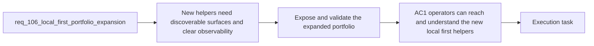

## item_193_expose_and_validate_the_expanded_local_first_delivery_portfolio_across_runtime_plugin_and_insights - Expose and validate the expanded local-first delivery portfolio across runtime, plugin, and insights
> From version: 1.16.0
> Schema version: 1.0
> Status: Done
> Understanding: 97%
> Confidence: 94%
> Progress: 100%
> Complexity: High
> Theme: Operator surfaces, observability, and validation for local-first portfolio expansion
> Reminder: Update status/understanding/confidence/progress and linked task references when you edit this doc.

# Problem
- Deterministic helpers and bounded Ollama-first flows only reduce real Codex usage if operators can discover them and if reporting keeps their runtime category visible.
- Without stable commands, documentation, optional plugin exposure, and trustworthy observability, the expanded portfolio will exist mostly in code rather than in operator behavior.
- The rollout therefore needs explicit surface design and validation, not only backend implementation.

# Scope
- In:
  - exposing the selected deterministic helpers and bounded Ollama-first flows through canonical runtime commands and documentation
  - adding plugin actions or Hybrid Insights updates where they materially improve discoverability
  - keeping deterministic, Ollama-backed, and fallback execution distinguishable in audit or measurement outputs
  - validating the expanded portfolio across runtime contracts, observability, and Windows-safe command assumptions
- Out:
  - adding every possible plugin action regardless of actual value
  - hiding degraded quality by over-aggregating local-first metrics
  - broad plugin redesign beyond what discoverability and observability require

# Acceptance criteria
- AC1: Operators can reach the selected deterministic helpers and new bounded Ollama-first flows through canonical runtime commands, documentation, and useful surface entrypoints.
- AC2: Audit, measurement, and observability output keep deterministic execution distinguishable from model-backed and fallback execution.
- AC3: Validation covers the expanded portfolio at the right layer, including runtime contracts, observability behavior, and Windows-safe command assumptions where relevant.

# AC Traceability
- req106-AC6 -> This backlog slice. Proof: the item exposes the new helper portfolio through canonical commands, docs, and optional plugin surfaces.
- req106-AC7 -> This backlog slice. Proof: the item preserves trustworthy reporting across deterministic, model-backed, and fallback execution paths.
- req106-AC8 -> This backlog slice. Proof: the item requires layer-appropriate validation including Windows-safe command assumptions.

# Decision framing
- Product framing: Helpful
- Product signals: discoverability, operator adoption, trust
- Product follow-up: Reuse `prod_001` and `prod_002`; no new product brief is required unless discoverability work materially changes the plugin navigation model.
- Architecture framing: Required
- Architecture signals: runtime command contract, reporting taxonomy, plugin thin-client boundaries
- Architecture follow-up: Reuse `adr_011` and `adr_012`; add no new ADR unless reporting taxonomy or plugin ownership changes materially.

# Links
- Product brief(s): `prod_001_hybrid_assist_operator_experience_for_repetitive_logics_delivery_flows`, `prod_002_plugin_hybrid_assist_runtime_visibility_and_action_ux`
- Architecture decision(s): `adr_011_keep_hybrid_assist_runtime_contracts_shared_backend_agnostic_and_safely_bounded`, `adr_012_keep_the_vs_code_plugin_as_a_thin_client_over_shared_hybrid_runtime_commands`
- Request: `req_106_expand_deterministic_and_ollama_first_delivery_assist_to_reduce_codex_usage`
- Primary task(s): `task_106_orchestration_delivery_for_req_104_to_req_106_repository_guardrails_hybrid_insights_refinement_and_local_first_assist_expansion`

# AI Context
- Summary: Expose the expanded deterministic and bounded local-first helper portfolio through real operator surfaces and keep observability trustworthy across runtime categories.
- Keywords: commands, plugin, observability, insights, deterministic, ollama, fallback, windows, discoverability
- Use when: Use when implementing or reviewing how new local-first helpers become discoverable and measurable across runtime and plugin surfaces.
- Skip when: Skip when the work is only about backend helper logic without surface or observability implications.

# References
- `logics/request/req_106_expand_deterministic_and_ollama_first_delivery_assist_to_reduce_codex_usage.md`
- `logics/product/prod_001_hybrid_assist_operator_experience_for_repetitive_logics_delivery_flows.md`
- `logics/product/prod_002_plugin_hybrid_assist_runtime_visibility_and_action_ux.md`
- `logics/skills/logics-flow-manager/scripts/logics_flow_hybrid.py`
- `src/logicsViewProvider.ts`
- `src/logicsHybridInsightsHtml.ts`

# Priority
- Impact:
- Urgency:

# Notes
- Derived from request `req_106_expand_deterministic_and_ollama_first_delivery_assist_to_reduce_codex_usage`.
- Source file: `logics/request/req_106_expand_deterministic_and_ollama_first_delivery_assist_to_reduce_codex_usage.md`.
- Task `task_106_orchestration_delivery_for_req_104_to_req_106_repository_guardrails_hybrid_insights_refinement_and_local_first_assist_expansion` was synchronized to `Done` on 2026-03-27 after confirming the delivered `1.6.0` runtime and documentation surface.
