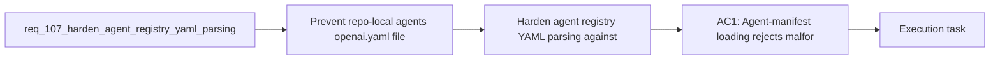

## item_194_harden_agent_registry_yaml_parsing_against_malicious_skill_manifests - Harden agent registry YAML parsing against malicious skill manifests
> From version: 1.16.0
> Schema version: 1.0
> Status: Ready
> Understanding: 90%
> Confidence: 90%
> Progress: 0%
> Complexity: Medium
> Theme: Security
> Reminder: Update status/understanding/confidence/progress and linked task references when you edit this doc.

# Problem
- Prevent repo-local `agents/openai.yaml` files from becoming a denial-of-service input for the extension.
- Reduce the gap between the extension trust model and the current dependency posture around YAML parsing.
- Make malformed or hostile agent manifests fail fast with a deterministic validation error instead of stressing the extension host.
- - The audit found that the extension parses repo-local YAML agent manifests directly through the `yaml` package:
- - [agentRegistry.ts](/Users/alexandreagostini/Documents/cdx-logics-vscode/src/agentRegistry.ts#L3)

# Scope
- In:
- Out:

# Acceptance criteria
- AC1: Agent-manifest loading rejects malformed or hostile YAML inputs, including deeply nested structures or equivalent pathological payloads, without crashing or hanging the extension-host validation path.
- AC2: The dependency and parser strategy is hardened in a concrete way, such as upgrading the vulnerable package, constraining parser behavior, or introducing a safer parse boundary, and the chosen approach is documented in-code or in tests.
- AC3: Invalid manifest input continues to surface as deterministic registry validation issues through the existing agent-registry reporting flow rather than becoming an unhandled failure.
- AC4: Regression coverage exists for both valid manifests and malicious or pathological manifest fixtures so future dependency or parser changes do not silently reopen the risk.
- AC5: The resulting security posture is reflected in repository validation, either by removing the reported audit issue or by documenting and enforcing the chosen mitigation if a direct dependency upgrade is not immediately feasible.

# AC Traceability
- AC1 -> Scope: Agent-manifest loading rejects malformed or hostile YAML inputs, including deeply nested structures or equivalent pathological payloads, without crashing or hanging the extension-host validation path.. Proof: implement in this backlog slice and capture validation evidence in the linked orchestration task.
- AC2 -> Scope: The dependency and parser strategy is hardened in a concrete way, such as upgrading the vulnerable package, constraining parser behavior, or introducing a safer parse boundary, and the chosen approach is documented in-code or in tests.. Proof: implement in this backlog slice and capture validation evidence in the linked orchestration task.
- AC3 -> Scope: Invalid manifest input continues to surface as deterministic registry validation issues through the existing agent-registry reporting flow rather than becoming an unhandled failure.. Proof: implement in this backlog slice and capture validation evidence in the linked orchestration task.
- AC4 -> Scope: Regression coverage exists for both valid manifests and malicious or pathological manifest fixtures so future dependency or parser changes do not silently reopen the risk.. Proof: implement in this backlog slice and capture validation evidence in the linked orchestration task.
- AC5 -> Scope: The resulting security posture is reflected in repository validation, either by removing the reported audit issue or by documenting and enforcing the chosen mitigation if a direct dependency upgrade is not immediately feasible.. Proof: implement in this backlog slice and capture validation evidence in the linked orchestration task.

# Decision framing
- Product framing: Not needed
- Product signals: (none detected)
- Product follow-up: No product brief follow-up is expected based on current signals.
- Architecture framing: Required
- Architecture signals: data model and persistence, contracts and integration, runtime and boundaries, security and identity
- Architecture follow-up: Create or link an architecture decision before irreversible implementation work starts.

# Links
- Product brief(s): (none yet)
- Architecture decision(s): (none yet)
- Request: `req_107_harden_agent_registry_yaml_parsing_against_malicious_skill_manifests`
- Primary task(s): `task_107_orchestration_delivery_for_req_107_to_req_117_across_maintenance_hardening_ui_refinement_and_modularization`

# AI Context
- Summary: Harden the repo-local agent manifest parsing path so malformed or hostile YAML can be rejected safely and the...
- Keywords: yaml, security, agent registry, manifest, parser, dependency, hostile input, validation, extension stability
- Use when: Use when planning or implementing manifest-parse hardening, dependency remediation, or regression coverage around agent registry loading.
- Skip when: Skip when the work is about agent UX, new agent features, or unrelated repository automation.

# References
- `[agentRegistry.ts](/Users/alexandreagostini/Documents/cdx-logics-vscode/src/agentRegistry.ts)`
- `[package.json](/Users/alexandreagostini/Documents/cdx-logics-vscode/package.json)`
- `[tests/agentRegistry.test.ts](/Users/alexandreagostini/Documents/cdx-logics-vscode/tests/agentRegistry.test.ts)`
- `logics/request/req_104_harden_repository_maintenance_guardrails_revealed_by_project_audit.md`
- `logics/request/req_115_sanitize_webview_error_rendering_instead_of_injecting_raw_error_html.md`

# Priority
- Impact:
- Urgency:

# Notes
- Derived from request `req_107_harden_agent_registry_yaml_parsing_against_malicious_skill_manifests`.
- Source file: `logics/request/req_107_harden_agent_registry_yaml_parsing_against_malicious_skill_manifests.md`.
- Request context seeded into this backlog item from `logics/request/req_107_harden_agent_registry_yaml_parsing_against_malicious_skill_manifests.md`.
