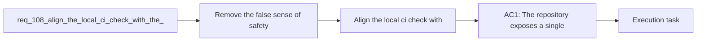

## item_195_align_the_local_ci_check_with_the_full_repository_ci_contract - Align the local ci check with the full repository CI contract
> From version: 1.16.0
> Schema version: 1.0
> Status: Done
> Understanding: 92%
> Confidence: 90%
> Progress: 100%
> Complexity: Medium
> Theme: Workflow
> Reminder: Update status/understanding/confidence/progress and linked task references when you edit this doc.

# Problem
- Remove the false sense of safety created by a local `ci:check` command that does not cover the same contract as GitHub CI.
- Give maintainers one reliable pre-push command that exercises the repository gates that actually matter.
- Reduce CI-only surprises by making local and remote validation semantics converge or by naming them honestly when they intentionally differ.
- - The audit found that the local script exposed as the main repository check omits several gates that are part of actual CI:
- - local command: [package.json](/Users/alexandreagostini/Documents/cdx-logics-vscode/package.json#L109)

# Scope
- In:
- Out:

# Acceptance criteria
- AC1: The repository exposes a single local validation entrypoint that either matches the blocking CI contract closely enough to be trusted as a pre-push gate, or the existing command surface is renamed so its narrower scope is explicit.
- AC2: The local validation path covers the Python-side checks currently enforced in CI, including workflow audit, Python unit tests, and CLI smoke checks, unless the repository deliberately documents and justifies a scoped exception.
- AC3: The command naming and contributor guidance make the difference between fast local checks and full CI-equivalent checks unambiguous.
- AC4: Regression coverage or command-level tests exist for the chosen command contract so future workflow changes do not silently widen the gap again.
- AC5: The release and CI workflows remain consistent with the chosen local command contract after the change.

# AC Traceability
- AC1 -> Scope: The repository exposes a single local validation entrypoint that either matches the blocking CI contract closely enough to be trusted as a pre-push gate, or the existing command surface is renamed so its narrower scope is explicit.. Proof: implement in this backlog slice and capture validation evidence in the linked orchestration task.
- AC2 -> Scope: The local validation path covers the Python-side checks currently enforced in CI, including workflow audit, Python unit tests, and CLI smoke checks, unless the repository deliberately documents and justifies a scoped exception.. Proof: implement in this backlog slice and capture validation evidence in the linked orchestration task.
- AC3 -> Scope: The command naming and contributor guidance make the difference between fast local checks and full CI-equivalent checks unambiguous.. Proof: implement in this backlog slice and capture validation evidence in the linked orchestration task.
- AC4 -> Scope: Regression coverage or command-level tests exist for the chosen command contract so future workflow changes do not silently widen the gap again.. Proof: implement in this backlog slice and capture validation evidence in the linked orchestration task.
- AC5 -> Scope: The release and CI workflows remain consistent with the chosen local command contract after the change.. Proof: implement in this backlog slice and capture validation evidence in the linked orchestration task.

# Decision framing
- Product framing: Not needed
- Product signals: (none detected)
- Product follow-up: No product brief follow-up is expected based on current signals.
- Architecture framing: Required
- Architecture signals: data model and persistence, contracts and integration
- Architecture follow-up: Create or link an architecture decision before irreversible implementation work starts.

# Links
- Product brief(s): (none yet)
- Architecture decision(s): `adr_014_keep_plugin_safety_and_repository_governance_explicit_bounded_and_modular`
- Request: `req_108_align_the_local_ci_check_with_the_full_repository_ci_contract`
- Primary task(s): `task_107_orchestration_delivery_for_req_107_to_req_117_across_maintenance_hardening_ui_refinement_and_modularization`

# AI Context
- Summary: Align the maintainer-facing local CI command with the real GitHub CI contract, or rename and document the command...
- Keywords: ci, local check, github actions, validation, workflow audit, python tests, smoke checks, command contract
- Use when: Use when planning or implementing CI contract alignment, contributor command cleanup, or drift-prevention checks.
- Skip when: Skip when the work is about individual test failures rather than the validation entrypoint contract.

# References
- `[package.json](/Users/alexandreagostini/Documents/cdx-logics-vscode/package.json)`
- `[ci.yml](/Users/alexandreagostini/Documents/cdx-logics-vscode/.github/workflows/ci.yml)`
- `[release.yml](/Users/alexandreagostini/Documents/cdx-logics-vscode/.github/workflows/release.yml)`
- `logics/request/req_104_harden_repository_maintenance_guardrails_revealed_by_project_audit.md`
- `logics/request/req_109_replace_coarse_bootstrap_detection_with_canonical_kit_inspection.md`

# Priority
- Impact:
- Urgency:

# Notes
- Derived from request `req_108_align_the_local_ci_check_with_the_full_repository_ci_contract`.
- Source file: `logics/request/req_108_align_the_local_ci_check_with_the_full_repository_ci_contract.md`.
- Request context seeded into this backlog item from `logics/request/req_108_align_the_local_ci_check_with_the_full_repository_ci_contract.md`.
