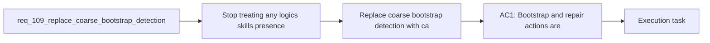

## item_196_replace_coarse_bootstrap_detection_with_canonical_kit_inspection - Replace coarse bootstrap detection with canonical kit inspection
> From version: 1.16.0
> Schema version: 1.0
> Status: Done
> Understanding: 90%
> Confidence: 90%
> Progress: 100%
> Complexity: Medium
> Theme: Workflow
> Reminder: Update status/understanding/confidence/progress and linked task references when you edit this doc.

# Problem
- Stop treating any `logics/skills` presence as equivalent to a healthy canonical bootstrap state.
- Make bootstrap and repair affordances reflect the real repository state instead of a coarse filesystem heuristic.
- Reduce operator confusion when the repository has a non-canonical, incomplete, or misdeclared Logics kit setup.
- - The audit found that bootstrap gating currently relies on a coarse helper:
- - [logicsProviderUtils.ts](/Users/alexandreagostini/Documents/cdx-logics-vscode/src/logicsProviderUtils.ts#L46)

# Scope
- In:
- Out:

# Acceptance criteria
- AC1: Bootstrap and repair actions are gated by canonical kit inspection or an equivalent richer state model rather than by simple `logics/skills` existence checks alone.
- AC2: The extension distinguishes at least these states in a user-meaningful way: canonical kit present, non-canonical kit present, malformed or incomplete submodule declaration, and kit missing.
- AC3: When bootstrap is blocked or redirected because the repository is non-canonical or partially configured, the UI surfaces the reason and the next operator action clearly.
- AC4: Existing supported paths for canonical submodule update and repair continue to work after the gating change.
- AC5: Regression coverage exists for the decision matrix so bootstrap prompts, tool availability, and update guidance do not silently regress to the coarse heuristic.

# AC Traceability
- AC1 -> Scope: Bootstrap and repair actions are gated by canonical kit inspection or an equivalent richer state model rather than by simple `logics/skills` existence checks alone.. Proof: implement in this backlog slice and capture validation evidence in the linked orchestration task.
- AC2 -> Scope: The extension distinguishes at least these states in a user-meaningful way: canonical kit present, non-canonical kit present, malformed or incomplete submodule declaration, and kit missing.. Proof: implement in this backlog slice and capture validation evidence in the linked orchestration task.
- AC3 -> Scope: When bootstrap is blocked or redirected because the repository is non-canonical or partially configured, the UI surfaces the reason and the next operator action clearly.. Proof: implement in this backlog slice and capture validation evidence in the linked orchestration task.
- AC4 -> Scope: Existing supported paths for canonical submodule update and repair continue to work after the gating change.. Proof: implement in this backlog slice and capture validation evidence in the linked orchestration task.
- AC5 -> Scope: Regression coverage exists for the decision matrix so bootstrap prompts, tool availability, and update guidance do not silently regress to the coarse heuristic.. Proof: implement in this backlog slice and capture validation evidence in the linked orchestration task.

# Decision framing
- Product framing: Not needed
- Product signals: (none detected)
- Product follow-up: No product brief follow-up is expected based on current signals.
- Architecture framing: Required
- Architecture signals: data model and persistence, contracts and integration
- Architecture follow-up: Create or link an architecture decision before irreversible implementation work starts.

# Links
- Product brief(s): (none yet)
- Architecture decision(s): `adr_013_replace_repo_local_codex_workspace_overlays_with_a_global_published_logics_kit`, `adr_014_keep_plugin_safety_and_repository_governance_explicit_bounded_and_modular`
- Request: `req_109_replace_coarse_bootstrap_detection_with_canonical_kit_inspection`
- Primary task(s): `task_107_orchestration_delivery_for_req_107_to_req_117_across_maintenance_hardening_ui_refinement_and_modularization`

# AI Context
- Summary: Replace coarse bootstrap heuristics with the richer canonical-kit inspection path so prompts and tool availability reflect the actual...
- Keywords: bootstrap, canonical kit, submodule, inspection, repair, workflow, extension UX, repository state
- Use when: Use when planning or implementing bootstrap-state handling, prompt gating, or update guidance for Logics kit setup.
- Skip when: Skip when the work is about Codex global publication or unrelated extension features.

# References
- `[logicsProviderUtils.ts](/Users/alexandreagostini/Documents/cdx-logics-vscode/src/logicsProviderUtils.ts)`
- `[logicsViewProvider.ts](/Users/alexandreagostini/Documents/cdx-logics-vscode/src/logicsViewProvider.ts)`
- `[logicsEnvironment.ts](/Users/alexandreagostini/Documents/cdx-logics-vscode/src/logicsEnvironment.ts)`
- `logics/request/req_104_harden_repository_maintenance_guardrails_revealed_by_project_audit.md`
- `logics/request/req_108_align_the_local_ci_check_with_the_full_repository_ci_contract.md`
- `logics/skills/logics-ui-steering/SKILL.md`

# Priority
- Impact:
- Urgency:

# Notes
- Derived from request `req_109_replace_coarse_bootstrap_detection_with_canonical_kit_inspection`.
- Source file: `logics/request/req_109_replace_coarse_bootstrap_detection_with_canonical_kit_inspection.md`.
- Request context seeded into this backlog item from `logics/request/req_109_replace_coarse_bootstrap_detection_with_canonical_kit_inspection.md`.
