## item_197_make_the_security_audit_workflow_block_on_actionable_vulnerabilities - Make the security audit workflow block on actionable vulnerabilities
> From version: 1.16.0 (refreshed)
> Schema version: 1.0
> Status: Done
> Understanding: 93%
> Confidence: 91%
> Progress: 100% (refreshed)
> Complexity: Medium
> Theme: Security
> Reminder: Update status/understanding/confidence/progress and linked task references when you edit this doc.

# Problem
- Turn the repository security-audit workflow into a decision point that can actually stop releasable vulnerabilities from drifting forward.
- Make the security signal truthful for maintainers instead of permanently green by construction.
- Define what counts as an actionable vulnerability for this repository and enforce that choice in automation.
- - The audit found that the dedicated security workflow currently executes `npm audit --audit-level=moderate || true`, which reports issues but never fails the workflow:
- - [audit.yml](/Users/alexandreagostini/Documents/cdx-logics-vscode/.github/workflows/audit.yml#L26)

# Scope
- In:
- Out:

```mermaid
%% logics-kind: backlog
%% logics-signature: backlog|make-the-security-audit-workflow-block-o|req-104-harden-repository-maintenance-gu|turn-the-repository-security-audit-workf|ac1-the-security-audit-workflow-enforces
flowchart LR
    Request[req_104_harden_repository_maintenance_guar] --> Problem[Turn the repository security-audit workflo]
    Problem --> Scope[Make the security audit workflow block]
    Scope --> Acceptance[AC1: The security-audit workflow enforces]
    Acceptance --> Tasks[task_107_orchestration_delivery_for_req_10]
```

# Acceptance criteria
- AC1: The security-audit workflow enforces an explicit vulnerability policy instead of always succeeding, and that policy is visible in repository automation or docs.
- AC2: The chosen policy defines what severities and dependency scopes are blocking, and how temporary exceptions are handled when a fix cannot land immediately.
- AC3: The repository no longer relies on a pure report-only audit step as its only security signal for known actionable issues.
- AC4: The workflow and contributor guidance make it clear how maintainers can reproduce the enforced policy locally.
- AC5: Regression coverage or workflow-level validation exists for the chosen gating behavior so future edits do not silently revert the job to non-blocking report mode.

# AC Traceability
- AC1 -> Scope: The security-audit workflow enforces an explicit vulnerability policy instead of always succeeding, and that policy is visible in repository automation or docs.. Proof: implement in this backlog slice and capture validation evidence in the linked orchestration task.
- AC2 -> Scope: The chosen policy defines what severities and dependency scopes are blocking, and how temporary exceptions are handled when a fix cannot land immediately.. Proof: implement in this backlog slice and capture validation evidence in the linked orchestration task.
- AC3 -> Scope: The repository no longer relies on a pure report-only audit step as its only security signal for known actionable issues.. Proof: implement in this backlog slice and capture validation evidence in the linked orchestration task.
- AC4 -> Scope: The workflow and contributor guidance make it clear how maintainers can reproduce the enforced policy locally.. Proof: implement in this backlog slice and capture validation evidence in the linked orchestration task.
- AC5 -> Scope: Regression coverage or workflow-level validation exists for the chosen gating behavior so future edits do not silently revert the job to non-blocking report mode.. Proof: implement in this backlog slice and capture validation evidence in the linked orchestration task.

# Decision framing
- Product framing: Not needed
- Product signals: (none detected)
- Product follow-up: No product brief follow-up is expected based on current signals.
- Architecture framing: Required
- Architecture signals: data model and persistence, contracts and integration, security and identity
- Architecture follow-up: Create or link an architecture decision before irreversible implementation work starts.

# Links
- Product brief(s): (none yet)
- Architecture decision(s): `adr_014_keep_plugin_safety_and_repository_governance_explicit_bounded_and_modular`
- Request: `req_110_make_the_security_audit_workflow_block_on_actionable_vulnerabilities`
- Primary task(s): `task_107_orchestration_delivery_for_req_107_to_req_117_across_maintenance_hardening_ui_refinement_and_modularization`

# AI Context
- Summary: Turn the repository security audit into an enforceable vulnerability gate with explicit severity, scope, and exception rules instead...
- Keywords: security audit, npm audit, github actions, vulnerability policy, enforcement, exceptions, dependency hygiene
- Use when: Use when planning or implementing repository vulnerability-policy enforcement and local reproduction guidance.
- Skip when: Skip when the work is about fixing one specific advisory without changing the workflow contract.

# References
- `[audit.yml](/Users/alexandreagostini/Documents/cdx-logics-vscode/.github/workflows/audit.yml)`
- `[package.json](/Users/alexandreagostini/Documents/cdx-logics-vscode/package.json)`
- `[ci.yml](/Users/alexandreagostini/Documents/cdx-logics-vscode/.github/workflows/ci.yml)`
- `logics/request/req_104_harden_repository_maintenance_guardrails_revealed_by_project_audit.md`
- `logics/request/req_116_address_the_remaining_esbuild_and_vite_audit_advisory_in_the_toolchain.md`

# Priority
- Impact:
- Urgency:

# Notes
- Derived from request `req_110_make_the_security_audit_workflow_block_on_actionable_vulnerabilities`.
- Source file: `logics/request/req_110_make_the_security_audit_workflow_block_on_actionable_vulnerabilities.md`.
- Request context seeded into this backlog item from `logics/request/req_110_make_the_security_audit_workflow_block_on_actionable_vulnerabilities.md`.
- Derived from `logics/request/req_110_make_the_security_audit_workflow_block_on_actionable_vulnerabilities.md`.
