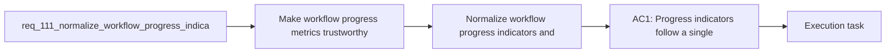

## item_198_normalize_workflow_progress_indicators_and_close_placeholder_debt_in_completed_docs - Normalize workflow progress indicators and close placeholder debt in completed docs
> From version: 1.16.0
> Schema version: 1.0
> Status: Done
> Understanding: 92%
> Confidence: 90%
> Progress: 100%
> Complexity: Medium
> Theme: Governance
> Reminder: Update status/understanding/confidence/progress and linked task references when you edit this doc.

# Problem
- Make workflow progress metrics trustworthy across requests, backlog items, tasks, and reporting scripts.
- Remove obviously unfinished placeholder content from documents already marked as completed or audit-aligned.
- Stop the repository from showing green governance while still carrying invalid progress formats and unresolved template debt.
- - The audit found completed backlog items that still contain generic scaffold text and placeholder AC traceability:
- - [item_028_replace_hide_used_requests_with_hide_processed_requests_semantics.md](/Users/alexandreagostini/Documents/cdx-logics-vscode/logics/backlog/item_028_replace_hide_used_requests_with_hide_processed_requests_semantics.md#L11)

# Scope
- In:
- Out:

# Acceptance criteria
- AC1: Progress indicators follow a single normalized format accepted by both the linter and the reporting scripts, so completed or in-progress docs are not classified as invalid solely because of decorated progress text.
- AC2: Existing completed docs that still carry placeholder problem statements, scaffold acceptance criteria, or unresolved AC traceability are cleaned up or reclassified so repository governance state becomes truthful again.
- AC3: The linter, workflow-audit, and global-review tooling agree on the allowed progress format and on which placeholder patterns are blocking versus advisory for completed or active docs.
- AC4: Regression coverage exists for the normalized progress format and for the placeholder-cleanup contract so future generated or edited docs do not drift back into the same mismatch.
- AC5: Any remaining intentionally tolerated placeholders or decorations are explicitly documented rather than left as accidental inconsistencies.

# AC Traceability
- AC1 -> Scope: Progress indicators follow a single normalized format accepted by both the linter and the reporting scripts, so completed or in-progress docs are not classified as invalid solely because of decorated progress text.. Proof: implement in this backlog slice and capture validation evidence in the linked orchestration task.
- AC2 -> Scope: Existing completed docs that still carry placeholder problem statements, scaffold acceptance criteria, or unresolved AC traceability are cleaned up or reclassified so repository governance state becomes truthful again.. Proof: implement in this backlog slice and capture validation evidence in the linked orchestration task.
- AC3 -> Scope: The linter, workflow-audit, and global-review tooling agree on the allowed progress format and on which placeholder patterns are blocking versus advisory for completed or active docs.. Proof: implement in this backlog slice and capture validation evidence in the linked orchestration task.
- AC4 -> Scope: Regression coverage exists for the normalized progress format and for the placeholder-cleanup contract so future generated or edited docs do not drift back into the same mismatch.. Proof: implement in this backlog slice and capture validation evidence in the linked orchestration task.
- AC5 -> Scope: Any remaining intentionally tolerated placeholders or decorations are explicitly documented rather than left as accidental inconsistencies.. Proof: implement in this backlog slice and capture validation evidence in the linked orchestration task.

# Decision framing
- Product framing: Not needed
- Product signals: (none detected)
- Product follow-up: No product brief follow-up is expected based on current signals.
- Architecture framing: Required
- Architecture signals: data model and persistence, contracts and integration
- Architecture follow-up: Create or link an architecture decision before irreversible implementation work starts.

# Links
- Product brief(s): (none yet)
- Architecture decision(s): `adr_014_keep_plugin_safety_and_repository_governance_explicit_bounded_and_modular`
- Request: `req_111_normalize_workflow_progress_indicators_and_close_placeholder_debt_in_completed_docs`
- Primary task(s): `task_107_orchestration_delivery_for_req_107_to_req_117_across_maintenance_hardening_ui_refinement_and_modularization`

# AI Context
- Summary: Normalize workflow progress formatting and clean completed-doc placeholders so governance tools report a truthful repository state.
- Keywords: progress, governance, placeholder, workflow docs, lint, audit, review, cleanup, normalization
- Use when: Use when planning or implementing workflow-governance cleanup, progress-format normalization, or completed-doc remediation.
- Skip when: Skip when the work is about feature delivery without governance contract changes.

# References
- `[item_028_replace_hide_used_requests_with_hide_processed_requests_semantics.md](/Users/alexandreagostini/Documents/cdx-logics-vscode/logics/backlog/item_028_replace_hide_used_requests_with_hide_processed_requests_semantics.md)`
- `[item_029_refine_plugin_detail_panel_identity_and_action_hierarchy.md](/Users/alexandreagostini/Documents/cdx-logics-vscode/logics/backlog/item_029_refine_plugin_detail_panel_identity_and_action_hierarchy.md)`
- `[task_003_build_flow_board_ui_and_details_panel.md](/Users/alexandreagostini/Documents/cdx-logics-vscode/logics/tasks/task_003_build_flow_board_ui_and_details_panel.md)`
- `[item_019_render_mermaid_diagrams_in_read_markdown_view.md](/Users/alexandreagostini/Documents/cdx-logics-vscode/logics/backlog/item_019_render_mermaid_diagrams_in_read_markdown_view.md)`
- `[logics_lint.py](/Users/alexandreagostini/Documents/cdx-logics-vscode/logics/skills/logics-doc-linter/scripts/logics_lint.py)`
- `[logics_global_review.py](/Users/alexandreagostini/Documents/cdx-logics-vscode/logics/skills/logics-global-reviewer/scripts/logics_global_review.py)`
- `logics/request/req_104_harden_repository_maintenance_guardrails_revealed_by_project_audit.md`
- `logics/request/req_114_fix_false_positive_mermaid_signature_warnings_after_signature_refresh.md`
- `logics/skills/logics-ui-steering/SKILL.md`

# Priority
- Impact:
- Urgency:

# Notes
- Derived from request `req_111_normalize_workflow_progress_indicators_and_close_placeholder_debt_in_completed_docs`.
- Source file: `logics/request/req_111_normalize_workflow_progress_indicators_and_close_placeholder_debt_in_completed_docs.md`.
- Request context seeded into this backlog item from `logics/request/req_111_normalize_workflow_progress_indicators_and_close_placeholder_debt_in_completed_docs.md`.
