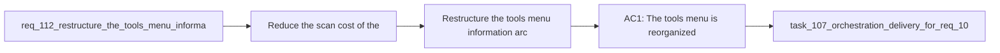

## item_199_restructure_the_tools_menu_information_architecture_without_moving_actions_out_of_the_menu - Restructure the tools menu information architecture without moving actions out of the menu
> From version: 1.16.0 (refreshed)
> Schema version: 1.0
> Status: Done
> Understanding: 93%
> Confidence: 91%
> Progress: 100% (refreshed)
> Complexity: Medium
> Theme: UI
> Reminder: Update status/understanding/confidence/progress and linked task references when you edit this doc.

# Problem
- Reduce the scan cost of the tools menu so operators can find the right action without reading a long flat list.
- Keep every existing action inside the tools menu while giving the menu a clearer information architecture.
- Make the menu reflect user intent and repository state instead of presenting all commands as equally primary.
- - The current tools menu is rendered as a single uninterrupted column of actions:
- - [logicsWebviewHtml.ts](/Users/alexandreagostini/Documents/cdx-logics-vscode/src/logicsWebviewHtml.ts#L110)

# Scope
- In:
- Out:

# Acceptance criteria
- AC1: The tools menu is reorganized into clear sections or groups based on operator intent, such as workflow actions, assist actions, runtime or diagnostics, workspace controls, and setup or maintenance.
- AC2: All existing tools-menu actions remain available inside the menu; the redesign must not depend on moving frequent actions out into the toolbar or another persistent surface.
- AC3: The menu introduces visible hierarchy, such as section headers, separators, or equivalent grouping cues, so users can scan categories before scanning individual commands.
- AC4: The menu supports a contextual priority model inside the menu itself, such as a `Recommended` or state-aware top section, so the most relevant actions for the current repository state can surface first without hiding the rest.
- AC5: Labels and ordering are refined so long or overlapping command names become easier to parse, while preserving the meaning of destructive, diagnostic, and maintenance actions.
- AC6: Disabled or unavailable actions remain understandable inside the new structure, including clear visual treatment and preserved discoverability for why an action is unavailable.
- AC7: The resulting menu remains accessible and usable in narrow plugin widths, with keyboard navigation and visual hierarchy that still work in constrained layouts.
- AC8: Regression coverage exists for the menu structure or rendering contract so the grouped information architecture does not silently collapse back into a flat unordered list.

# AC Traceability
- AC1 -> Scope: The tools menu is reorganized into clear sections or groups based on operator intent, such as workflow actions, assist actions, runtime or diagnostics, workspace controls, and setup or maintenance.. Proof: implement in this backlog slice and capture validation evidence in the linked orchestration task.
- AC2 -> Scope: All existing tools-menu actions remain available inside the menu; the redesign must not depend on moving frequent actions out into the toolbar or another persistent surface.. Proof: implement in this backlog slice and capture validation evidence in the linked orchestration task.
- AC3 -> Scope: The menu introduces visible hierarchy, such as section headers, separators, or equivalent grouping cues, so users can scan categories before scanning individual commands.. Proof: implement in this backlog slice and capture validation evidence in the linked orchestration task.
- AC4 -> Scope: The menu supports a contextual priority model inside the menu itself, such as a `Recommended` or state-aware top section, so the most relevant actions for the current repository state can surface first without hiding the rest.. Proof: implement in this backlog slice and capture validation evidence in the linked orchestration task.
- AC5 -> Scope: Labels and ordering are refined so long or overlapping command names become easier to parse, while preserving the meaning of destructive, diagnostic, and maintenance actions.. Proof: implement in this backlog slice and capture validation evidence in the linked orchestration task.
- AC6 -> Scope: Disabled or unavailable actions remain understandable inside the new structure, including clear visual treatment and preserved discoverability for why an action is unavailable.. Proof: implement in this backlog slice and capture validation evidence in the linked orchestration task.
- AC7 -> Scope: The resulting menu remains accessible and usable in narrow plugin widths, with keyboard navigation and visual hierarchy that still work in constrained layouts.. Proof: implement in this backlog slice and capture validation evidence in the linked orchestration task.
- AC8 -> Scope: Regression coverage exists for the menu structure or rendering contract so the grouped information architecture does not silently collapse back into a flat unordered list.. Proof: implement in this backlog slice and capture validation evidence in the linked orchestration task.

# Decision framing
- Product framing: Required
- Product signals: navigation and discoverability
- Product follow-up: Create or link a product brief before implementation moves deeper into delivery.
- Architecture framing: Required
- Architecture signals: data model and persistence, contracts and integration
- Architecture follow-up: Create or link an architecture decision before irreversible implementation work starts.

# Links
- Product brief(s): `prod_003_plugin_tools_menu_and_activity_scanability`
- Architecture decision(s): `adr_002_keep_the_plugin_webview_as_a_modular_vanilla_frontend`
- Request: `req_112_restructure_the_tools_menu_information_architecture_without_moving_actions_out_of_the_menu`
- Primary task(s): `task_107_orchestration_delivery_for_req_107_to_req_117_across_maintenance_hardening_ui_refinement_and_modularization`

# AI Context
- Summary: Redesign the tools menu as a grouped, state-aware menu that keeps every action inside the menu but improves...
- Keywords: tools menu, information architecture, grouping, recommended actions, hierarchy, narrow layout, menu UX, discoverability
- Use when: Use when planning or implementing the tools-menu redesign, grouping strategy, menu labels, or contextual prioritization logic.
- Skip when: Skip when the work is about moving actions into the toolbar or redesigning unrelated screens.

# References
- `[logicsWebviewHtml.ts](/Users/alexandreagostini/Documents/cdx-logics-vscode/src/logicsWebviewHtml.ts)`
- `[toolbar.css](/Users/alexandreagostini/Documents/cdx-logics-vscode/media/css/toolbar.css)`
- `[webviewChrome.js](/Users/alexandreagostini/Documents/cdx-logics-vscode/media/webviewChrome.js)`
- `logics/request/req_113_show_updated_timestamps_in_activity_cells.md`
- `logics/skills/logics-ui-steering/SKILL.md`

# Priority
- Impact:
- Urgency:

# Notes
- Derived from request `req_112_restructure_the_tools_menu_information_architecture_without_moving_actions_out_of_the_menu`.
- Source file: `logics/request/req_112_restructure_the_tools_menu_information_architecture_without_moving_actions_out_of_the_menu.md`.
- Request context seeded into this backlog item from `logics/request/req_112_restructure_the_tools_menu_information_architecture_without_moving_actions_out_of_the_menu.md`.
- Derived from `logics/request/req_112_restructure_the_tools_menu_information_architecture_without_moving_actions_out_of_the_menu.md`.
