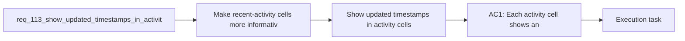

## item_200_show_updated_timestamps_in_activity_cells - Show updated timestamps in activity cells
> From version: 1.16.0
> Schema version: 1.0
> Status: Ready
> Understanding: 92%
> Confidence: 90%
> Progress: 0%
> Complexity: Low
> Theme: UI
> Reminder: Update status/understanding/confidence/progress and linked task references when you edit this doc.

# Problem
- Make recent-activity cells more informative by showing when the item was last updated.
- Align the activity panel with the rest of the UI, where `Updated` is already exposed in board previews and in the details panel.
- Improve quick triage from the activity panel without forcing the user to open details first.
- - The activity panel currently renders each entry with a title and one condensed metadata line, but it does not expose the item's `Updated` information:
- - [webviewChrome.js](/Users/alexandreagostini/Documents/cdx-logics-vscode/media/webviewChrome.js#L142)

# Scope
- In:
- Out:

# Acceptance criteria
- AC1: Each activity cell shows an `Updated` value in addition to the existing title and metadata, using the item data already available in the activity panel.
- AC2: The displayed `Updated` information is formatted consistently with the intended activity-panel density, so it is readable in narrow layouts without making each cell visually heavy.
- AC3: The new `Updated` information does not regress click, double-click, keyboard navigation, or existing activity-panel selection behavior.
- AC4: Empty or invalid timestamps degrade gracefully, without rendering broken text or collapsing the activity cell layout.
- AC5: Regression coverage exists for the activity-panel rendering so future changes do not remove or break the `Updated` information.

# AC Traceability
- AC1 -> Scope: Each activity cell shows an `Updated` value in addition to the existing title and metadata, using the item data already available in the activity panel.. Proof: implement in this backlog slice and capture validation evidence in the linked orchestration task.
- AC2 -> Scope: The displayed `Updated` information is formatted consistently with the intended activity-panel density, so it is readable in narrow layouts without making each cell visually heavy.. Proof: implement in this backlog slice and capture validation evidence in the linked orchestration task.
- AC3 -> Scope: The new `Updated` information does not regress click, double-click, keyboard navigation, or existing activity-panel selection behavior.. Proof: implement in this backlog slice and capture validation evidence in the linked orchestration task.
- AC4 -> Scope: Empty or invalid timestamps degrade gracefully, without rendering broken text or collapsing the activity cell layout.. Proof: implement in this backlog slice and capture validation evidence in the linked orchestration task.
- AC5 -> Scope: Regression coverage exists for the activity-panel rendering so future changes do not remove or break the `Updated` information.. Proof: implement in this backlog slice and capture validation evidence in the linked orchestration task.

# Decision framing
- Product framing: Consider
- Product signals: navigation and discoverability
- Product follow-up: Review whether a product brief is needed before scope becomes harder to change.
- Architecture framing: Consider
- Architecture signals: data model and persistence
- Architecture follow-up: Review whether an architecture decision is needed before implementation becomes harder to reverse.

# Links
- Product brief(s): (none yet)
- Architecture decision(s): (none yet)
- Request: `req_113_show_updated_timestamps_in_activity_cells`
- Primary task(s): `task_107_orchestration_delivery_for_req_107_to_req_117_across_maintenance_hardening_ui_refinement_and_modularization`

# AI Context
- Summary: Add the Updated information to activity-panel cells so recent activity becomes more informative and consistent with board preview...
- Keywords: activity panel, updated, timestamp, recent activity, UI consistency, metadata, narrow layout
- Use when: Use when planning or implementing the activity-cell update display and its related tests.
- Skip when: Skip when the work is about broader activity-panel redesign or unrelated menu and toolbar changes.

# References
- `[webviewChrome.js](/Users/alexandreagostini/Documents/cdx-logics-vscode/media/webviewChrome.js)`
- `[renderBoard.js](/Users/alexandreagostini/Documents/cdx-logics-vscode/media/renderBoard.js)`
- `[renderDetails.js](/Users/alexandreagostini/Documents/cdx-logics-vscode/media/renderDetails.js)`
- `[tests/webview.harness-core.test.ts](/Users/alexandreagostini/Documents/cdx-logics-vscode/tests/webview.harness-core.test.ts)`
- `[toolbar.css](/Users/alexandreagostini/Documents/cdx-logics-vscode/media/css/toolbar.css)`
- `logics/request/req_112_restructure_the_tools_menu_information_architecture_without_moving_actions_out_of_the_menu.md`
- `logics/skills/logics-ui-steering/SKILL.md`

# Priority
- Impact:
- Urgency:

# Notes
- Derived from request `req_113_show_updated_timestamps_in_activity_cells`.
- Source file: `logics/request/req_113_show_updated_timestamps_in_activity_cells.md`.
- Request context seeded into this backlog item from `logics/request/req_113_show_updated_timestamps_in_activity_cells.md`.
