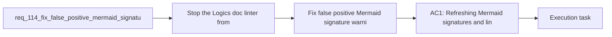

## item_201_fix_false_positive_mermaid_signature_warnings_after_signature_refresh - Fix false positive Mermaid signature warnings after signature refresh
> From version: 1.16.0
> Schema version: 1.0
> Status: Ready
> Understanding: 92%
> Confidence: 90%
> Progress: 0%
> Complexity: Medium
> Theme: Governance
> Reminder: Update status/understanding/confidence/progress and linked task references when you edit this doc.

# Problem
- Stop the Logics doc linter from reporting Mermaid signature warnings immediately after the repository refresh command has supposedly repaired them.
- Restore trust in workflow governance warnings so maintainers can distinguish real drift from tool false positives.
- Make the `refresh-mermaid-signatures` command and the linter use a consistent contract for what counts as a current signature.
- - The current linter warns when the Mermaid signature comment differs from the expected derived signature:
- - [logics_lint.py](/Users/alexandreagostini/Documents/cdx-logics-vscode/logics/skills/logics-doc-linter/scripts/logics_lint.py#L255)

# Scope
- In:
- Out:

# Acceptance criteria
- AC1: Refreshing Mermaid signatures and linting the same unchanged workflow doc no longer produces a stale-signature warning when the doc content already matches the refreshed signature contract.
- AC2: The linter and the signature-refresh command derive their expected signature from the same normalized source inputs, or the difference is made explicit and intentional in code.
- AC3: Regression coverage exists for at least one workflow doc fixture that used to reproduce the false positive.
- AC4: The resulting warning behavior remains precise enough to still catch genuinely stale Mermaid signatures.
- AC5: The repo exposes a reproducible developer path for validating the fix, such as a targeted command or test flow that demonstrates refresh plus lint consistency.

# AC Traceability
- AC1 -> Scope: Refreshing Mermaid signatures and linting the same unchanged workflow doc no longer produces a stale-signature warning when the doc content already matches the refreshed signature contract.. Proof: implement in this backlog slice and capture validation evidence in the linked orchestration task.
- AC2 -> Scope: The linter and the signature-refresh command derive their expected signature from the same normalized source inputs, or the difference is made explicit and intentional in code.. Proof: implement in this backlog slice and capture validation evidence in the linked orchestration task.
- AC3 -> Scope: Regression coverage exists for at least one workflow doc fixture that used to reproduce the false positive.. Proof: implement in this backlog slice and capture validation evidence in the linked orchestration task.
- AC4 -> Scope: The resulting warning behavior remains precise enough to still catch genuinely stale Mermaid signatures.. Proof: implement in this backlog slice and capture validation evidence in the linked orchestration task.
- AC5 -> Scope: The repo exposes a reproducible developer path for validating the fix, such as a targeted command or test flow that demonstrates refresh plus lint consistency.. Proof: implement in this backlog slice and capture validation evidence in the linked orchestration task.

# Decision framing
- Product framing: Not needed
- Product signals: (none detected)
- Product follow-up: No product brief follow-up is expected based on current signals.
- Architecture framing: Required
- Architecture signals: data model and persistence, contracts and integration
- Architecture follow-up: Create or link an architecture decision before irreversible implementation work starts.

# Links
- Product brief(s): (none yet)
- Architecture decision(s): (none yet)
- Request: `req_114_fix_false_positive_mermaid_signature_warnings_after_signature_refresh`
- Primary task(s): `task_107_orchestration_delivery_for_req_107_to_req_117_across_maintenance_hardening_ui_refinement_and_modularization`

# AI Context
- Summary: Fix the mismatch between Mermaid signature refresh and lint validation so the repo stops producing false positive stale-signature...
- Keywords: mermaid, signature, linter, refresh, false positive, governance, workflow docs
- Use when: Use when diagnosing or fixing Mermaid signature drift detection and its regression coverage.
- Skip when: Skip when the work is about Mermaid visual rendering rather than signature validation.

# References
- `[logics_lint.py](/Users/alexandreagostini/Documents/cdx-logics-vscode/logics/skills/logics-doc-linter/scripts/logics_lint.py)`
- `[logics_flow.py](/Users/alexandreagostini/Documents/cdx-logics-vscode/logics/skills/logics-flow-manager/scripts/logics_flow.py)`
- `logics/request/req_104_harden_repository_maintenance_guardrails_revealed_by_project_audit.md`
- `logics/request/req_111_normalize_workflow_progress_indicators_and_close_placeholder_debt_in_completed_docs.md`

# Priority
- Impact:
- Urgency:

# Notes
- Derived from request `req_114_fix_false_positive_mermaid_signature_warnings_after_signature_refresh`.
- Source file: `logics/request/req_114_fix_false_positive_mermaid_signature_warnings_after_signature_refresh.md`.
- Request context seeded into this backlog item from `logics/request/req_114_fix_false_positive_mermaid_signature_warnings_after_signature_refresh.md`.
