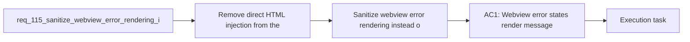

## item_202_sanitize_webview_error_rendering_instead_of_injecting_raw_error_html - Sanitize webview error rendering instead of injecting raw error HTML
> From version: 1.16.0
> Schema version: 1.0
> Status: Ready
> Understanding: 92%
> Confidence: 90%
> Progress: 0%
> Complexity: Medium
> Theme: Security
> Reminder: Update status/understanding/confidence/progress and linked task references when you edit this doc.

# Problem
- Remove direct HTML injection from the webview error state.
- Ensure repository paths, configuration values, and other error text can be displayed safely without being interpreted as markup.
- Keep the existing error UX simple while making the rendering path defensible from a security perspective.
- - The current webview error path writes `payload.error` directly into `innerHTML`:
- - [main.js](/Users/alexandreagostini/Documents/cdx-logics-vscode/media/main.js#L857)

# Scope
- In:
- Out:

# Acceptance criteria
- AC1: Webview error states render message text without injecting raw HTML from `payload.error`.
- AC2: Error messages containing paths, angle brackets, or other markup-like characters display correctly as text.
- AC3: The error-state UX remains readable and preserves current behavior for clearing or resetting dependent UI sections.
- AC4: Regression coverage exists for the error rendering path, including a payload that would have been unsafe or misleading under `innerHTML`.
- AC5: The resulting implementation does not introduce a parallel unsafe error-rendering helper elsewhere in the same webview flow.

# AC Traceability
- AC1 -> Scope: Webview error states render message text without injecting raw HTML from `payload.error`.. Proof: implement in this backlog slice and capture validation evidence in the linked orchestration task.
- AC2 -> Scope: Error messages containing paths, angle brackets, or other markup-like characters display correctly as text.. Proof: implement in this backlog slice and capture validation evidence in the linked orchestration task.
- AC3 -> Scope: The error-state UX remains readable and preserves current behavior for clearing or resetting dependent UI sections.. Proof: implement in this backlog slice and capture validation evidence in the linked orchestration task.
- AC4 -> Scope: Regression coverage exists for the error rendering path, including a payload that would have been unsafe or misleading under `innerHTML`.. Proof: implement in this backlog slice and capture validation evidence in the linked orchestration task.
- AC5 -> Scope: The resulting implementation does not introduce a parallel unsafe error-rendering helper elsewhere in the same webview flow.. Proof: implement in this backlog slice and capture validation evidence in the linked orchestration task.

# Decision framing
- Product framing: Not needed
- Product signals: (none detected)
- Product follow-up: No product brief follow-up is expected based on current signals.
- Architecture framing: Required
- Architecture signals: data model and persistence, contracts and integration, security and identity
- Architecture follow-up: Create or link an architecture decision before irreversible implementation work starts.

# Links
- Product brief(s): (none yet)
- Architecture decision(s): (none yet)
- Request: `req_115_sanitize_webview_error_rendering_instead_of_injecting_raw_error_html`
- Primary task(s): `task_107_orchestration_delivery_for_req_107_to_req_117_across_maintenance_hardening_ui_refinement_and_modularization`

# AI Context
- Summary: Replace the raw-HTML webview error rendering path with safe text rendering so workspace- and config-derived error messages cannot...
- Keywords: webview, security, innerHTML, error state, sanitization, safe text rendering
- Use when: Use when hardening the webview error path or writing tests around unsafe-looking error payloads.
- Skip when: Skip when the work is about generic UI polish unrelated to rendering safety.

# References
- `[main.js](/Users/alexandreagostini/Documents/cdx-logics-vscode/media/main.js)`
- `[logicsViewProvider.ts](/Users/alexandreagostini/Documents/cdx-logics-vscode/src/logicsViewProvider.ts)`
- `logics/request/req_104_harden_repository_maintenance_guardrails_revealed_by_project_audit.md`
- `logics/request/req_107_harden_agent_registry_yaml_parsing_against_malicious_skill_manifests.md`
- `logics/skills/logics-ui-steering/SKILL.md`

# Priority
- Impact:
- Urgency:

# Notes
- Derived from request `req_115_sanitize_webview_error_rendering_instead_of_injecting_raw_error_html`.
- Source file: `logics/request/req_115_sanitize_webview_error_rendering_instead_of_injecting_raw_error_html.md`.
- Request context seeded into this backlog item from `logics/request/req_115_sanitize_webview_error_rendering_instead_of_injecting_raw_error_html.md`.
