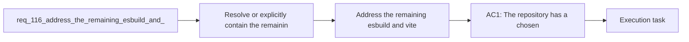

## item_203_address_the_remaining_esbuild_and_vite_audit_advisory_in_the_toolchain - Address the remaining esbuild and vite audit advisory in the toolchain
> From version: 1.16.0
> Schema version: 1.0
> Status: Done
> Understanding: 92%
> Confidence: 90%
> Progress: 100%
> Complexity: Medium
> Theme: Security
> Reminder: Update status/understanding/confidence/progress and linked task references when you edit this doc.

# Problem
- Resolve or explicitly contain the remaining `esbuild` and `vite` audit advisory still reported by the repository toolchain.
- Prevent the repo from fixing only the `yaml` advisory while leaving the build and test stack in a still-known vulnerable state.
- Choose a maintainable path forward even if the cleanest fix requires a controlled Vitest or Vite upgrade.
- - `npm audit --audit-level=moderate` still reports a moderate advisory through the `vite` and `vitest` dependency chain:
- - transitive path through `vite`, `vite-node`, and `@vitest/mocker`

# Scope
- In:
- Out:

# Acceptance criteria
- AC1: The repository has a chosen and testable strategy for the remaining `esbuild` and `vite` advisory, either through dependency remediation or through an explicit temporary exception path with documented rationale.
- AC2: If remediation is chosen, the required Vite, Vitest, or related dependency updates land with passing compile, test, smoke, and packaging validation.
- AC3: If an exception path is chosen temporarily, the repo records the scope, rationale, and expiry or follow-up condition instead of leaving the advisory as an undocumented known issue.
- AC4: Contributor guidance and audit expectations reflect the chosen strategy so maintainers know whether the advisory is supposed to be fixed now or tracked as an explicit exception.
- AC5: Regression coverage or validation evidence exists to keep the upgraded or exception-governed toolchain from drifting silently.

# AC Traceability
- AC1 -> Scope: The repository has a chosen and testable strategy for the remaining `esbuild` and `vite` advisory, either through dependency remediation or through an explicit temporary exception path with documented rationale.. Proof: implement in this backlog slice and capture validation evidence in the linked orchestration task.
- AC2 -> Scope: If remediation is chosen, the required Vite, Vitest, or related dependency updates land with passing compile, test, smoke, and packaging validation.. Proof: implement in this backlog slice and capture validation evidence in the linked orchestration task.
- AC3 -> Scope: If an exception path is chosen temporarily, the repo records the scope, rationale, and expiry or follow-up condition instead of leaving the advisory as an undocumented known issue.. Proof: implement in this backlog slice and capture validation evidence in the linked orchestration task.
- AC4 -> Scope: Contributor guidance and audit expectations reflect the chosen strategy so maintainers know whether the advisory is supposed to be fixed now or tracked as an explicit exception.. Proof: implement in this backlog slice and capture validation evidence in the linked orchestration task.
- AC5 -> Scope: Regression coverage or validation evidence exists to keep the upgraded or exception-governed toolchain from drifting silently.. Proof: implement in this backlog slice and capture validation evidence in the linked orchestration task.

# Decision framing
- Product framing: Not needed
- Product signals: (none detected)
- Product follow-up: No product brief follow-up is expected based on current signals.
- Architecture framing: Required
- Architecture signals: data model and persistence, contracts and integration, security and identity
- Architecture follow-up: Create or link an architecture decision before irreversible implementation work starts.

# Links
- Product brief(s): (none yet)
- Architecture decision(s): `adr_014_keep_plugin_safety_and_repository_governance_explicit_bounded_and_modular`
- Request: `req_116_address_the_remaining_esbuild_and_vite_audit_advisory_in_the_toolchain`
- Primary task(s): `task_107_orchestration_delivery_for_req_107_to_req_117_across_maintenance_hardening_ui_refinement_and_modularization`

# AI Context
- Summary: Resolve or explicitly govern the remaining esbuild and vite advisory in the repo toolchain, including any required Vite...
- Keywords: esbuild, vite, vitest, audit, dependency advisory, toolchain, upgrade, exception
- Use when: Use when planning or implementing the remaining build and test toolchain remediation after audit-policy work.
- Skip when: Skip when the work is about unrelated package upgrades.

# References
- `[package.json](/Users/alexandreagostini/Documents/cdx-logics-vscode/package.json)`
- `[ci.yml](/Users/alexandreagostini/Documents/cdx-logics-vscode/.github/workflows/ci.yml)`
- `[audit.yml](/Users/alexandreagostini/Documents/cdx-logics-vscode/.github/workflows/audit.yml)`
- `logics/request/req_110_make_the_security_audit_workflow_block_on_actionable_vulnerabilities.md`
- `logics/request/req_117_resume_modularization_of_oversized_core_extension_and_workflow_modules.md`

# Priority
- Impact:
- Urgency:

# Notes
- Derived from request `req_116_address_the_remaining_esbuild_and_vite_audit_advisory_in_the_toolchain`.
- Source file: `logics/request/req_116_address_the_remaining_esbuild_and_vite_audit_advisory_in_the_toolchain.md`.
- Request context seeded into this backlog item from `logics/request/req_116_address_the_remaining_esbuild_and_vite_audit_advisory_in_the_toolchain.md`.
