## item_204_resume_modularization_of_oversized_core_extension_and_workflow_modules - Resume modularization of oversized core extension and workflow modules
> From version: 1.16.0 (refreshed)
> Schema version: 1.0
> Status: Done
> Understanding: 93%
> Confidence: 91%
> Progress: 100% (refreshed)
> Complexity: Medium
> Theme: Architecture
> Reminder: Update status/understanding/confidence/progress and linked task references when you edit this doc.

# Problem
- Reduce the maintenance cost of the largest remaining extension and workflow modules.
- Make future UI, governance, and runtime changes cheaper by splitting oversized files along clearer domain boundaries.
- Continue the modularization effort in a deliberate way instead of waiting for more features to accumulate on already large files.
- - The repository still contains several large central modules, including:
- - [src/logicsViewProvider.ts](/Users/alexandreagostini/Documents/cdx-logics-vscode/src/logicsViewProvider.ts)

# Scope
- In:
- Out:

```mermaid
%% logics-kind: backlog
%% logics-signature: backlog|resume-modularization-of-oversized-core-|req-104-harden-repository-maintenance-gu|reduce-the-maintenance-cost-of-the|ac1-the-next-modularization-pass-identif
flowchart LR
    Request[req_104_harden_repository_maintenance_guar] --> Problem[Reduce the maintenance cost of the]
    Problem --> Scope[Resume modularization of oversized core ex]
    Scope --> Acceptance[AC1: The next modularization pass identifi]
    Acceptance --> Tasks[task_107_orchestration_delivery_for_req_10]
```

# Acceptance criteria
- AC1: The next modularization pass identifies explicit target files and the domain seams that justify splitting them, rather than treating file size alone as the reason to extract code.
- AC2: The chosen split plan is incremental and bounded, so each resulting backlog slice can land without a risky big-bang rewrite.
- AC3: The work preserves current behavior with validation appropriate to each extracted surface, especially for the extension provider flow, webview runtime flow, and workflow-manager CLI flow.
- AC4: The resulting module boundaries improve ownership clarity, such as separating orchestration, rendering, state selection, command dispatch, or shared utility concerns.
- AC5: The repo gains regression confidence or test coverage where modularization would otherwise make behavior drift easy to miss.

# AC Traceability
- AC1 -> Scope: The next modularization pass identifies explicit target files and the domain seams that justify splitting them, rather than treating file size alone as the reason to extract code.. Proof: implement in this backlog slice and capture validation evidence in the linked orchestration task.
- AC2 -> Scope: The chosen split plan is incremental and bounded, so each resulting backlog slice can land without a risky big-bang rewrite.. Proof: implement in this backlog slice and capture validation evidence in the linked orchestration task.
- AC3 -> Scope: The work preserves current behavior with validation appropriate to each extracted surface, especially for the extension provider flow, webview runtime flow, and workflow-manager CLI flow.. Proof: implement in this backlog slice and capture validation evidence in the linked orchestration task.
- AC4 -> Scope: The resulting module boundaries improve ownership clarity, such as separating orchestration, rendering, state selection, command dispatch, or shared utility concerns.. Proof: implement in this backlog slice and capture validation evidence in the linked orchestration task.
- AC5 -> Scope: The repo gains regression confidence or test coverage where modularization would otherwise make behavior drift easy to miss.. Proof: implement in this backlog slice and capture validation evidence in the linked orchestration task.

# Decision framing
- Product framing: Consider
- Product signals: pricing and packaging
- Product follow-up: Review whether a product brief is needed before scope becomes harder to change.
- Architecture framing: Required
- Architecture signals: data model and persistence, contracts and integration, runtime and boundaries
- Architecture follow-up: Create or link an architecture decision before irreversible implementation work starts.

# Links
- Product brief(s): (none yet)
- Architecture decision(s): `adr_002_keep_the_plugin_webview_as_a_modular_vanilla_frontend`, `adr_014_keep_plugin_safety_and_repository_governance_explicit_bounded_and_modular`
- Request: `req_117_resume_modularization_of_oversized_core_extension_and_workflow_modules`
- Primary task(s): `task_107_orchestration_delivery_for_req_107_to_req_117_across_maintenance_hardening_ui_refinement_and_modularization`

# AI Context
- Summary: Resume the repo's modularization effort for oversized core modules with bounded seam-driven splits across the extension, webview, and...
- Keywords: modularization, architecture, large files, seams, extension, webview, workflow manager, refactor
- Use when: Use when planning or implementing the next bounded modularization pass for core repo surfaces.
- Skip when: Skip when the work is about feature delivery with no structural ownership change.

# References
- `[src/logicsViewProvider.ts](/Users/alexandreagostini/Documents/cdx-logics-vscode/src/logicsViewProvider.ts)`
- `[media/main.js](/Users/alexandreagostini/Documents/cdx-logics-vscode/media/main.js)`
- `[logics_flow.py](/Users/alexandreagostini/Documents/cdx-logics-vscode/logics/skills/logics-flow-manager/scripts/logics_flow.py)`
- `[logics_flow_hybrid.py](/Users/alexandreagostini/Documents/cdx-logics-vscode/logics/skills/logics-flow-manager/scripts/logics_flow_hybrid.py)`
- `logics/request/req_104_harden_repository_maintenance_guardrails_revealed_by_project_audit.md`
- `logics/request/req_116_address_the_remaining_esbuild_and_vite_audit_advisory_in_the_toolchain.md`
- `logics/skills/logics-ui-steering/SKILL.md`

# Priority
- Impact:
- Urgency:

# Notes
- Derived from request `req_117_resume_modularization_of_oversized_core_extension_and_workflow_modules`.
- Source file: `logics/request/req_117_resume_modularization_of_oversized_core_extension_and_workflow_modules.md`.
- Request context seeded into this backlog item from `logics/request/req_117_resume_modularization_of_oversized_core_extension_and_workflow_modules.md`.
- Derived from `logics/request/req_117_resume_modularization_of_oversized_core_extension_and_workflow_modules.md`.
