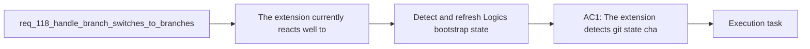

## item_205_detect_and_refresh_logics_bootstrap_state_after_git_branch_switches - Detect and refresh Logics bootstrap state after git branch switches
> From version: 1.17.0
> Schema version: 1.0
> Status: Ready
> Understanding: 93%
> Confidence: 91%
> Progress: 0%
> Complexity: Medium
> Theme: Bootstrap resilience and branch-aware recovery
> Reminder: Update status/understanding/confidence/progress and linked task references when you edit this doc.

# Problem
- The extension currently reacts well to filesystem changes inside `logics/**/*`, but the underlying git branch can change the existence of `logics/`, `logics/skills`, or workflow directories without a branch-aware invalidation step.
- As a result, users can switch from a healthy branch to an unbootstrapped one and keep stale assumptions or stale prompt-suppression state tied only to the repository root.
- This slice is specifically about detecting that the repository state changed and recomputing the bootstrap-related state model quickly and honestly.
- This item should not try to solve the full operator messaging or repair UX by itself; it should provide the reliable refresh and state-transition foundation those flows depend on.

# Scope
- In:
- branch-aware or git-state-aware refresh triggers for bootstrap-relevant repository state
- invalidation of stale provider state when the active branch no longer matches the previously inspected bootstrap state
- recomputation of `missing-logics`, `missing-kit`, `partial-bootstrap`, and `ready` after checkout-equivalent changes
- resetting bootstrap prompt suppression when the effective branch/bootstrap fingerprint changes
- Out:
- redesigning the final recovery copy or CTA hierarchy in the plugin UX
- broad changes to bootstrap execution itself beyond what is needed to support correct state transitions
- unrelated global Codex kit publication semantics

# Acceptance criteria
- AC1: The extension detects git-state changes that can alter bootstrap availability after checkout or equivalent branch movement, rather than relying only on `logics/**/*` file events.
- AC2: After such a change, repository state is recomputed so a previously ready root can correctly become `missing-logics`, `missing-kit`, `partial-bootstrap`, or remain `ready` without requiring a manual refresh.
- AC3: Provider-held state derived from the previous branch, including stale item lists, stale agent assumptions, and stale bootstrap prompt suppression, is invalidated or recomputed when the effective bootstrap fingerprint changes.
- AC4: The refresh path keeps the current repository-state contract intact instead of introducing a parallel branch-only state model.
- AC5: The implementation stays compatible with supported non-branch-triggered refresh flows, so normal `logics/**/*` changes still refresh the view correctly.

# AC Traceability
- AC1 -> Scope: branch-aware or git-state-aware refresh triggers. Proof: this item explicitly requires detection beyond `logics/**/*` file events.
- AC2 -> Scope: repository-state recomputation after checkout-equivalent changes. Proof: this item explicitly requires state transition back into existing repository states.
- AC3 -> Scope: invalidation of stale provider state and prompt suppression. Proof: this item explicitly requires old-branch assumptions to be cleared when the fingerprint changes.
- AC4 -> Scope: reuse of the current repository-state contract. Proof: this item explicitly forbids a second parallel branch-only state model.
- AC5 -> Scope: compatibility with normal refresh behavior. Proof: this item explicitly keeps existing file-driven refresh paths intact.

# Decision framing
- Product framing: Consider
- Product signals: conversion journey
- Product follow-up: Review whether a product brief is needed before scope becomes harder to change.
- Architecture framing: Required
- Architecture signals: data model and persistence, contracts and integration
- Architecture follow-up: Create or link an architecture decision before irreversible implementation work starts.

# Links
- Product brief(s): (none yet)
- Architecture decision(s): (none yet)
- Request: `req_118_handle_branch_switches_to_branches_without_logics_bootstrap_and_offer_setup_repair`
- Primary task(s): `task_108_orchestration_delivery_for_req_118_branch_aware_bootstrap_recovery_and_setup_repair`

# AI Context
- Summary: Make the extension branch-aware for Logics bootstrap state so checkout to an unbootstrapped branch surfaces clear setup guidance...
- Keywords: branch switch, bootstrap, repair, setup fix, missing logics, partial bootstrap, git state, recovery, extension UX
- Use when: Use when planning or implementing branch-aware bootstrap detection, degraded-state messaging, or current-branch setup repair in the VS Code extension.
- Skip when: Skip when the work is only about global Codex kit publication or unrelated workflow features.

# References
- `[extension.ts](/Users/alexandreagostini/Documents/cdx-logics-vscode/src/extension.ts)`
- `[logicsViewProvider.ts](/Users/alexandreagostini/Documents/cdx-logics-vscode/src/logicsViewProvider.ts)`
- `[logicsEnvironment.ts](/Users/alexandreagostini/Documents/cdx-logics-vscode/src/logicsEnvironment.ts)`
- `[logicsProviderUtils.ts](/Users/alexandreagostini/Documents/cdx-logics-vscode/src/logicsProviderUtils.ts)`
- `tests/logicsViewProvider.test.ts`
- `tests/logicsEnvironment.test.ts`
- `logics/request/req_065_harden_partial_logics_bootstrap_recovery_when_workflow_directories_are_missing.md`
- `logics/request/req_077_adapt_logics_bootstrap_and_environment_checks_to_codex_workspace_overlays.md`
- `logics/request/req_109_replace_coarse_bootstrap_detection_with_canonical_kit_inspection.md`

# Priority
- Impact: High
- Urgency: Medium

# Notes
- Derived from request `req_118_handle_branch_switches_to_branches_without_logics_bootstrap_and_offer_setup_repair`.
- Source file: `logics/request/req_118_handle_branch_switches_to_branches_without_logics_bootstrap_and_offer_setup_repair.md`.
- Request context seeded into this backlog item from `logics/request/req_118_handle_branch_switches_to_branches_without_logics_bootstrap_and_offer_setup_repair.md`.
