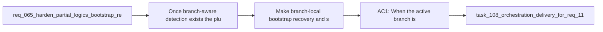

## item_206_make_branch_local_bootstrap_recovery_and_setup_repair_explicit_in_the_plugin_ux - Make branch-local bootstrap recovery and setup repair explicit in the plugin UX
> From version: 1.18.0
> Schema version: 1.0
> Status: Done
> Understanding: 97%
> Confidence: 97%
> Progress: 100%
> Complexity: Medium
> Theme: Bootstrap resilience and branch-aware recovery
> Reminder: Update status/understanding/confidence/progress and linked task references when you edit this doc.

# Problem
- Once branch-aware detection exists, the plugin still needs to explain the degraded state in an operator-friendly way and offer the right repair action for the active branch.
- The current UX can fall back to a raw "No logics/ folder found" feeling, which is technically true but does not tell the user whether the branch is merely unbootstrapped, partially repaired, or malformed in a way that blocks automation.
- This slice is about degraded-state messaging, action routing, and supported setup repair for the current branch.
- It should explicitly keep branch-local uninitialized state separate from non-canonical or malformed setup so the wrong CTA is not offered.

# Scope
- In:
- branch-local degraded-state copy in the plugin when checkout lands on `missing-logics`, `missing-kit`, or `partial-bootstrap`
- explicit CTAs for bootstrapping or repairing the current branch setup when automation is supported
- remediation wording that clarifies whether the current branch is simply uninitialized or requires repair of an incomplete supported setup
- preserving the non-canonical or malformed setup path as a distinct guidance branch
- Out:
- the low-level branch-change detection mechanism itself
- broad bootstrap implementation redesign unrelated to current-branch recovery UX
- generic documentation cleanup outside the affected plugin surfaces

# Acceptance criteria
- AC1: When the active branch is `missing-logics`, the plugin explains that the current branch does not yet contain Logics and offers the supported bootstrap action for that branch.
- AC2: When the active branch is `missing-kit` or `partial-bootstrap`, the plugin explains that the current branch has an incomplete supported setup and offers the appropriate repair/bootstrap action when automation is supported.
- AC3: The degraded-state UX keeps non-canonical or malformed setup distinct from supported missing or incomplete states, with guidance that avoids suggesting the wrong automatic repair.
- AC4: The operator-facing copy makes it clear that the issue can be branch-local, so a branch switch from a healthy branch does not read like the extension itself is broken.
- AC5: The supported repair path remains explicit and operator-confirmed, avoiding silent writes on branches where Logics may be intentionally absent.

# AC Traceability
- AC1 -> Scope: branch-local copy plus bootstrap CTA for `missing-logics`. Proof: this item explicitly routes that state to a branch bootstrap action.
- AC2 -> Scope: branch-local copy plus repair CTA for `missing-kit` and `partial-bootstrap`. Proof: this item explicitly routes incomplete supported setup to repair-capable UX.
- AC3 -> Scope: separate treatment for malformed or non-canonical setup. Proof: this item explicitly preserves that state as a different guidance branch.
- AC4 -> Scope: operator-facing wording. Proof: this item explicitly requires the UX to describe the issue as branch-local rather than extension breakage.
- AC5 -> Scope: explicit operator-confirmed writes. Proof: this item explicitly prevents silent repair on possibly intentional branch states.
- req_118 AC6 -> Scope: explicit current-branch bootstrap or repair flow. Proof: this item keeps canonical re-bootstrap or repair available for the active branch while preserving explicit operator confirmation.

# Decision framing
- Product framing: Consider
- Product signals: conversion journey
- Product follow-up: Review whether a product brief is needed before scope becomes harder to change.
- Architecture framing: Required
- Architecture signals: data model and persistence, contracts and integration
- Architecture follow-up: Create or link an architecture decision before irreversible implementation work starts.

# Links
- Product brief(s): (none yet)
- Architecture decision(s): `adr_015_make_bootstrap_recovery_branch_aware`
- Request: `req_118_handle_branch_switches_to_branches_without_logics_bootstrap_and_offer_setup_repair`
- Primary task(s): `task_108_orchestration_delivery_for_req_118_branch_aware_bootstrap_recovery_and_setup_repair`

# AI Context
- Summary: Make the extension branch-aware for Logics bootstrap state so checkout to an unbootstrapped branch surfaces clear setup guidance...
- Keywords: branch switch, bootstrap, repair, setup fix, missing logics, partial bootstrap, git state, recovery, extension UX
- Use when: Use when planning or implementing branch-aware bootstrap detection, degraded-state messaging, or current-branch setup repair in the VS Code extension.
- Skip when: Skip when the work is only about global Codex kit publication or unrelated workflow features.

# References
- `[extension.ts](/Users/alexandreagostini/Documents/cdx-logics-vscode/src/extension.ts)`
- `[logicsViewProvider.ts](/Users/alexandreagostini/Documents/cdx-logics-vscode/src/logicsViewProvider.ts)`
- `[logicsEnvironment.ts](/Users/alexandreagostini/Documents/cdx-logics-vscode/src/logicsEnvironment.ts)`
- `[logicsProviderUtils.ts](/Users/alexandreagostini/Documents/cdx-logics-vscode/src/logicsProviderUtils.ts)`
- `README.md`
- `tests/logicsViewProvider.test.ts`
- `logics/request/req_065_harden_partial_logics_bootstrap_recovery_when_workflow_directories_are_missing.md`
- `logics/request/req_077_adapt_logics_bootstrap_and_environment_checks_to_codex_workspace_overlays.md`
- `logics/request/req_109_replace_coarse_bootstrap_detection_with_canonical_kit_inspection.md`

# Priority
- Impact: High
- Urgency: Medium

# Notes
- Derived from request `req_118_handle_branch_switches_to_branches_without_logics_bootstrap_and_offer_setup_repair`.
- Source file: `logics/request/req_118_handle_branch_switches_to_branches_without_logics_bootstrap_and_offer_setup_repair.md`.
- Request context seeded into this backlog item from `logics/request/req_118_handle_branch_switches_to_branches_without_logics_bootstrap_and_offer_setup_repair.md`.
- Task `task_108_orchestration_delivery_for_req_118_branch_aware_bootstrap_recovery_and_setup_repair` was finished via `logics_flow.py finish task` on 2026-04-03.
