## item_207_add_regression_coverage_for_branch_switch_bootstrap_degradation_and_repair - Add regression coverage for branch-switch bootstrap degradation and repair
> From version: 1.18.0
> Schema version: 1.0
> Status: Done
> Understanding: 97%
> Confidence: 97%
> Progress: 100%
> Complexity: Medium
> Theme: Bootstrap resilience and branch-aware recovery
> Reminder: Update status/understanding/confidence/progress and linked task references when you edit this doc.

# Problem
- The branch-switch problem is easy to reintroduce because it crosses provider refresh timing, bootstrap prompt suppression, repository-state inspection, and degraded-state UX.
- This slice exists to lock the new behavior down with focused tests instead of relying on manual git checkout smoke checks only.
- The coverage should prove both the state transition and the user-facing recovery path for supported setups.

# Scope
- In:
- targeted tests for ready -> missing-logics and ready -> partial-bootstrap transitions
- tests for bootstrap prompt suppression reset or equivalent branch-fingerprint invalidation
- tests for degraded-state repair/bootstrap affordances after a branch-state transition
- tests that malformed or non-canonical setup still avoids the supported automatic repair path
- Out:
- unrelated broad test refactors
- exhaustive end-to-end git integration coverage beyond the risk surface introduced by this request
- replacing existing manual smoke validation where it still adds signal

```mermaid
%% logics-kind: backlog
%% logics-signature: backlog|add-regression-coverage-for-branch-switc|req-065-harden-partial-logics-bootstrap-|the-branch-switch-problem-is-easy-to|ac1-automated-coverage-proves-a-previous
flowchart LR
    Request[req_065_harden_partial_logics_bootstrap_re] --> Problem[The branch-switch problem is easy to]
    Problem --> Scope[Add regression coverage for branch-switch]
    Scope --> Acceptance[AC1: Automated coverage proves a previousl]
    Acceptance --> Tasks[task_108_orchestration_delivery_for_req_11]
```

# Acceptance criteria
- AC1: Automated coverage proves a previously ready repository view can transition to `missing-logics` after a branch-state change or equivalent refresh trigger.
- AC2: Automated coverage proves a previously ready repository view can transition to `partial-bootstrap` after a branch-state change or equivalent refresh trigger.
- AC3: Coverage proves the bootstrap/remediation prompt is not permanently suppressed across branch-state transitions for the same root.
- AC4: Coverage proves the degraded-state UX exposes supported repair/bootstrap affordances for supported missing or incomplete states.
- AC5: Coverage proves non-canonical or malformed setup still routes to warning guidance rather than the normal supported repair path.

# AC Traceability
- AC1 -> Scope: ready to `missing-logics` transition coverage. Proof: this item explicitly requires that scenario.
- AC2 -> Scope: ready to `partial-bootstrap` transition coverage. Proof: this item explicitly requires that scenario.
- AC3 -> Scope: prompt reset coverage. Proof: this item explicitly requires suppression not to persist incorrectly across branch states.
- AC4 -> Scope: degraded-state CTA coverage. Proof: this item explicitly requires supported repair/bootstrap affordance tests.
- AC5 -> Scope: malformed and non-canonical routing coverage. Proof: this item explicitly requires the safe warning path to remain distinct.
- req_118 AC7 -> Scope: branch-switch regression coverage. Proof: this item explicitly requires automated coverage for ready-to-missing, ready-to-partial, and remediation-prompt scenarios.

# Decision framing
- Product framing: Consider
- Product signals: conversion journey
- Product follow-up: Review whether a product brief is needed before scope becomes harder to change.
- Architecture framing: Required
- Architecture signals: data model and persistence, contracts and integration
- Architecture follow-up: Create or link an architecture decision before irreversible implementation work starts.

# Links
- Product brief(s): (none yet)
- Architecture decision(s): `adr_015_make_bootstrap_recovery_branch_aware`
- Request: `req_118_handle_branch_switches_to_branches_without_logics_bootstrap_and_offer_setup_repair`
- Primary task(s): `task_108_orchestration_delivery_for_req_118_branch_aware_bootstrap_recovery_and_setup_repair`

# AI Context
- Summary: Make the extension branch-aware for Logics bootstrap state so checkout to an unbootstrapped branch surfaces clear setup guidance...
- Keywords: branch switch, bootstrap, repair, setup fix, missing logics, partial bootstrap, git state, recovery, extension UX
- Use when: Use when planning or implementing branch-aware bootstrap detection, degraded-state messaging, or current-branch setup repair in the VS Code extension.
- Skip when: Skip when the work is only about global Codex kit publication or unrelated workflow features.

# References
- `[extension.ts](/Users/alexandreagostini/Documents/cdx-logics-vscode/src/extension.ts)`
- `[logicsViewProvider.ts](/Users/alexandreagostini/Documents/cdx-logics-vscode/src/logicsViewProvider.ts)`
- `[logicsEnvironment.ts](/Users/alexandreagostini/Documents/cdx-logics-vscode/src/logicsEnvironment.ts)`
- `[logicsProviderUtils.ts](/Users/alexandreagostini/Documents/cdx-logics-vscode/src/logicsProviderUtils.ts)`
- `tests/logicsViewProvider.test.ts`
- `tests/logicsEnvironment.test.ts`
- `tests/logicsViewDocumentController.test.ts`
- `logics/request/req_065_harden_partial_logics_bootstrap_recovery_when_workflow_directories_are_missing.md`
- `logics/request/req_077_adapt_logics_bootstrap_and_environment_checks_to_codex_workspace_overlays.md`
- `logics/request/req_109_replace_coarse_bootstrap_detection_with_canonical_kit_inspection.md`

# Priority
- Impact: High
- Urgency: Medium

# Notes
- Derived from request `req_118_handle_branch_switches_to_branches_without_logics_bootstrap_and_offer_setup_repair`.
- Source file: `logics/request/req_118_handle_branch_switches_to_branches_without_logics_bootstrap_and_offer_setup_repair.md`.
- Request context seeded into this backlog item from `logics/request/req_118_handle_branch_switches_to_branches_without_logics_bootstrap_and_offer_setup_repair.md`.
- Task `task_108_orchestration_delivery_for_req_118_branch_aware_bootstrap_recovery_and_setup_repair` was finished via `logics_flow.py finish task` on 2026-04-03.
