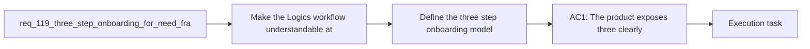

## item_208_define_the_three_step_onboarding_model_and_operator_copy - Define the three step onboarding model and operator copy
> From version: 1.18.0
> Schema version: 1.0
> Status: Ready
> Understanding: 95%
> Confidence: 92%
> Progress: 0%
> Complexity: Medium
> Theme: Workflow
> Reminder: Update status/understanding/confidence/progress and linked task references when you edit this doc.

# Problem
- Make the Logics workflow understandable at entry through three visible steps: Need, Framing, and Execution.
- Reduce the need for users to know the internal request to backlog to task protocol before they can start using the system correctly.
- Keep the first slice focused on onboarding, wording, and workflow visibility rather than on full auto orchestration.
- The current repository already exposes guided request and workflow actions in the plugin, but the user-facing model still needs clearer stage naming and operator copy:
  - `src/workflowSupport.ts`
  - `src/logicsViewDocumentController.ts`
  - `media/toolsPanelLayout.js`

# Scope
- In:
  - define the visible Need, Framing, and Execution stage labels
  - write concise operator-facing copy for each stage
  - define how the visible three-step model maps to the canonical request, backlog, and task workflow
  - keep the language simple enough for first-use understanding without overpromising automation
- Out:
  - wiring the model into concrete plugin surfaces
  - broader workflow-surface validation and regression checks
  - full auto orchestration, autonomy modes, or Git policy changes

# Acceptance criteria
- AC1: The product exposes three clearly labeled onboarding stages: Need, Framing, and Execution.
- AC2: Each stage includes short operator-facing copy that explains its purpose without requiring prior knowledge of request, backlog, task, or companion-doc terminology.
- AC3: The onboarding model maps cleanly to the existing Logics workflow primitives without renaming or replacing the canonical internal document structure.
- AC4: At least one current entry surface used by operators makes the three-step model visible where new workflow actions are initiated.
- AC5: The implementation scope stays limited to onboarding and workflow comprehension; full auto orchestration remains explicitly out of scope for this request.

# AC Traceability
- AC1 -> Scope: define the visible Need, Framing, and Execution stage labels. Proof: this item owns the naming and stage-model definition.
- AC2 -> Scope: write concise operator-facing copy for each stage. Proof: this item owns the wording and non-protocol-first operator text.
- AC3 -> Scope: define how the visible three-step model maps to the canonical request, backlog, and task workflow. Proof: this item owns the abstraction contract between visible onboarding and internal workflow primitives.
- AC4 -> Handoff to `item_209`. Proof: this item defines what should be shown, while the surface integration lives in the second backlog slice.
- AC5 -> Scope boundary. Proof: this item explicitly keeps automation expansion out of scope and only defines the onboarding model and copy.

# Decision framing
- Product framing: Required
- Product signals: conversion journey
- Product follow-up: Create or link a product brief before implementation moves deeper into delivery.
- Architecture framing: Consider
- Architecture signals: contracts and integration
- Architecture follow-up: Re-evaluate only if the final wording contract forces a deeper workflow or persistence change.

# Links
- Product brief(s): `prod_004_logics_auto_orchestration_vision`
- Architecture decision(s): (none yet)
- Request: `req_119_three_step_onboarding_for_need_framing_and_execution`
- Primary task(s): `task_109_orchestration_delivery_for_req_119_three_step_onboarding`

# AI Context
- Summary: Add a simple three-step onboarding model so users understand Logics as Need, Framing, and Execution before they have...
- Keywords: onboarding, workflow, need, framing, execution, guided request, product entry, workflow comprehension
- Use when: Use when designing or implementing first-use workflow messaging, onboarding copy, or information architecture around Logics entry surfaces.
- Skip when: Skip when the work is specifically about deeper orchestration automation, Git policy, or internal workflow mutation behavior.

# References
- `logics/instructions.md`
- `logics/skills/logics-flow-manager/SKILL.md`
- `logics/product/prod_004_logics_auto_orchestration_vision.md`
- `src/logicsViewProvider.ts`
- `src/logicsViewDocumentController.ts`
- `media/toolsPanelLayout.js`
- `.claude/agents/logics-flow-manager.md`
- `.claude/agents/logics-hybrid-delivery-assistant.md`
- `logics/skills/logics-ui-steering/SKILL.md`

# Priority
- Impact: High
- Urgency: Medium

# Notes
- Derived from request `req_119_three_step_onboarding_for_need_framing_and_execution`.
- Source file: `logics/request/req_119_three_step_onboarding_for_need_framing_and_execution.md`.
- Request context seeded into this backlog item from `logics/request/req_119_three_step_onboarding_for_need_framing_and_execution.md`.
