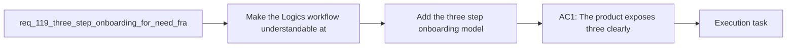

## item_209_add_the_three_step_onboarding_model_to_guided_request_entry_surfaces_and_validate_workflow_alignment - Add the three step onboarding model to guided request entry surfaces and validate workflow alignment
> From version: 1.18.1
> Schema version: 1.0
> Status: Ready
> Understanding: 97%
> Confidence: 94%
> Progress: 5%
> Complexity: Medium
> Theme: Workflow
> Reminder: Update status/understanding/confidence/progress and linked task references when you edit this doc.

# Problem
- Make the Logics workflow understandable through a dedicated onboarding webview that presents three visible steps: Need, Framing, and Execution.
- Reduce the need for users to know the internal request to backlog to task protocol before they can start using the system correctly.
- Keep the first slice focused on onboarding, wording, and workflow visibility rather than on full auto orchestration.
- The current repository already exposes guided request and workflow actions in the plugin, but the chosen onboarding model still needs to be surfaced through a dedicated webview that fits the plugin's established panel pattern:
  - `src/workflowSupport.ts`
  - `src/logicsViewDocumentController.ts`
  - `src/logicsViewProvider.ts`
  - `media/toolsPanelLayout.js`

# Scope
- In:
  - implement a dedicated onboarding webview similar in product posture to Hybrid Insights
  - show the onboarding webview on first plugin use or after a relevant product update
  - allow the onboarding webview to be reopened manually from the plugin tools or an equivalent action
  - surface the three-step onboarding model and the primary workflow actions in that webview
  - align the visible onboarding text with the canonical request, backlog, and task workflow
  - validate that the chosen surface stays readable and does not regress existing workflow entry actions
  - capture the workflow-alignment evidence in linked docs and tests
- Out:
  - redefining the three-step model itself beyond what `item_208` establishes
  - deeper orchestration automation, autonomy modes, or Git policy changes
  - redesigning unrelated plugin surfaces outside the onboarding entry path
  - making onboarding a permanent board-level screen

# Acceptance criteria
- AC1: The product exposes three clearly labeled onboarding stages: Need, Framing, and Execution inside a dedicated onboarding webview.
- AC2: Each stage includes short operator-facing copy that explains its purpose without requiring prior knowledge of request, backlog, task, or companion-doc terminology.
- AC3: The onboarding webview exposes the main actions that help the operator start or continue the workflow.
- AC4: The onboarding model maps cleanly to the existing Logics workflow primitives without renaming or replacing the canonical internal document structure.
- AC5: The onboarding webview can be shown on first plugin use or after a relevant update without becoming a permanent everyday surface.
- AC6: The implementation scope stays limited to onboarding and workflow comprehension; full auto orchestration remains explicitly out of scope for this request.

# AC Traceability
- AC1 -> Webview implementation. Proof: render the three labeled stages in the onboarding webview using the model defined in `item_208`.
- AC2 -> Webview copy. Proof: show the operator-facing copy in context and verify it reads clearly without protocol knowledge.
- AC3 -> Action exposure. Proof: present the main workflow actions in the onboarding webview and validate that they point to the expected operator flow.
- AC4 -> Workflow alignment. Proof: validate that the visible onboarding still maps cleanly to canonical request, backlog, and task behavior in the implementation.
- AC5 -> Lifecycle behavior. Proof: implement and validate first-use or post-update visibility with a bounded, non-permanent onboarding lifecycle.
- AC6 -> Scope boundary. Proof: keep the delivery limited to onboarding and workflow comprehension rather than automation expansion.

# Decision framing
- Product framing: Required
- Product signals: conversion journey
- Product follow-up: Create or link a product brief before implementation moves deeper into delivery.
- Architecture framing: Consider
- Architecture signals: contracts and integration
- Architecture follow-up: Re-evaluate if the chosen entry surface requires a non-trivial host or data-contract change.

# Links
- Product brief(s): `prod_004_logics_auto_orchestration_vision`
- Architecture decision(s): (none yet)
- Request: `req_119_three_step_onboarding_for_need_framing_and_execution`
- Primary task(s): `task_109_orchestration_delivery_for_req_119_three_step_onboarding`

# AI Context
- Summary: Implement the dedicated onboarding webview and its lifecycle so the three-step model and key actions appear once at first use or after a relevant update, then get out of the way.
- Keywords: onboarding, workflow, need, framing, execution, webview, first run, update trigger, workflow actions
- Use when: Use when implementing the onboarding webview, its trigger conditions, or its workflow-action integration.
- Skip when: Skip when the work is specifically about deeper orchestration automation, Git policy, or internal workflow mutation behavior.

# References
- `logics/instructions.md`
- `logics/skills/logics-flow-manager/SKILL.md`
- `logics/product/prod_004_logics_auto_orchestration_vision.md`
- `src/logicsViewProvider.ts`
- `src/logicsViewDocumentController.ts`
- `media/toolsPanelLayout.js`
- `.claude/agents/logics-flow-manager.md`
- `.claude/agents/logics-hybrid-delivery-assistant.md`
- `logics/skills/logics-ui-steering/SKILL.md`

# Priority
- Impact: High
- Urgency: Medium

# Notes
- Derived from request `req_119_three_step_onboarding_for_need_framing_and_execution`.
- Source file: `logics/request/req_119_three_step_onboarding_for_need_framing_and_execution.md`.
- Request context seeded into this backlog item from `logics/request/req_119_three_step_onboarding_for_need_framing_and_execution.md`.
