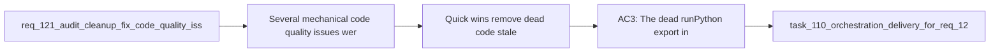

## item_210_quick_wins_remove_dead_code_stale_artifacts_and_update_doc_references - Quick wins — remove dead code, stale artifacts, and update doc references
> From version: 1.18.0
> Schema version: 1.0
> Status: Done
> Understanding: 98%
> Confidence: 98%
> Progress: 100%
> Complexity: Low
> Theme: Quality
> Reminder: Update status/understanding/confidence/progress and linked task references when you edit this doc.

# Problem
- Several mechanical code quality issues were identified during the 2026-04-04 audit that can be fixed quickly with low risk: dead exports, stale build artifacts, outdated doc references, missing config files, and an empty folder without documentation.
- These issues add noise and confusion but do not require structural refactoring.

# Scope
- In: Remove dead code (`runPython`), delete stale `.vsix` files, update `logics/instructions.md` entrypoint references, update 3 SKILL.md files and `.claude/` bridge files to use canonical `logics.py`, add README to `logics/specs/`, seed `logics.yaml`.
- Out: Structural refactors, test additions, submodule-wide launcher harmonization (covered by item_211), module decomposition (covered by item_212).

# Acceptance criteria
- AC3: The dead `runPython()` export in `src/logicsProviderUtils.ts` is removed.
- AC7: All stale `.vsix` files removed from project root. The existing `.gitignore` rule (`*.vsix`) is verified as present.
- AC9: `logics/instructions.md` references `logics.py` (not `logics_flow.py`) as the preferred entrypoint.
- AC10: The 3 SKILL.md files (backlog-groomer, task-breakdown, triage-assistant) reference `logics.py` instead of `logics_flow.py`.
- AC11: All `.claude/commands/` and `.claude/agents/` files use `python` and `logics.py` as the canonical launcher and entrypoint.
- AC14: `logics/specs/` is kept and a `README.md` is added explaining its purpose: "Lightweight functional specs derived from backlog/tasks. Created on demand via logics-spec-writer."
- AC15: A `logics.yaml` file is seeded at repo root with explicit defaults so the effective configuration is visible.

# AC Traceability
- AC3 -> req_121 AC3: dead `runPython()` export removal. Proof: grep confirms no remaining export or import.
- AC7 -> req_121 AC7: stale `.vsix` cleanup. Proof: `ls *.vsix` returns nothing; `.gitignore` contains `*.vsix`.
- AC9 -> req_121 AC9: instructions entrypoint update. Proof: grep `logics_flow.py` in `logics/instructions.md` returns nothing.
- AC10 -> req_121 AC10: 3 SKILL.md entrypoint update. Proof: grep `logics_flow.py` in the 3 files returns nothing.
- AC11 -> req_121 AC11: `.claude/` bridge alignment. Proof: grep `python3` and `logics_flow.py` in `.claude/` returns nothing.
- AC14 -> req_121 AC14: specs README. Proof: `logics/specs/README.md` exists with expected content.
- AC15 -> req_121 AC15: `logics.yaml` seeded. Proof: file exists at repo root with explicit defaults.

# Decision framing
- Product framing: Not needed
- Architecture framing: Not needed — all changes are mechanical.

# Links
- Product brief(s): (none needed)
- Architecture decision(s): (none needed)
- Request: `req_121_audit_cleanup_fix_code_quality_issues_across_plugin_and_logics_kit`

# AI Context
- Summary: 7 mechanical quick-win fixes from the audit: remove dead `runPython` export, delete stale VSIX files, update instructions and SKILL.md entrypoint refs to `logics.py`, align `.claude/` bridge files, add specs README, seed `logics.yaml`.
- Keywords: dead code, vsix cleanup, instructions update, logics.py entrypoint, claude bridge, specs readme, logics.yaml
- Use when: Executing the first low-risk batch of audit cleanup.
- Skip when: Working on structural refactors or kit-wide harmonization.

# References
- `src/logicsProviderUtils.ts`
- `logics/instructions.md`
- `logics/skills/logics-backlog-groomer/SKILL.md`
- `logics/skills/logics-task-breakdown/SKILL.md`
- `logics/skills/logics-triage-assistant/SKILL.md`
- `.claude/commands/`
- `.claude/agents/`

# Priority
- Impact: Low — reduces noise, no functional change
- Urgency: Low — can be done anytime, no blocker

# Notes
- Derived from request `req_121_audit_cleanup_fix_code_quality_issues_across_plugin_and_logics_kit`.
- Completed on 2026-04-04 in `task_110_orchestration_delivery_for_req_120_and_req_121_multi_provider_hybrid_dispatch_and_audit_cleanup`.
