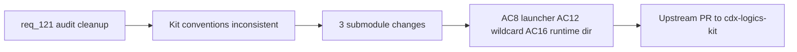

## item_211_kit_harmonization_launcher_convention_wildcard_import_and_runtime_directory_relocation - Kit harmonization — launcher convention, wildcard import, and runtime directory relocation
> From version: 1.18.0
> Schema version: 1.0
> Status: Done
> Understanding: 98%
> Confidence: 96%
> Progress: 100%
> Complexity: Medium
> Theme: Quality
> Reminder: Update status/understanding/confidence/progress and linked task references when you edit this doc.

# Problem
- 34 of 47 SKILL.md files in the Logics kit use `python3` instead of the canonical `python` launcher documented in the README and `logics/instructions.md`.
- `logics_flow.py` uses a wildcard import (`from logics_flow_support import *`) that hinders static analysis and symbol tracing across 88 exported symbols.
- The `logics/skills/logics/` runtime directory (JSONL audit/measurement logs, cache) lives inside the submodule and shares naming with skill packages, causing confusion.
- All three changes touch the kit submodule and require an upstream PR to `cdx-logics-kit`.

# Scope
- In: Update 34 SKILL.md files to use `python` launcher, replace wildcard import with explicit imports of ~15-20 used symbols, relocate runtime state to `logics/.cache/`.
- Out: Plugin TypeScript changes (covered by item_212), `.claude/` bridge changes (covered by item_210), hybrid module split (covered by item_212).

# Acceptance criteria
- AC8: All 47 SKILL.md files use `python` as the canonical launcher, consistent with README and `logics/instructions.md`. Each SKILL.md that currently hardcodes `python3` is updated to `python`, and the README/instructions include an explicit note: "substitute `python3` or `py -3` according to your environment."
- AC12: The wildcard `from logics_flow_support import *` in `logics_flow.py` is replaced with explicit imports of the ~15-20 symbols actually used. Remaining symbols stay accessible via `logics_flow_support.xxx` if needed. A grep identifies the effective usage before the change.
- AC16: The `logics/skills/logics/` runtime directory is relocated to `logics/.cache/` (which already exists with `runtime_index.json`). JSONL audit and measurement files are moved there too. Write paths in `logics_flow_hybrid.py` are updated accordingly. The dot-prefix signals "generated/ignorable" and avoids confusion with skill packages.

# AC Traceability
- AC8 -> req_121 AC8: launcher harmonization. Proof: grep `python3` in `logics/skills/*/SKILL.md` returns zero matches.
- AC12 -> req_121 AC12: wildcard import removal. Proof: grep `import \*` in `logics_flow.py` returns nothing; explicit import block lists only used symbols.
- AC16 -> req_121 AC16: runtime directory relocation. Proof: `logics/skills/logics/` no longer contains runtime state; `logics/.cache/` holds JSONL and cache files; `logics_flow_hybrid.py` write paths updated.

# Decision framing
- Product framing: Not needed
- Architecture framing: Not needed — changes are convention alignment, not architectural.

# Links
- Product brief(s): (none needed)
- Architecture decision(s): (none needed)
- Request: `req_121_audit_cleanup_fix_code_quality_issues_across_plugin_and_logics_kit`

# AI Context
- Summary: Harmonize the Logics kit submodule: update 34 SKILL.md files from `python3` to canonical `python` launcher, replace wildcard import in `logics_flow.py` with explicit imports, and relocate the confusing `logics/skills/logics/` runtime directory to `logics/.cache/`. All changes require an upstream PR.
- Keywords: launcher, python, python3, SKILL.md, wildcard import, logics_flow_support, runtime directory, logics cache, submodule, upstream PR
- Use when: Executing kit-wide convention alignment that requires an upstream PR to cdx-logics-kit.
- Skip when: Working on plugin TypeScript changes or structural refactors.

# References
- `logics/skills/logics-flow-manager/scripts/logics_flow.py`
- `logics/skills/logics-flow-manager/scripts/logics_flow_support.py`
- `logics/skills/logics-flow-manager/scripts/logics_flow_hybrid.py`
- `logics/skills/logics/` (runtime state — to be relocated)
- `logics/.cache/` (target location)

# Priority
- Impact: Medium — reduces confusion and improves static analysis
- Urgency: Low — no functional blocker, but AC16 unblocks req_120 cooldown persistence design

# Notes
- Derived from request `req_121_audit_cleanup_fix_code_quality_issues_across_plugin_and_logics_kit`.
- All 3 ACs modify the kit submodule — changes must be contributed upstream to `cdx-logics-kit` and the submodule pointer updated after merge.
- Completed on 2026-04-04 in `task_110_orchestration_delivery_for_req_120_and_req_121_multi_provider_hybrid_dispatch_and_audit_cleanup`.
