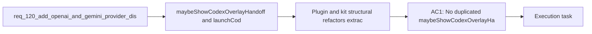

## item_212_plugin_and_kit_structural_refactors_extract_duplications_add_type_safety_decompose_modules_and_add_html_test_coverage - Plugin and kit structural refactors — extract duplications, add type safety, decompose modules, and add HTML test coverage
> From version: 1.18.0
> Schema version: 1.0
> Status: Done
> Understanding: 98%
> Confidence: 95%
> Progress: 100%
> Complexity: High
> Theme: Quality
> Reminder: Update status/understanding/confidence/progress and linked task references when you edit this doc.

# Problem
- `maybeShowCodexOverlayHandoff` and `launchCodexOverlayTerminal` are duplicated in `src/logicsViewProvider.ts` and `src/logicsViewDocumentController.ts` — a maintenance hazard.
- 8 inline `as { ... }` casts on unvalidated Python backend responses in `src/logicsViewProvider.ts` (lines 698-852) silently yield undefined fields if a response is malformed.
- `src/gitRuntime.ts:164` uses dynamic `require("vscode")` for test isolation — fragile and untestable.
- 3 HTML generator files (~1 300 lines combined) have zero dedicated tests.
- `src/logicsViewProvider.ts` at 1 998 lines has multiple cohesive groups that could be extracted.
- The webview message dispatch (30+ cases) has `default: break` with no compile-time exhaustive check.
- `logics_flow_hybrid.py` at 2 375 lines (53 functions) needs decomposition — and is a prerequisite for req_120 provider abstraction.

# Scope
- In: Extract shared overlay logic to `src/logicsOverlaySupport.ts`, add type guards in `src/logicsHybridAssistTypes.ts`, inject config reader in `gitRuntime.ts`, add snapshot tests for HTML generators, decompose `logicsViewProvider.ts`, add discriminated union for message types, split `logics_flow_hybrid.py` into 3 modules.
- Out: Mechanical doc/reference fixes (covered by item_210), kit-wide launcher harmonization (covered by item_211).

# Acceptance criteria
- AC1: No duplicated `maybeShowCodexOverlayHandoff` or `launchCodexOverlayTerminal` — shared logic extracted to `src/logicsOverlaySupport.ts`, both callers delegate to it.
- AC2: All hybrid assist JSON responses from the Python backend are validated at runtime via type guards in `src/logicsHybridAssistTypes.ts`. No bare `as { ... }` casts on external data.
- AC4: `src/gitRuntime.ts` no longer uses dynamic `require("vscode")`; config reading is injected as a function argument.
- AC5: At least snapshot-level tests exist for `logicsHybridInsightsHtml.ts`, `logicsWebviewHtml.ts`, and `logicsReadPreviewHtml.ts`.
- AC6: `src/logicsViewProvider.ts` is decomposed into smaller modules where each module has a single identifiable responsibility (target: no module exceeds ~1 000 lines; the real criterion is one module = one cohesive responsibility, not an arbitrary line count).
- AC13: `logics_flow_hybrid.py` is split into 3 focused modules by responsibility:
  - `logics_flow_hybrid_core.py` — contracts, policy, model resolution, validation (`build_flow_contract`, `validate_hybrid_result`, `build_flow_backend_policy`, etc.)
  - `logics_flow_hybrid_transport.py` — probe, Ollama execution, JSON request, transport failure (`probe_ollama_backend`, `run_ollama_hybrid`, `_json_request`, etc.) — this is where future providers (OpenAI, Gemini) will plug in
  - `logics_flow_hybrid_observability.py` — audit, measurements, ROI, runtime status, insights (`build_hybrid_roi_report`, `build_runtime_status`, `append_jsonl_record`, etc.)
  - `logics_flow_hybrid.py` remains as the public entry point re-exporting public interfaces to avoid breaking existing imports.
- AC17: The webview message dispatch in `logicsViewProvider.ts` uses a discriminated union type for message types so that missing handlers are caught at compile time instead of silently falling through the `default: break`.

# AC Traceability
- AC1 -> req_121 AC1: duplication extraction. Proof: grep confirms single definition in `logicsOverlaySupport.ts`; both callers import from it.
- AC2 -> req_121 AC2: type-safe JSON validation. Proof: grep `as {` in `logicsViewProvider.ts` returns zero matches on hybrid assist payloads; type guards exist in `logicsHybridAssistTypes.ts`.
- AC4 -> req_121 AC4: dependency injection for gitRuntime. Proof: grep `require("vscode")` in `gitRuntime.ts` returns nothing.
- AC5 -> req_121 AC5: HTML generator tests. Proof: test files exist for all 3 generators; `npm test` passes.
- AC6 -> req_121 AC6: provider decomposition. Proof: `logicsViewProvider.ts` delegates hybrid-assist and Codex/bootstrap responsibilities to extracted controllers; shared overlay logic and message parsing moved into dedicated modules with tests green.
- AC13 -> req_121 AC13: hybrid module split. Proof: 3 new modules exist; `logics_flow_hybrid.py` re-exports; all kit tests pass.
- AC17 -> req_121 AC17: discriminated union. Proof: adding a new message type without a handler causes a TypeScript compile error.

# Delivery report
- 2026-04-04: Extracted shared overlay handoff and terminal-launch logic into `src/logicsOverlaySupport.ts`, introduced `src/logicsHybridAssistTypes.ts` and `src/logicsViewMessages.ts` for runtime validation and exhaustive message dispatch, and split `src/logicsViewProvider.ts` responsibilities into `src/logicsHybridAssistController.ts` and `src/logicsCodexWorkflowController.ts`.
- 2026-04-04: Removed dynamic `require("vscode")` from `src/gitRuntime.ts` by injecting the Git config reader from `src/extension.ts`.
- 2026-04-04: Added snapshot coverage for the three HTML builders and updated the provider and git runtime tests to preserve the existing bootstrap and overlay behavior under the new structure.
- 2026-04-04: Split `logics_flow_hybrid.py` into `logics_flow_hybrid_core.py`, `logics_flow_hybrid_transport.py`, and `logics_flow_hybrid_observability.py`, while keeping `logics_flow_hybrid.py` as the public compatibility facade used by `logics_flow.py`.

# Validation report
- `npm run lint`
- `npm run test`
- `python3 -m unittest tests.test_bootstrapper tests.test_logics_flow -v`

# Decision framing
- Product framing: Not needed
- Architecture framing: Not needed — refactoring preserves existing architecture, no new decisions.

# Links
- Product brief(s): (none needed)
- Architecture decision(s): (none needed)
- Request: `req_121_audit_cleanup_fix_code_quality_issues_across_plugin_and_logics_kit`
- Dependency: `req_120_add_openai_and_gemini_provider_dispatch_to_the_hybrid_assist_runtime` — AC13 (hybrid split) must land before req_120 provider abstraction work begins.

# AI Context
- Summary: 7 structural refactors from the audit: extract duplicated overlay logic to `logicsOverlaySupport.ts`, add type guards for hybrid assist JSON in `logicsHybridAssistTypes.ts`, inject config in `gitRuntime.ts`, add HTML generator snapshot tests, decompose `logicsViewProvider.ts`, split `logics_flow_hybrid.py` into core/transport/observability modules, add discriminated union for message dispatch. AC13 is a prerequisite for req_120.
- Keywords: duplication extraction, type guard, dependency injection, snapshot tests, module decomposition, hybrid split, discriminated union, logicsOverlaySupport, logicsHybridAssistTypes, logics_flow_hybrid_core, logics_flow_hybrid_transport, logics_flow_hybrid_observability
- Use when: Executing structural refactors with regression risk from the audit cleanup.
- Skip when: Working on mechanical fixes (item_210) or kit-wide convention alignment (item_211).

# References
- `src/logicsViewProvider.ts`
- `src/logicsViewDocumentController.ts`
- `src/logicsProviderUtils.ts`
- `src/gitRuntime.ts`
- `src/logicsHybridInsightsHtml.ts`
- `src/logicsWebviewHtml.ts`
- `src/logicsReadPreviewHtml.ts`
- `logics/skills/logics-flow-manager/scripts/logics_flow_hybrid.py`

# Priority
- Impact: High — reduces maintenance risk, improves type safety, unblocks req_120
- Urgency: Medium — AC13 (hybrid split) is on req_120's critical path

# Notes
- Derived from request `req_121_audit_cleanup_fix_code_quality_issues_across_plugin_and_logics_kit`.
- AC13 modifies the kit submodule — requires an upstream PR to `cdx-logics-kit`.
- AC6 (provider decomposition) is the highest-risk item: large refactor touching the central file, requires careful test verification.
- AC5 (HTML generator tests) may require JSDOM or snapshot tooling additions.
- Suggested execution order: AC13 (hybrid split, unblocks req_120) -> AC1 (duplication) -> AC4 (gitRuntime) -> AC2 (type guards) -> AC17 (message dispatch) -> AC6 (provider decomposition) -> AC5 (HTML tests).
