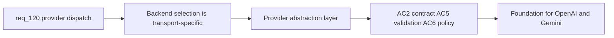

## item_213_refactor_hybrid_backend_selection_around_a_provider_abstraction - Refactor hybrid backend selection around a provider abstraction
> From version: 1.18.0
> Schema version: 1.0
> Status: Ready
> Understanding: 98%
> Confidence: 90%
> Progress: 0%
> Complexity: High
> Theme: Hybrid assist provider abstraction
> Reminder: Update status/understanding/confidence/progress and linked task references when you edit this doc.

# Problem
- Backend selection in the hybrid assist runtime is currently transport-specific: `probe_ollama_backend(...)`, `run_ollama_hybrid(...)`, and direct branching on concrete backend names (`ollama`, `codex`, `deterministic`).
- Adding OpenAI and Gemini as special cases would create a second and third transport-specific path, making the runtime harder to extend and reason about.
- The runtime needs a provider abstraction so probing, execution, and degraded-mode reporting work across multiple providers through one shared contract.

# Scope
- In: Define a provider interface/protocol, refactor Ollama-specific probing and execution behind it, preserve per-flow backend policy, ensure existing flow contracts remain the source of truth for structured payloads.
- Out: Adding actual OpenAI/Gemini transports (item_214), readiness gating (item_215), observability updates (item_216), regression tests (item_217).

# Acceptance criteria
- AC2: Backend selection is refactored around a provider abstraction instead of direct Ollama-specific branching, so probing, execution, and degraded-mode reporting can work across multiple providers through one shared contract.
- AC5: Existing hybrid flow contracts remain the source of truth: provider-specific transports must still return structured payloads validated by the shared flow contract; degraded or invalid remote responses must still fall back safely according to the existing bounded policy model.
- AC6: Backend policy remains explicit per flow, so the runtime can define which flows are: deterministic only, provider-routable under `auto`, Codex-only, or eligible for ordered fallback such as `ollama -> openai -> codex`.

# AC Traceability
- AC2 -> req_120 AC2: provider abstraction refactor. Proof: Ollama probe/execute go through provider interface; no direct `if backend == "ollama"` branching in dispatch path.
- AC5 -> req_120 AC5: preserved contract validation. Proof: provider transport returns are validated by existing flow contract; fallback semantics unchanged.
- AC6 -> req_120 AC6: explicit per-flow policy. Proof: `build_flow_backend_policy` returns ordered provider list; each flow declares its routing constraints.

# Decision framing
- Product framing: Not needed at this stage — no operator-visible changes.
- Architecture framing: Required — this defines the provider contract that all subsequent items depend on.
- Architecture decision refs: `adr_011_keep_hybrid_assist_runtime_contracts_shared_backend_agnostic_and_safely_bounded`

# Links
- Product brief(s): `prod_001_hybrid_assist_operator_experience_for_repetitive_logics_delivery_flows`
- Architecture decision(s): `adr_011_keep_hybrid_assist_runtime_contracts_shared_backend_agnostic_and_safely_bounded`
- Request: `req_120_add_openai_and_gemini_provider_dispatch_to_the_hybrid_assist_runtime`
- Prerequisite: `item_212` AC13 (hybrid module split into core/transport/observability) must land first.

# AI Context
- Summary: Refactor hybrid backend selection from Ollama-specific branching to a provider abstraction layer. Defines the provider interface that OpenAI and Gemini transports will implement. Preserves flow contracts and per-flow backend policy.
- Keywords: provider abstraction, backend selection, provider interface, ollama refactor, flow contract, backend policy, transport layer
- Use when: Implementing the foundational provider abstraction before adding new providers.
- Skip when: Working on specific provider transports or observability updates.

# References
- `logics/skills/logics-flow-manager/scripts/logics_flow_hybrid.py`
- `logics/skills/logics-flow-manager/scripts/logics_flow.py`
- `logics/request/req_121_audit_cleanup_fix_code_quality_issues_across_plugin_and_logics_kit.md`

# Priority
- Impact: High — foundational for all other req_120 items
- Urgency: High — blocks item_214, item_215, item_216, item_217

# Notes
- Derived from request `req_120_add_openai_and_gemini_provider_dispatch_to_the_hybrid_assist_runtime`.
- Depends on item_212 AC13 (hybrid module split) landing first — the provider abstraction should go into the split `logics_flow_hybrid_transport.py` module.
- Default fallback order: `ollama -> openai -> gemini -> codex` (local-first).
