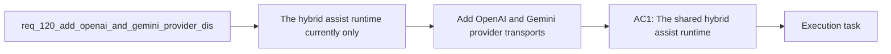

## item_214_add_openai_and_gemini_provider_transports_with_config_and_credential_handling - Add OpenAI and Gemini provider transports with config and credential handling
> From version: 1.18.0
> Schema version: 1.0
> Status: Done
> Understanding: 98%
> Confidence: 96%
> Progress: 100%
> Complexity: High
> Theme: Hybrid assist provider abstraction
> Reminder: Update status/understanding/confidence/progress and linked task references when you edit this doc.

# Problem
- The hybrid assist runtime currently only dispatches to local Ollama or Codex fallback. Operators need direct access to remote providers (OpenAI API, Gemini API) for higher quality responses on specific flows.
- API keys and provider config need a clean separation: secrets in environment variables, behavior in `logics.yaml`.
- Operator-facing commands need explicit provider selection (`auto`, `ollama`, `openai`, `gemini`, `codex`).

# Scope
- In: Implement OpenAI chat/completions transport, implement Gemini generateContent transport, add `.env` loading (minimal inline parser, stdlib-only), add `logics.yaml` provider config, add `--backend openai|gemini` CLI support.
- Out: Provider abstraction layer (item_213), readiness gating (item_215), observability updates (item_216).

# Acceptance criteria
- AC1: The shared hybrid assist runtime supports provider dispatch to `OpenAI API` and `Gemini API` in addition to the existing local `Ollama` path, without requiring either remote provider to be tunneled through Ollama.
- AC3: Operator-facing commands support explicit provider selection for bounded hybrid-assist flows, including at minimum: `auto`, `ollama`, `openai`, `gemini`, `codex` where the flow or policy still permits it.
- AC4: The runtime can authenticate and configure `OpenAI API` and `Gemini API` through repository-safe or environment-based configuration surfaces, including clear handling for missing credentials, invalid models, or unreachable endpoints.
- AC4a: The secret and config contract is separated cleanly: API keys are read from environment variables; a local `.env` can be used as a convenience source for those variables without being committed; `logics.yaml` stores only non-secret provider behavior such as enablement, model defaults, fallback order, and readiness tuning.

# AC Traceability
- AC1 -> req_120 AC1: multi-provider dispatch. Proof: `runtime-status` shows `openai` and `gemini` as available providers; a flow executes through each.
- AC3 -> req_120 AC3: operator provider selection. Proof: `--backend openai` and `--backend gemini` CLI flags work; `auto` follows policy-driven fallback order.
- AC4 -> req_120 AC4: config and credential handling. Proof: missing `OPENAI_API_KEY` produces a clear error; invalid model name is reported; unreachable endpoint triggers fallback.
- AC4a -> req_120 AC4a: secret/config separation. Proof: `logics.yaml` contains no secrets; `.env` is loaded for API keys; `.env` is in `.gitignore`.

# Decision framing
- Product framing: Not needed — no new UI surfaces.
- Architecture framing: Required — defines transport implementations and config contract.
- Architecture decision refs: `adr_011_keep_hybrid_assist_runtime_contracts_shared_backend_agnostic_and_safely_bounded`

# Links
- Product brief(s): `prod_001_hybrid_assist_operator_experience_for_repetitive_logics_delivery_flows`
- Architecture decision(s): `adr_011_keep_hybrid_assist_runtime_contracts_shared_backend_agnostic_and_safely_bounded`
- Request: `req_120_add_openai_and_gemini_provider_dispatch_to_the_hybrid_assist_runtime`
- Prerequisite: `item_213` (provider abstraction) must land first.

# AI Context
- Summary: Implement OpenAI (chat/completions) and Gemini (generateContent) transports behind the provider abstraction. Add `.env` loading with a minimal inline parser (stdlib-only), `logics.yaml` provider config, and `--backend` CLI flag for explicit provider selection.
- Keywords: openai transport, gemini transport, chat completions, generateContent, env loading, logics.yaml, provider config, api key, backend selection
- Use when: Implementing the actual remote provider transports and configuration.
- Skip when: Working on the provider abstraction layer or observability updates.

# References
- `logics/skills/logics-flow-manager/scripts/logics_flow_hybrid.py`
- `logics/skills/logics-flow-manager/scripts/logics_flow_config.py`

# Priority
- Impact: High — core deliverable of req_120
- Urgency: Medium — depends on item_213 landing first

# Notes
- Derived from request `req_120_add_openai_and_gemini_provider_dispatch_to_the_hybrid_assist_runtime`.
- API surface: chat/completions (OpenAI) and generateContent (Gemini) only. No function calling or structured output mode initially.
- `.env` parser: minimal inline (10-15 lines, `KEY=VALUE` without interpolation), no `python-dotenv` dependency.
- No streaming — synchronous request/response with post-response validation.

# Delivery report
- 2026-04-04: Added direct `openai` and `gemini` transport implementations behind the shared provider abstraction, including explicit backend selection, auto routing through the ordered provider policy, and shared contract validation for both remote paths.
- Added minimal `.env` loading plus non-secret provider configuration through `logics.yaml`, keeping API keys out of repo config while exposing provider enablement, base URLs, and default models in a reviewable surface.
- `runtime-status` now reports configured provider availability, and the CLI backend choices now include `openai` and `gemini` across the shared assist commands.

# Validation report
- `python3 -m unittest logics.skills.tests.test_bootstrapper logics.skills.tests.test_logics_flow -v`
- Remote-provider regression coverage now includes explicit OpenAI and Gemini execution, `.env` credential loading, runtime-status provider visibility, and clear missing-credential failures.
