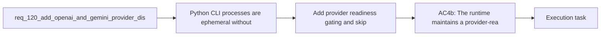

## item_215_add_provider_readiness_gating_and_skip_semantics_for_unconfigured_or_unhealthy_backends - Add provider readiness gating and skip semantics for unconfigured or unhealthy backends
> From version: 1.18.0
> Schema version: 1.0
> Status: Done
> Understanding: 98%
> Confidence: 96%
> Progress: 100%
> Complexity: Medium
> Theme: Hybrid assist provider abstraction
> Reminder: Update status/understanding/confidence/progress and linked task references when you edit this doc.

# Problem
- Python CLI processes are ephemeral — without persisted readiness state, the runtime would probe unavailable providers on every invocation, adding latency and noise.
- Missing credentials, disabled providers, and known-unhealthy backends should be skipped immediately rather than triggering live calls that will fail.

# Scope
- In: Implement provider readiness gate with `logics/.cache/provider_health.json` persistence, bounded cooldown (default 5 min, configurable in `logics.yaml`), skip semantics for missing/disabled/unhealthy providers.
- Out: Provider abstraction (item_213), transport implementations (item_214), observability updates (item_216).

# Acceptance criteria
- AC4b: The runtime maintains a provider-readiness gate so unavailable optional providers are not treated as candidates on every invocation:
  - missing credentials or disabled providers do not trigger live calls;
  - known-unhealthy providers can be skipped for a bounded cooldown or equivalent cached-unavailable period;
  - when no optional provider is viable, the runtime routes directly to the safe fallback path instead of repeatedly attempting dead providers first.

# AC Traceability
- AC4b -> req_120 AC4b: readiness gating. Proof: after a failed probe, `logics/.cache/provider_health.json` records the failure with expiration; subsequent invocations within cooldown skip the provider; after cooldown expires the provider is re-probed.

# Decision framing
- Product framing: Not needed
- Architecture framing: Not needed — uses the provider interface from item_213; persistence is a simple JSON file.

# Links
- Product brief(s): `prod_001_hybrid_assist_operator_experience_for_repetitive_logics_delivery_flows`
- Architecture decision(s): `adr_011_keep_hybrid_assist_runtime_contracts_shared_backend_agnostic_and_safely_bounded`
- Request: `req_120_add_openai_and_gemini_provider_dispatch_to_the_hybrid_assist_runtime`
- Prerequisite: `item_213` (provider abstraction) and `item_214` (transports) should land first.
- Related: `item_211` AC16 (relocate runtime state to `logics/.cache/`) aligns the persistence location.

# AI Context
- Summary: Add provider readiness gating with `logics/.cache/provider_health.json` persistence. Providers that are unconfigured, disabled, or known-unhealthy are skipped during the cooldown window (default 5 min). When no optional provider is viable, the runtime falls back immediately.
- Keywords: readiness gate, provider health, cooldown, skip semantics, provider_health.json, logics cache, persistence
- Use when: Implementing the readiness layer that prevents repeated probing of dead providers.
- Skip when: Working on the provider abstraction or transport implementations.

# References
- `logics/skills/logics-flow-manager/scripts/logics_flow_hybrid.py`
- `logics/skills/logics-flow-manager/scripts/logics_flow_config.py`
- `logics/.cache/`

# Priority
- Impact: Medium — improves operator latency and reduces noise
- Urgency: Low — providers work without it, just with more probe overhead

# Notes
- Derived from request `req_120_add_openai_and_gemini_provider_dispatch_to_the_hybrid_assist_runtime`.
- Default cooldown: 5 minutes, configurable via `logics.yaml` `providers.readiness_cooldown_seconds`.
- Persistence in `logics/.cache/provider_health.json` aligns with item_211 AC16 (runtime state relocation).

# Delivery report
- 2026-04-04: Added persisted provider readiness state in `logics/.cache/provider_health.json`, with bounded cooldown handling for failed remote-provider probes and cache invalidation when the endpoint or model changes.
- Remote providers now skip live probes during the active cooldown window, surface explicit skip reasons such as `openai-cooldown-active`, and still avoid network calls entirely when providers are disabled or missing credentials.
- The readiness settings are now repo-configurable through `logics.yaml` via `hybrid_assist.provider_health_path` and `hybrid_assist.providers.readiness_cooldown_seconds`.

# Validation report
- `python3 -m unittest logics.skills.tests.test_bootstrapper logics.skills.tests.test_logics_flow -v`
- Added regression coverage proving a failed remote probe persists cooldown state, writes `provider_health.json`, and skips a second probe on the next CLI invocation.
