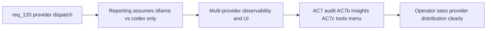

## item_216_update_observability_hybrid_insights_and_plugin_tools_surface_for_multi_provider_dispatch - Update observability, Hybrid Insights, and plugin tools surface for multi-provider dispatch
> From version: 1.18.0
> Schema version: 1.0
> Status: Done
> Understanding: 98%
> Confidence: 96%
> Progress: 100%
> Complexity: High
> Theme: Hybrid assist provider abstraction
> Reminder: Update status/understanding/confidence/progress and linked task references when you edit this doc.

# Problem
- After provider expansion, the observability layer must stop assuming "local versus codex" is the whole story. Audit, measurement, runtime-status, and Hybrid Insights all need provider-aware semantics.
- The plugin Tools menu must remain compact — no one action per provider.
- Operators need to understand when a provider is absent, skipped, in cooldown, or actually used.

# Scope
- In: Update audit/measurement records with provider details, update runtime-status for per-provider availability, update Hybrid Insights HTML for multi-provider distribution, keep Tools menu grouped under a runtime-management surface.
- Out: Provider abstraction (item_213), transport implementations (item_214), readiness gating (item_215).

# Acceptance criteria
- AC7: Observability remains trustworthy after provider expansion:
  - audit records show requested backend, actual backend used, degraded reasons, and transport/provider details;
  - measurement records distinguish local, remote, deterministic, and fallback execution paths;
  - runtime-status can report provider availability separately instead of collapsing all provider failures into one generic degraded bucket;
  - status output makes clear when providers are skipped because they are unconfigured, disabled, in cooldown, or currently unhealthy.
- AC7b: `Hybrid Insights` and adjacent reporting surfaces are updated for the multi-provider model:
  - provider usage charts or summaries distinguish `ollama`, `openai`, `gemini`, `codex`, and `deterministic`;
  - fallback and degraded summaries remain intelligible after provider expansion;
  - the operator can tell whether cost or latency shifts come from remote providers versus local-model offload.
- AC7c: The plugin `Tools` surface remains compact and operator-readable after provider expansion:
  - provider management is grouped under a runtime-oriented surface rather than split into one tool action per provider;
  - workflow actions remain provider-agnostic by default and continue to route through policy-driven `auto`;
  - when provider setup is missing or unhealthy, the menu can surface a compact runtime-management affordance without turning provider choice into toolbar clutter.

# AC Traceability
- AC7 -> req_120 AC7: trustworthy observability. Proof: audit JSONL includes `provider` field; `runtime-status --format json` shows per-provider health; measurement JSONL distinguishes execution paths.
- AC7b -> req_120 AC7b: multi-provider Insights. Proof: Hybrid Insights panel shows provider distribution chart; fallback/degraded summaries are provider-aware.
- AC7c -> req_120 AC7c: compact Tools menu. Proof: no new per-provider tool actions; provider management is under a grouped surface; workflow actions remain provider-agnostic.

# Decision framing
- Product framing: Consider — Hybrid Insights and Tools menu are operator-visible surfaces.
- Architecture framing: Not needed — extends existing patterns.

# Links
- Product brief(s): `prod_001_hybrid_assist_operator_experience_for_repetitive_logics_delivery_flows`
- Architecture decision(s): `adr_011_keep_hybrid_assist_runtime_contracts_shared_backend_agnostic_and_safely_bounded`
- Request: `req_120_add_openai_and_gemini_provider_dispatch_to_the_hybrid_assist_runtime`
- Prerequisite: `item_213` (provider abstraction) and `item_214` (transports) should land first.

# AI Context
- Summary: Update all observability surfaces for multi-provider dispatch: audit/measurement JSONL with provider details, runtime-status with per-provider health, Hybrid Insights with provider distribution charts, and keep the plugin Tools menu compact with grouped provider management.
- Keywords: observability, audit, measurement, runtime status, hybrid insights, provider distribution, tools menu, multi-provider, grouped management
- Use when: Updating reporting and UI surfaces after provider transports are implemented.
- Skip when: Working on the provider abstraction or transport implementations.

# References
- `src/logicsHybridInsightsHtml.ts`
- `src/logicsWebviewHtml.ts`
- `src/logicsViewProvider.ts`
- `media/toolsPanelLayout.js`
- `logics/skills/logics-flow-manager/scripts/logics_flow_hybrid.py`

# Priority
- Impact: High — operators need clear provider visibility
- Urgency: Medium — can ship after transports work but before GA

# Notes
- Derived from request `req_120_add_openai_and_gemini_provider_dispatch_to_the_hybrid_assist_runtime`.

# Delivery report
- 2026-04-04: Extended hybrid observability so measurement records now persist provider-aware execution paths (`local`, `remote`, `deterministic`, `fallback`, `codex-direct`) and the ROI report aggregates those paths alongside requested and used providers.
- `runtime-status` now surfaces compact per-provider readiness details to the plugin, so operators can immediately see which providers are ready and which are blocked by cooldown, missing credentials, or other health reasons.
- Updated the operator-facing UI surfaces to stay compact while becoming provider-aware: `Hybrid Insights` now shows provider mix and execution-path breakdowns, and the `Tools` menu keeps runtime management grouped under `AI Runtime` with `AI Runtime Status` and `AI Provider Insights`.

# Validation report
- `npm run test`
- `python3 -m unittest logics.skills.tests.test_bootstrapper logics.skills.tests.test_logics_flow -v`
- Snapshot and view-provider coverage now assert the provider-aware runtime summary, the renamed `AI Runtime` tools surface, and the expanded `Hybrid Insights` reporting panels.
