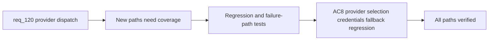

## item_217_add_regression_coverage_for_multi_provider_hybrid_dispatch_and_bounded_fallback - Add regression coverage for multi-provider hybrid dispatch and bounded fallback
> From version: 1.18.0
> Schema version: 1.0
> Status: Ready
> Understanding: 98%
> Confidence: 93%
> Progress: 0%
> Complexity: Medium
> Theme: Hybrid assist provider abstraction
> Reminder: Update status/understanding/confidence/progress and linked task references when you edit this doc.

# Problem
- Adding OpenAI and Gemini providers introduces new dispatch paths, fallback behaviors, and failure modes that must be covered by tests.
- Existing `ollama`, `deterministic`, and `codex` paths must still behave correctly after the refactor.
- Provider selection, policy routing, missing credentials, unreachable providers, and invalid remote payloads all need explicit test coverage.

# Scope
- In: Tests for provider selection and policy routing, missing-credential behavior, unreachable-provider behavior, contract validation after invalid remote payloads, regression tests for existing paths.
- Out: Implementing the provider abstraction or transports (items 213, 214), readiness gating (item_215), observability updates (item_216).

# Acceptance criteria
- AC8: Validation covers at minimum:
  - provider selection and policy routing for `openai` and `gemini`;
  - missing-credential and unreachable-provider behavior;
  - contract validation and bounded fallback after invalid remote payloads;
  - regression coverage proving existing `ollama`, `deterministic`, and `codex` paths still behave correctly.

# AC Traceability
- AC8 -> req_120 AC8: regression and failure-path coverage. Proof: test suite includes cases for each provider selection scenario, credential failure, invalid payload fallback, and all existing backend paths pass.

# Decision framing
- Product framing: Not needed
- Architecture framing: Not needed — tests exercise existing contracts.

# Links
- Product brief(s): (none needed)
- Architecture decision(s): `adr_011_keep_hybrid_assist_runtime_contracts_shared_backend_agnostic_and_safely_bounded`
- Request: `req_120_add_openai_and_gemini_provider_dispatch_to_the_hybrid_assist_runtime`
- Prerequisite: `item_213` (provider abstraction) and `item_214` (transports) must land first.

# AI Context
- Summary: Add regression and failure-path test coverage for multi-provider hybrid dispatch: provider selection routing, missing credentials, unreachable providers, invalid remote payloads, and backward compatibility for existing ollama/deterministic/codex paths.
- Keywords: regression tests, provider selection, missing credentials, unreachable provider, invalid payload, bounded fallback, backward compatibility, test coverage
- Use when: Writing tests after provider transports are implemented.
- Skip when: Working on the provider abstraction, transports, or observability.

# References
- `logics/skills/tests/test_logics_flow.py`
- `logics/skills/logics-flow-manager/scripts/logics_flow_hybrid.py`

# Priority
- Impact: High — validates the entire provider expansion
- Urgency: Medium — should ship alongside or right after transports

# Notes
- Derived from request `req_120_add_openai_and_gemini_provider_dispatch_to_the_hybrid_assist_runtime`.
- Tests should be additive — existing test file `test_logics_flow.py` is extended, not replaced.
