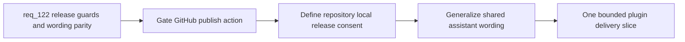

## item_218_harden_release_publish_guards_and_generalize_codex_specific_plugin_surfaces_for_claude_parity - Harden release publish guards and generalize Codex specific plugin surfaces for Claude parity
> From version: 1.21.0
> Schema version: 1.0
> Status: Ready
> Understanding: 96%
> Confidence: 92%
> Progress: 0%
> Complexity: High
> Theme: AI Runtime
> Reminder: Update status/understanding/confidence/progress and linked task references when you edit this doc.

# Problem
- `Publish Release` still relies on a GitHub-specific backend path, but the plugin does not yet make that contract explicit enough in the Tools surface.
- Any future direct helper for maintaining the local `release` branch needs an explicit repository-local consent model before the plugin can safely automate that path.
- Several shared plugin surfaces still sound Codex-only even when the underlying artifact or flow is intended to work for Claude or for a generic assistant session.
- This slice should harden the release and wording contract without widening into a full Tools-menu redesign or a deep Codex-overlay rewrite.

# Scope
- In:
  - gate `Publish Release` on an explicit GitHub-compatible repository check
  - keep `Publish Release` visible but disabled with a precise reason when GitHub publication is unavailable
  - define and implement the repository-local consent contract for any future non-destructive `release` fast-forward helper
  - neutralize Codex-biased wording on shared plugin surfaces while preserving explicit Codex-only and Claude-only labels where appropriate
  - close the minimum shared-surface Claude parity gaps around handoff, context-pack, session-hint, and prompt-routing copy
- Out:
  - replacing the GitHub release backend
  - broad new Assist actions
  - redesigning the whole Tools menu information architecture
  - delivering Codex overlay publication parity for Claude

# Acceptance criteria
- AC1: `Publish Release` is guarded by a concrete GitHub-compatibility check that verifies a valid Git repository, a GitHub-oriented remote, and local `gh` availability before the action is treated as executable.
- AC2: When GitHub release publication is unavailable, `Publish Release` stays visible but disabled with a precise explanation, and the plugin still distinguishes that state from repositories where `Prepare Release` remains useful.
- AC3: The plugin defines the consent contract for the future non-destructive `release` fast-forward helper as repository-local configuration, reviewable and revocable by operators, with no mutation when consent is absent.
- AC4: The consent contract is explicitly narrow: it covers only the future explicit fast-forward helper for `release` and does not imply consent for arbitrary branch mutation or hidden automation.
- AC5: Shared plugin surfaces that already work for Claude and Codex adopt assistant-neutral wording such as `Assistant`, `AI assistant`, or `Assistant session`, while Codex-only and Claude-only surfaces remain explicitly labeled.
- AC6: The delivery closes the minimum shared-surface Claude parity gaps identified in the request, covering guided handoff copy, context-pack labels or actions, session-hint wording, and prompt-routing text that still assumes Codex as the only consumer.
- AC7: The implementation stays backward-compatible with the existing `prepare-release` and `publish-release` runtime contracts and limits changes to plugin gating, consent modeling, parity, and wording.

# AC Traceability
- req122-AC1/AC2/AC3 -> Scope: GitHub-specific publish gating and visible-disabled behavior. Proof: plugin tools surface and assist controller expose `Publish Release` only as executable on GitHub-compatible repos, with explicit disabled messaging elsewhere.
- req122-AC4/AC5/AC6/AC7 -> Scope: repository-local consent contract for future `release` fast-forward helper. Proof: consent model is defined in repo configuration, absent consent prevents mutation, and the contract scope is explicitly narrow.
- req122-AC8/AC9/AC10/AC11/AC12 -> Scope: assistant-neutral wording and shared-surface Claude parity. Proof: shared plugin labels and copy use neutral wording while Codex-only and Claude-only surfaces stay explicitly named.
- req122-AC13/AC14 -> Scope: keep release UX truthful without rewriting runtime contracts. Proof: `Prepare Release` and `Publish Release` remain differentiated and existing shared runtime contracts stay intact.

# Decision framing
- Product framing: Required
- Product signals: navigation and discoverability, experience scope
- Product follow-up: Existing product framing is sufficient for this slice.
- Architecture framing: Required
- Architecture signals: data model and persistence, contracts and integration
- Architecture follow-up: Existing architecture framing is sufficient for this slice.

# Links
- Product brief(s): `prod_002_plugin_hybrid_assist_runtime_visibility_and_action_ux`
- Architecture decision(s): `adr_012_keep_the_vs_code_plugin_as_a_thin_client_over_shared_hybrid_runtime_commands`
- Request: `req_122_harden_release_publish_guards_and_generalize_codex_specific_plugin_surfaces_for_claude_parity`
- Primary task(s): `task_111_orchestration_delivery_for_req_122_and_req_123_across_release_guardrails_assistant_wording_and_environment_diagnostics_clarity`

# AI Context
- Summary: Harden the plugin contract around GitHub release publication, repository-local consent for future `release` maintenance, and assistant-neutral wording on shared surfaces, while keeping Codex-only and Claude-only paths explicitly labeled.
- Keywords: publish release, GitHub, gh, release branch, consent, assistant wording, claude parity, codex wording, context pack, handoff
- Use when: Use when implementing the plugin-side release guardrails, shared wording cleanup, or minimum Claude parity slice defined by `req_122`.
- Skip when: Skip when the work is about broad Tools-menu IA, backend release reimplementation, or Codex overlay parity.

# References
- `src/logicsHybridAssistController.ts`
- `src/logicsWebviewHtml.ts`
- `src/runtimeLaunchers.ts`
- `src/logicsEnvironment.ts`
- `src/logicsViewProvider.ts`
- `src/logicsViewDocumentController.ts`
- `media/renderDetails.js`
- `media/logicsModel.js`
- `media/mainInteractions.js`
- `media/hostApi.js`
- `logics/skills/logics-flow-manager/scripts/logics_flow.py`
- `logics/skills/logics-version-release-manager/scripts/publish_version_release.py`
- `logics/request/req_092_add_a_second_wave_of_hybrid_ollama_or_codex_assist_flows_for_risk_triage_commit_planning_closure_summaries_doc_consistency_checks_and_validation_checklists.md`
- `logics/request/req_093_add_shared_hybrid_assist_contracts_fallback_policy_activation_rules_and_audit_governance_for_logics_delivery_automation.md`
- `logics/request/req_103_separate_optional_claude_bridge_status_from_hybrid_runtime_degradation_and_expand_ollama_first_dispatch_across_supported_flows.md`

# Priority
- Impact: High
- Urgency: Medium

# Notes
- Derived from request `req_122_harden_release_publish_guards_and_generalize_codex_specific_plugin_surfaces_for_claude_parity`.
- Source file: `logics/request/req_122_harden_release_publish_guards_and_generalize_codex_specific_plugin_surfaces_for_claude_parity.md`.
- Keep this backlog item as one bounded delivery slice. The environment-diagnostics UX follow-on is intentionally tracked separately by `item_219`.
