## item_219_make_check_environment_explainable_action_first_and_state_promoted_in_tools - Make Check Environment explainable, action first, and state promoted in Tools
> From version: 1.21.1 (refreshed)
> Schema version: 1.0
> Status: Done
> Understanding: 100% (refreshed)
> Confidence: 100%
> Progress: 100% (refreshed)
> Complexity: High
> Theme: UI
> Reminder: Update status/understanding/confidence/progress and linked task references when you edit this doc.

# Problem
- `Check Environment` already exposes useful status, but the current interaction still leaves operators unsure whether they should click, read, or ignore particular rows.
- The current quick-pick presentation mixes actionable remediation and passive information at the same level, which weakens both comprehension and next-step clarity.
- The Tools surface should promote `Check Environment` more intentionally when repository state, prerequisite gaps, or runtime degradation make it the most useful recovery step.
- This slice should improve explainability and actionability without reopening the whole Tools-menu redesign or inventing a plugin-only diagnostics model.

# Scope
- In:
  - restructure the `Check Environment` surface around a clear hierarchy of summary, recommended actions, current status, and technical details
  - make the first implementation wave work within the current QuickPick model unless a richer view becomes strictly necessary
  - separate actionable rows from passive rows and use operator-readable wording with technical detail in secondary text
  - apply the explicit severity model `Blocked`, `Degraded`, `Info`, `Optional`
  - promote `Check Environment` into `Recommended` only when state actually warrants it
  - add regression coverage for summary presence, action-first ordering, and state-driven recommendation behavior
- Out:
  - broad Tools-menu information-architecture redesign beyond the changes needed to surface `Check Environment` better
  - unrelated new assist or maintenance actions
  - replacing shared runtime diagnostics with a second plugin-only health model

```mermaid
%% logics-kind: backlog
%% logics-signature: backlog|make-check-environment-explainable-actio|req-112-restructure-the-tools-menu-infor|check-environment-already-exposes-useful|ac1-the-first-implementation-wave-stays
flowchart LR
    Request[req_112_restructure_the_tools_menu_informa] --> Problem[Check Environment already exposes useful s]
    Problem --> Scope[Make Check Environment explainable action]
    Scope --> Acceptance[AC1: The first implementation wave stays]
    Acceptance --> Tasks[task_111_orchestration_delivery_for_req_12]
```

# Acceptance criteria
- AC1: The first implementation wave stays within the current QuickPick model unless a richer view is strictly necessary, but it still presents a clearer hierarchy with `Summary`, `Recommended actions`, `Current status`, then `Technical details`.
- AC2: The environment surface clearly distinguishes actionable remediation rows from passive informational rows, and passive rows use operator-readable labels first with technical detail second.
- AC3: The environment surface uses the visible severity classes `Blocked`, `Degraded`, `Info`, and `Optional`, and the healthy state uses explicit calm wording such as `Environment healthy - no action required`.
- AC4: `Check Environment` is promoted into the Tools `Recommended` section only under a restrained policy: when a flow is blocked, when runtime health is degraded, or when a clear repair path exists, but not as a permanent top recommendation for healthy repositories.
- AC5: The implementation includes a secondary detail affordance such as `Open detailed diagnostic report`, or an equivalent explicit path, so advanced operators can reach deeper technical context without crowding the first screen.
- AC6: Regression coverage protects the summary state, action-first ordering, severity treatment, and state-driven `Recommended` promotion behavior for `Check Environment`.

# AC Traceability
- req123-AC1/AC3/AC4/AC9 -> Scope: information hierarchy and first-wave QuickPick delivery. Proof: the rendered diagnostics surface starts with a visible summary and ordered sections for actions, status, and details.
- req123-AC2/AC5/AC6/AC7/AC13 -> Scope: action-versus-info distinction, operator wording, and severity treatment. Proof: remediation rows are clearly clickable, passive rows are explanatory, and visible severity labels follow the requested model.
- req123-AC14 -> Scope: preserve narrow-width and keyboard-friendly diagnostics interaction. Proof: the delivery stays inside the existing QuickPick and Tools-menu model, so operators keep the narrow-pane and keyboard selection behavior instead of being forced into a wider custom diagnostics surface.
- req123-AC8/AC15 -> Scope: healthy-state copy and secondary detail affordance. Proof: healthy diagnostics use calm explicit wording and the surface still offers an opt-in deeper detail path.
- req123-AC10/AC11/AC12/AC16 -> Scope: restrained `Recommended` promotion with regression protection. Proof: Tools-menu recommendation behavior changes with blocked or degraded state and remains subdued on healthy repositories.

# Decision framing
- Product framing: Consider
- Product signals: navigation and discoverability
- Product follow-up: Existing product framing is sufficient for this slice.
- Architecture framing: Not needed
- Architecture signals: extends existing diagnostics rendering and recommendation logic
- Architecture follow-up: Existing architecture framing is sufficient for this slice.

# Links
- Product brief(s): `prod_002_plugin_hybrid_assist_runtime_visibility_and_action_ux`, `prod_003_plugin_tools_menu_and_activity_scanability`
- Architecture decision(s): `adr_012_keep_the_vs_code_plugin_as_a_thin_client_over_shared_hybrid_runtime_commands`
- Request: `req_123_make_check_environment_explainable_action_first_and_state_promoted_in_tools`
- Primary task(s): `task_111_orchestration_delivery_for_req_122_and_req_123_across_release_guardrails_assistant_wording_and_environment_diagnostics_clarity`

# AI Context
- Summary: Rework `Check Environment` so operators first see overall health, recommended actions, current status, and optional technical detail, while also promoting the action into `Recommended` only when current repo or runtime state justifies it.
- Keywords: check environment, quick pick, summary, severity, recommended actions, tools menu, diagnostics wording, recommendation policy
- Use when: Use when implementing environment-diagnostics clarity, recommendation heuristics, or associated regression coverage.
- Skip when: Skip when the work is about unrelated menu IA, backend runtime changes, or new assist commands.

# References
- `src/logicsViewProvider.ts`
- `src/logicsEnvironment.ts`
- `src/logicsHybridAssistController.ts`
- `src/logicsWebviewHtml.ts`
- `media/toolsPanelLayout.js`
- `media/mainInteractions.js`
- `tests/logicsViewProvider.test.ts`
- `tests/logicsHtml.test.ts`
- `logics/request/req_112_restructure_the_tools_menu_information_architecture_without_moving_actions_out_of_the_menu.md`
- `logics/backlog/item_155_extend_plugin_environment_diagnostics_with_hybrid_runtime_health_backend_selection_and_degraded_state_visibility.md`
- `logics/backlog/item_199_restructure_the_tools_menu_information_architecture_without_moving_actions_out_of_the_menu.md`

# Priority
- Impact: High
- Urgency: Medium

# Notes
- Derived from request `req_123_make_check_environment_explainable_action_first_and_state_promoted_in_tools`.
- Source file: `logics/request/req_123_make_check_environment_explainable_action_first_and_state_promoted_in_tools.md`.
- This item intentionally stays focused on environment diagnostics and recommendation behavior. Release guardrails and assistant wording parity are tracked separately by `item_218`.

- Derived from `logics/request/req_123_make_check_environment_explainable_action_first_and_state_promoted_in_tools.md`.
# Delivery report
- 2026-04-04: Reworked `Check Environment` into an action-first QuickPick with explicit `Summary`, `Recommended actions`, `Current status`, and `Technical details` sections, plus a calm healthy-state summary and an `Open detailed diagnostic report` affordance.
- Reworded remediation and status rows into operator-readable language, separated clickable fixes from passive diagnostics, and surfaced runtime, bootstrap, provider, Claude bridge, publish-release, and repo-local `release` consent states more clearly.
- Promoted `Check Environment` into `Recommended` only when repository or runtime state warrants it, and disabled `Publish Release` in the Tools surface with a reason when GitHub publication is unavailable.

# Validation report
- `npm run lint:ts`
- `npm test`
- `npm run test:smoke`
- Added regression coverage for structured environment diagnostics, state-driven `Recommended` promotion, disabled `Publish Release`, and updated webview/html snapshots.
