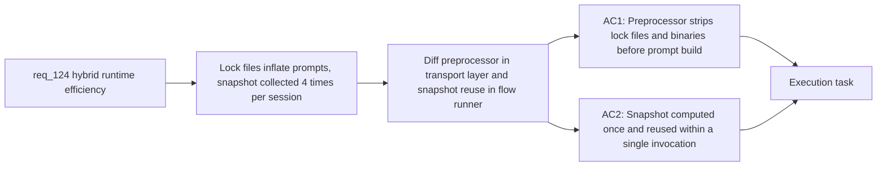

## item_220_diff_preprocessor_and_git_snapshot_reuse_in_hybrid_runtime - Diff preprocessor and git snapshot reuse in hybrid runtime
> From version: 1.21.1
> Schema version: 1.0
> Status: Draft
> Understanding: 93%
> Confidence: 88%
> Progress: 0%
> Complexity: Low
> Theme: Hybrid assist token efficiency
> Reminder: Update status/understanding/confidence/progress and linked task references when you edit this doc.

Derived from `logics/request/req_124_harden_hybrid_assist_runtime_efficiency_with_diff_preprocessing_result_caching_and_profile_aware_fallback.md`

# Problem

Lock files (`package-lock.json`, `yarn.lock`, `Cargo.lock`, `Pipfile.lock`, `poetry.lock`) and binary file stubs reach AI providers unchanged, inflating prompts with thousands of diff lines that carry no semantic value. This waste hits every provider — Ollama, OpenAI, Gemini, and Codex — on every flow.

Separately, `collect_git_snapshot` is called independently at lines 724, 1069, 1154, and 1305 in `logics/skills/logics-flow-manager/scripts/logics_flow.py`, spawning redundant subprocess git commands when nothing has changed between calls in the same execution.

# Scope
- In: diff preprocessor integrated in `build_hybrid_messages_impl` in `logics_flow_hybrid_transport.py`; `collect_git_snapshot` result shared within a single CLI invocation across all chained flows.
- Out: result caching (item_221), profile downgrade (item_222), tier system (item_223).

# Acceptance criteria
- AC1: The hybrid runtime strips lock file diffs (`package-lock.json`, `yarn.lock`, `Cargo.lock`, `Pipfile.lock`, `poetry.lock`) and binary file stubs from the diff content before `build_hybrid_messages_impl` builds prompts. The preprocessor is deterministic, does not modify the working tree, and is skipped gracefully when the diff is empty after stripping.
- AC2: Within a single CLI invocation, `collect_git_snapshot` results are computed once and reused by all flows that run in the same execution context, eliminating redundant subprocess git calls in chained workflows such as `commit-all`.

# AC Traceability
- AC1 -> Maps to req_124 AC1. Proof: `build_hybrid_messages_impl` no longer receives lock file diff lines; unit test asserts stripped prompt is shorter than raw.
- AC2 -> Maps to req_124 AC2. Proof: `collect_git_snapshot` subprocess called exactly once per CLI invocation in an integration test that chains two flows.

# Decision framing
- Product framing: Not needed
- Architecture framing: Not needed

# Links
- Product brief(s): (none yet)
- Architecture decision(s): (none yet)
- Request: `logics/request/req_124_harden_hybrid_assist_runtime_efficiency_with_diff_preprocessing_result_caching_and_profile_aware_fallback.md`
- Primary task(s): `logics/tasks/task_112_orchestration_delivery_for_req_124_to_req_128_across_hybrid_efficiency_claude_parity_and_mermaid_skill.md`

# AI Context
- Summary: Add a diff preprocessor to strip lock files and binaries from hybrid assist prompts, and make collect_git_snapshot reuse its result within a single CLI invocation instead of spawning redundant subprocess calls.
- Keywords: diff preprocessor, lock files, binary stubs, git snapshot, reuse, hybrid transport, build_hybrid_messages_impl, collect_git_snapshot, token reduction
- Use when: Implementing runtime-layer prompt noise reduction and git snapshot deduplication in the hybrid assist flow runner.
- Skip when: Work is about result caching, profile downgrade, or tier-based overlay publishing.

# Priority
- Impact: Medium — affects every hybrid flow, every provider
- Urgency: Normal
