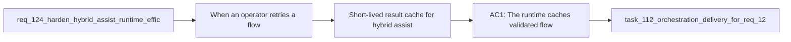

## item_221_short_lived_result_cache_for_hybrid_assist_flows - Short-lived result cache for hybrid assist flows
> From version: 1.21.1 (refreshed)
> Schema version: 1.0
> Status: Done
> Understanding: 100% (refreshed)
> Confidence: 96%
> Progress: 100% (refreshed)
> Complexity: Medium
> Theme: Hybrid assist token efficiency
> Reminder: Update status/understanding/confidence/progress and linked task references when you edit this doc.

Derived from `logics/request/req_124_harden_hybrid_assist_runtime_efficiency_with_diff_preprocessing_result_caching_and_profile_aware_fallback.md`

# Problem

When an operator retries a flow or chains multiple flows back-to-back on an unchanged staging area, the hybrid runtime rebuilds context and dispatches a new AI call each time. For paid remote providers (OpenAI, Gemini) this has a direct monetary cost on every redundant call, with no benefit since the input has not changed.

# Scope
- In: a short-lived result cache in `logics/.cache/flow_results_cache.json` keyed on `sha256(flow_name + diff_fingerprint)` with a configurable TTL (default 5–10 minutes); `cache-hit` logging in the measurement log.
- Out: diff preprocessing (item_220), profile downgrade (item_222), long-lived cross-session caching.

# Acceptance criteria
- AC1: The runtime caches validated flow results in `logics/.cache/flow_results_cache.json` keyed on `sha256(flow_name + diff_fingerprint)` with a configurable TTL (default 5–10 minutes). Cache hits skip the AI call entirely and are logged as `cache-hit` in the measurement log so they are distinguishable from live runs in Hybrid Insights.

# AC Traceability
- AC1 -> Maps to req_124 AC3. Proof: integration test retries the same flow twice on the same diff within TTL; second call produces no AI subprocess and measurement log contains a `cache-hit` entry.

# Decision framing
- Product framing: Not needed
- Architecture framing: Not needed — keep TTL and invalidation semantics explicit in the item, implementation notes, and regression tests.

# Links
- Product brief(s): (none yet)
- Architecture decision(s): (none yet)
- Request: `logics/request/req_124_harden_hybrid_assist_runtime_efficiency_with_diff_preprocessing_result_caching_and_profile_aware_fallback.md`
- Primary task(s): `logics/tasks/task_112_orchestration_delivery_for_req_124_to_req_128_across_hybrid_efficiency_claude_parity_and_mermaid_skill.md`

# AI Context
- Summary: Add a short-lived result cache for hybrid assist flows keyed on sha256 of flow name and diff fingerprint, stored in logics/.cache/flow_results_cache.json with configurable TTL, so repeated calls on an unchanged staging area skip AI dispatch.
- Keywords: result cache, diff fingerprint, sha256, TTL, cache-hit, measurement log, hybrid assist, paid provider, token reduction
- Use when: Implementing flow result deduplication in the hybrid assist runtime to avoid redundant AI calls on identical inputs.
- Skip when: Work is about diff preprocessing, profile downgrade, or snapshot reuse.

# Priority
- Impact: High — direct cost saving on paid providers for teams that retry or chain flows
- Urgency: Normal

# Notes
