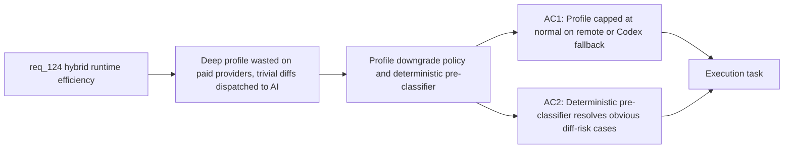

## item_222_profile_downgrade_and_deterministic_pre_classification_for_bounded_flows - Profile downgrade and deterministic pre-classification for bounded flows
> From version: 1.21.1
> Schema version: 1.0
> Status: Done
> Understanding: 100%
> Confidence: 96%
> Progress: 100%
> Complexity: Medium
> Theme: Hybrid assist token efficiency
> Reminder: Update status/understanding/confidence/progress and linked task references when you edit this doc.

Derived from `logics/request/req_124_harden_hybrid_assist_runtime_efficiency_with_diff_preprocessing_result_caching_and_profile_aware_fallback.md`

# Problem

`handoff-packet` uses `profile: deep` regardless of which provider handles the call. When the effective provider is OpenAI, Gemini, or Codex — as primary or fallback — the same expensive context is dispatched unchanged. Additionally, `diff-risk` dispatches an AI call for trivially classifiable cases (lock-file-only diffs, empty diffs, DB migration diffs) where the answer is deterministic.

# Scope
- In: profile cap at `normal` for `handoff-packet` on paid remote or Codex providers, with `--profile deep` override; deterministic pre-classifier for `diff-risk` and `windows-compat-risk` covering lock-file-only, migration, and empty diff patterns.
- Out: result caching (item_221), diff preprocessing (item_220), new flow contracts.

# Acceptance criteria
- AC1: When a flow with `profile: deep` (currently only `handoff-packet`) is dispatched to a paid remote provider (`openai`, `gemini`) or `codex` — whether as primary, auto-selected fallback, or explicit `--backend` override — the runtime automatically caps the context profile at `normal`. The downgrade is logged in the audit record and visible in the degraded-reasons field. An explicit `--profile deep` operator override opts out.
- AC2: Before dispatching `diff-risk` or `windows-compat-risk` to any AI backend, the runtime applies a deterministic pre-classifier: diff containing only lock file or generated file changes → `low` risk; diff touching a DB migration or schema file → `high` risk; empty diff → `low` risk. Pre-classified results are logged as `deterministic-preclassified` in the measurement log.

# AC Traceability
- AC1 -> Maps to req_124 AC4. Proof: audit log entry for a `handoff-packet` run on OpenAI shows `degraded-reasons: profile-downgrade`; `--profile deep` flag bypasses it.
- AC2 -> Maps to req_124 AC5. Proof: `diff-risk` on a lock-file-only diff returns `low` with no AI subprocess and measurement log shows `deterministic-preclassified`.

# Decision framing
- Product framing: Not needed
- Architecture framing: Not needed

# Links
- Product brief(s): (none yet)
- Architecture decision(s): (none yet)
- Request: `logics/request/req_124_harden_hybrid_assist_runtime_efficiency_with_diff_preprocessing_result_caching_and_profile_aware_fallback.md`
- Primary task(s): `logics/tasks/task_112_orchestration_delivery_for_req_124_to_req_128_across_hybrid_efficiency_claude_parity_and_mermaid_skill.md`

# AI Context
- Summary: Cap handoff-packet context profile at normal when the effective provider is OpenAI, Gemini, or Codex, and add a deterministic pre-classifier for diff-risk that resolves lock-file-only, migration, and empty diffs without an AI call.
- Keywords: profile downgrade, deep profile, handoff-packet, deterministic pre-classification, diff-risk, lock files, migration, paid provider, audit log
- Use when: Implementing provider-aware profile selection and deterministic pre-classification for bounded-risk flows.
- Skip when: Work is about result caching, diff preprocessing, or snapshot reuse.

# Priority
- Impact: High — reduces cost on every handoff-packet call to paid providers
- Urgency: Normal
