## item_223_tier_based_selective_skill_overlay_publishing_for_global_kit - Tier-based selective skill overlay publishing for global kit
> From version: 1.21.1 (refreshed)
> Schema version: 1.0
> Status: Done
> Understanding: 100% (refreshed)
> Confidence: 96%
> Progress: 100% (refreshed)
> Complexity: Low
> Theme: Hybrid assist token efficiency
> Reminder: Update status/understanding/confidence/progress and linked task references when you edit this doc.

Derived from `logics/request/req_124_harden_hybrid_assist_runtime_efficiency_with_diff_preprocessing_result_caching_and_profile_aware_fallback.md`

# Problem

The global kit publication (`~/.codex/skills/` and, with req_126, `~/.claude/`) publishes all ~47 skills regardless of relevance. If assistants auto-load SKILL.md files from those directories, the entire skill corpus inflates every session context whether the skills are needed or not.

# Scope
- In: `tier` field (`core` / `optional`) in each skill's `agents/openai.yaml`; publication filters to `core`-only by default; `--include-optional` flag or config opt-in restores full publication; existing skills without a `tier` field default to `core`.
- Out: per-runtime tier differentiation (`codex_tier`, `claude_tier`) — deferred to req_127 item_232; changing the Codex or Claude kit file formats.

```mermaid
%% logics-kind: backlog
%% logics-signature: backlog|tier-based-selective-skill-overlay-publi|req-124-harden-hybrid-assist-runtime-eff|the-global-kit-publication-codex-skills|ac1-the-skill-overlay-publication-contra
flowchart LR
    Request[req_124_harden_hybrid_assist_runtime_effic] --> Problem[The global kit publication .codex skills]
    Problem --> Scope[Tier-based selective skill overlay publish]
    Scope --> Acceptance[AC1: The skill overlay publication contrac]
    Acceptance --> Tasks[task_112_orchestration_delivery_for_req_12]
```

# Acceptance criteria
- AC1: The skill overlay publication contract supports a single `tier` field (`core` or `optional`) in each skill's `agents/openai.yaml`. This field applies to both the Codex global kit and the Claude global kit (req_126). When publishing any global kit, only `core`-tier skills are included by default. An `--include-optional` flag or equivalent config opt-in restores full publication. Existing skills without a `tier` field default to `core`.

# AC Traceability
- AC1 -> Maps to req_124 AC6. Proof: global kit publication script outputs only `core`-tier skill directories; `--include-optional` flag causes optional skills to be included; skills with no `tier` field are treated as `core`.

# Decision framing
- Product framing: Not needed
- Architecture framing: Not needed

# Links
- Product brief(s): (none yet)
- Architecture decision(s): (none yet)
- Request: `logics/request/req_124_harden_hybrid_assist_runtime_efficiency_with_diff_preprocessing_result_caching_and_profile_aware_fallback.md`
- Primary task(s): `logics/tasks/task_112_orchestration_delivery_for_req_124_to_req_128_across_hybrid_efficiency_claude_parity_and_mermaid_skill.md`

# AI Context
- Summary: Add a tier field (core or optional) to agents/openai.yaml for each skill and filter global kit publication to core-only by default, with an --include-optional flag to restore full publication.
- Keywords: tier, core, optional, skill overlay, global kit, agents openai.yaml, publication filter, Codex, Claude
- Use when: Implementing tier-based skill filtering in the global kit publication pipeline for both Codex and Claude runtimes.
- Skip when: Work is about per-runtime tier differentiation (item_232), result caching, or profile downgrade.

# Priority
- Impact: Medium — reduces context inflation in assistant sessions
- Urgency: Normal — prerequisite for item_232 (per-runtime tiers) in req_127

# Notes
