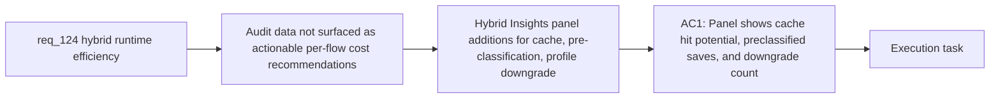

## item_224_actionable_efficiency_recommendations_in_hybrid_insights - Actionable efficiency recommendations in Hybrid Insights
> From version: 1.21.1
> Schema version: 1.0
> Status: Done
> Understanding: 100%
> Confidence: 95%
> Progress: 100%
> Complexity: Medium
> Theme: Hybrid assist token efficiency
> Reminder: Update status/understanding/confidence/progress and linked task references when you edit this doc.

Derived from `logics/request/req_124_harden_hybrid_assist_runtime_efficiency_with_diff_preprocessing_result_caching_and_profile_aware_fallback.md`

# Problem

`hybrid_assist_measurements.jsonl` and `hybrid_assist_audit.jsonl` track every run with backend provenance, but the Hybrid Insights panel shows raw data without translating it into actionable per-flow cost recommendations. Operators cannot easily tell how many calls could have been cached, how many were pre-classified deterministically, or how often the deep profile was downgraded.

# Scope
- In: Hybrid Insights panel additions surfacing: cache effectiveness and repeat-call opportunities (AC3), deterministic pre-classification savings (AC5), and profile downgrade events (AC4) — all sourced from measurement and audit logs.
- Out: recommendations for expanding which flows go through hybrid (covered by req_125); ROI report redesign beyond adding the three new recommendation categories.

# Acceptance criteria
- AC1: The Hybrid Insights panel surfaces actionable efficiency recommendations grounded in the observed audit and measurement data: highlight flows where result caching is already serving repeats or where recent repeat calls indicate additional cache savings opportunities (cache-hit count plus recent cacheable repeat count); highlight flows where deterministic pre-classification resolved cases (AI calls skipped); highlight flows where the `deep` profile was automatically downgraded (provider and downgrade frequency). Recommendations for expanding which flows go hybrid are out of scope.

# AC Traceability
- AC1 -> Maps to req_124 AC7. Proof: Hybrid Insights panel renders at least three new recommendation sections backed by real measurement log data from a session that exercised the cache, pre-classifier, and profile downgrade code paths.

# Decision framing
- Product framing: Not needed
- Architecture framing: Not needed

# Links
- Product brief(s): (none yet)
- Architecture decision(s): (none yet)
- Request: `logics/request/req_124_harden_hybrid_assist_runtime_efficiency_with_diff_preprocessing_result_caching_and_profile_aware_fallback.md`
- Primary task(s): `logics/tasks/task_112_orchestration_delivery_for_req_124_to_req_128_across_hybrid_efficiency_claude_parity_and_mermaid_skill.md`

# AI Context
- Summary: Add actionable efficiency recommendations to the Hybrid Insights panel surfacing cache hit potential, deterministic pre-classification savings, and profile downgrade events from the measurement and audit logs.
- Keywords: Hybrid Insights, efficiency recommendations, cache hit, deterministic pre-classification, profile downgrade, measurement log, audit log, ROI
- Use when: Implementing the observability and recommendation layer for the efficiency optimizations added in items 220-222.
- Skip when: Work is about the efficiency implementations themselves (items 220-222) or about expanding hybrid flow coverage (req_125).

# Priority
- Impact: Medium — improves operator visibility into efficiency gains
- Urgency: Low — depends on items 220-222 being implemented first
