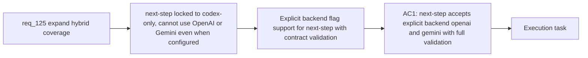

## item_225_enable_next_step_dispatch_to_openai_and_gemini_via_explicit_backend_flag - Enable next-step dispatch to OpenAI and Gemini via explicit backend flag
> From version: 1.21.1+item225
> Schema version: 1.0
> Status: Done
> Understanding: 100%
> Confidence: 95%
> Progress: 100%
> Complexity: Low
> Theme: Hybrid assist provider coverage
> Reminder: Update status/understanding/confidence/progress and linked task references when you edit this doc.

Derived from `logics/request/req_125_expand_hybrid_provider_coverage_to_replace_more_claude_and_codex_interactive_flows.md`

# Problem

`next-step` is the last hybrid flow locked to `codex-only` under the `auto` policy. Teams that have OpenAI or Gemini configured as their primary backend cannot route `next-step` through the cheaper hybrid path — they must consume a full Codex session for every `next-step` call, even when the provider is healthy and the contract is well-defined.

# Scope
- In: `--backend openai` and `--backend gemini` accepted for `next-step` with the same strict contract validation applied to all other hybrid flows; `auto` policy remains `codex-first` (auto policy opt-in deferred to item_234 / req_127).
- Out: changing the `auto` default, new authoring flows (items 226-227), Claude bridge (item_228).

# Acceptance criteria
- AC1: `next-step` is made eligible for explicit `--backend openai` and `--backend gemini` dispatch under the same strict contract validation already applied to all hybrid flows. The `auto` default policy for `next-step` remains `codex-first` — changing the auto default via `logics.yaml` opt-in is deferred to req_127.

# AC Traceability
- AC1 -> Maps to req_125 AC1. Proof: `python3 logics/skills/logics.py next-step --backend openai` dispatches to OpenAI and returns a validated next-step proposal; invalid output from the provider triggers bounded Codex fallback.

# Decision framing
- Product framing: Not needed
- Architecture framing: Not needed

# Links
- Product brief(s): (none yet)
- Architecture decision(s): (none yet)
- Request: `logics/request/req_125_expand_hybrid_provider_coverage_to_replace_more_claude_and_codex_interactive_flows.md`
- Primary task(s): `logics/tasks/task_112_orchestration_delivery_for_req_124_to_req_128_across_hybrid_efficiency_claude_parity_and_mermaid_skill.md`

# AI Context
- Summary: Make next-step eligible for explicit --backend openai and --backend gemini dispatch with the same contract validation applied to all hybrid flows, while keeping the auto default as codex-first.
- Keywords: next-step, openai, gemini, explicit backend, codex-only, hybrid dispatch, contract validation, BACKEND_POLICY_CODEX_ONLY
- Use when: Implementing multi-provider dispatch support for the next-step flow in logics_flow_hybrid.py.
- Skip when: Work is about changing the auto default (item_234), adding authoring flows (items 226-227), or extending the Claude bridge (item_228).

# Priority
- Impact: Medium — unlocks cost saving for teams with OpenAI/Gemini as primary
- Urgency: Normal
