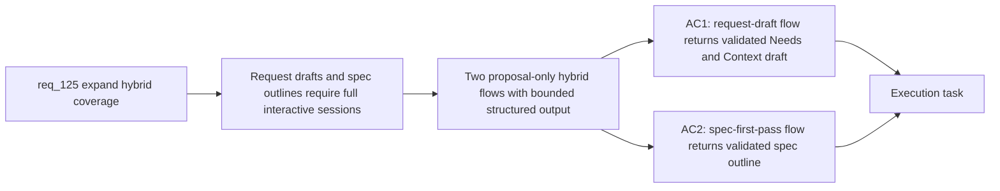

## item_226_add_request_draft_and_spec_first_pass_bounded_authoring_hybrid_flows - Add request-draft and spec-first-pass bounded authoring hybrid flows
> From version: 1.21.1
> Schema version: 1.0
> Status: Draft
> Understanding: 90%
> Confidence: 85%
> Progress: 0%
> Complexity: High
> Theme: Hybrid assist provider coverage
> Reminder: Update status/understanding/confidence/progress and linked task references when you edit this doc.

Derived from `logics/request/req_125_expand_hybrid_provider_coverage_to_replace_more_claude_and_codex_interactive_flows.md`

# Problem

Creating a request doc or drafting a first-pass spec currently requires a full interactive Claude or Codex session. Both tasks have well-defined inputs (user intent, relevant logics context, a backlog item with ACs) and bounded structured outputs — they are strong candidates for cheaper hybrid flows that return a validated proposal without consuming interactive session budget.

# Scope
- In: `request-draft` flow (given short user intent and logics context, returns structured `# Needs` and `# Context` draft); `spec-first-pass` flow (given backlog item and ACs, returns minimal spec outline with sections and open questions). Both flows are strictly `proposal-only` — they return validated JSON and do not write to disk. Execute mode is deferred to item_233 / req_127.
- Out: `backlog-groom` flow (item_227), Claude bridge extension (item_228), file writing from proposal output.

# Acceptance criteria
- AC1: The hybrid runtime adds a `request-draft` flow: given a short user intent and relevant logics context, it produces a structured draft `# Needs` and `# Context` block suitable for a new request doc. The flow is strictly `proposal-only`, returns validated JSON output, conforms to the shared hybrid contract (compact structured input, bounded Codex fallback, audit and measurement logging), and does not write any file to disk.
- AC2: The hybrid runtime adds a `spec-first-pass` flow: given a backlog item and its acceptance criteria, it produces a minimal structured spec outline (sections, open questions, constraints). The flow is strictly `proposal-only`, returns validated JSON output, conforms to the shared hybrid contract, and does not write any file to disk.

# AC Traceability
- AC1 -> Maps to req_125 AC2 (request-draft). Proof: `python3 logics/skills/logics.py request-draft --intent "..."` returns validated JSON with `needs` and `context` keys; measurement log shows the call; no file is written to disk.
- AC2 -> Maps to req_125 AC2 (spec-first-pass). Proof: `python3 logics/skills/logics.py spec-first-pass --backlog item_XXX.md` returns validated JSON with spec sections; no file is written.

# Decision framing
- Product framing: Not needed
- Architecture framing: Not needed

# Links
- Product brief(s): (none yet)
- Architecture decision(s): (none yet)
- Request: `logics/request/req_125_expand_hybrid_provider_coverage_to_replace_more_claude_and_codex_interactive_flows.md`
- Primary task(s): `logics/tasks/task_112_orchestration_delivery_for_req_124_to_req_128_across_hybrid_efficiency_claude_parity_and_mermaid_skill.md`

# AI Context
- Summary: Add two proposal-only bounded hybrid flows — request-draft and spec-first-pass — that replace common interactive Claude or Codex authoring tasks with cheaper hybrid API calls returning validated JSON proposals.
- Keywords: request-draft, spec-first-pass, bounded flow, proposal-only, hybrid assist, authoring, interactive session reduction, validated JSON
- Use when: Implementing the two new authoring hybrid flows in logics_flow_hybrid.py and their flow contracts.
- Skip when: Work is about backlog-groom (item_227), execute mode for authoring flows (item_233), Claude bridge (item_228), or next-step routing (item_225).

# Priority
- Impact: High — replaces the most common interactive authoring operations with cheaper bounded calls
- Urgency: Normal — gated on shared hybrid contract being stable (req_093 / req_120)
