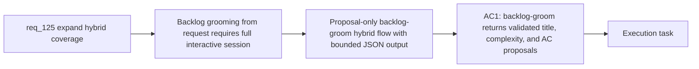

## item_227_add_backlog_groom_bounded_authoring_hybrid_flow - Add backlog-groom bounded authoring hybrid flow
> From version: 1.21.1
> Schema version: 1.0
> Status: Draft
> Understanding: 90%
> Confidence: 85%
> Progress: 0%
> Complexity: Medium
> Theme: Hybrid assist provider coverage
> Reminder: Update status/understanding/confidence/progress and linked task references when you edit this doc.

Derived from `logics/request/req_125_expand_hybrid_provider_coverage_to_replace_more_claude_and_codex_interactive_flows.md`

# Problem

Grooming a backlog item from a request doc — proposing a scoped title, complexity estimate, and AC candidates — currently requires an interactive Claude or Codex session. The task has a well-defined input (a request doc) and a well-defined bounded output (structured JSON proposal), making it an ideal candidate for a cheaper hybrid flow.

# Scope
- In: `backlog-groom` flow (given a request doc, proposes a scoped backlog item title, complexity, and acceptance criteria candidates). Strictly `proposal-only` — returns validated JSON, does not write to disk. Execute mode deferred to item_233 / req_127.
- Out: `request-draft` and `spec-first-pass` (item_226), Claude bridge extension (item_228), file writing.

# Acceptance criteria
- AC1: The hybrid runtime adds a `backlog-groom` flow: given a request doc, it proposes a scoped backlog item title, complexity estimate, and acceptance criteria candidates as a validated JSON proposal. The flow is strictly `proposal-only`, conforms to the shared hybrid contract (compact structured input, bounded Codex fallback, audit and measurement logging), and does not write any file to disk.

# AC Traceability
- AC1 -> Maps to req_125 AC2 (backlog-groom). Proof: `python3 logics/skills/logics.py backlog-groom --request req_XXX.md` returns validated JSON with `title`, `complexity`, and `acceptance_criteria` keys; no file is written; measurement log contains the run.

# Decision framing
- Product framing: Not needed
- Architecture framing: Not needed

# Links
- Product brief(s): (none yet)
- Architecture decision(s): (none yet)
- Request: `logics/request/req_125_expand_hybrid_provider_coverage_to_replace_more_claude_and_codex_interactive_flows.md`
- Primary task(s): `logics/tasks/task_112_orchestration_delivery_for_req_124_to_req_128_across_hybrid_efficiency_claude_parity_and_mermaid_skill.md`

# AI Context
- Summary: Add a proposal-only backlog-groom bounded hybrid flow that takes a request doc and returns a validated JSON proposal with a scoped backlog item title, complexity estimate, and AC candidates, replacing the need for an interactive Claude or Codex session.
- Keywords: backlog-groom, bounded flow, proposal-only, hybrid assist, grooming, request doc, JSON proposal, complexity, acceptance criteria
- Use when: Implementing the backlog-groom hybrid flow in logics_flow_hybrid.py and its flow contract.
- Skip when: Work is about request-draft or spec-first-pass (item_226), execute mode (item_233), or Claude bridge (item_228).

# Priority
- Impact: Medium — useful for teams that groom backlog frequently from request docs
- Urgency: Normal — can ship after item_226 to validate the authoring flow pattern first
