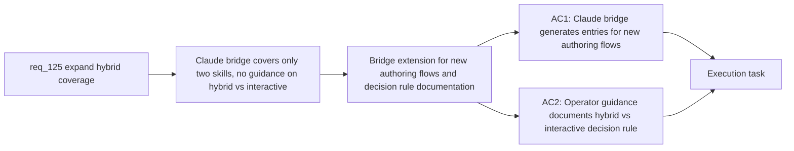

## item_228_extend_claude_bridge_for_new_authoring_flows_and_add_operator_guidance - Extend Claude bridge for new authoring flows and add operator guidance
> From version: 1.21.1
> Schema version: 1.0
> Status: Draft
> Understanding: 88%
> Confidence: 83%
> Progress: 0%
> Complexity: Low
> Theme: Hybrid assist provider coverage
> Reminder: Update status/understanding/confidence/progress and linked task references when you edit this doc.

Derived from `logics/request/req_125_expand_hybrid_provider_coverage_to_replace_more_claude_and_codex_interactive_flows.md`

# Problem

The Claude bridge (`src/claudeBridgeSupport.ts`) currently only wires two skills — `hybrid-assist` and `flow-manager` — to `.claude/commands/` and `.claude/agents/`. When Claude is invoked for the new authoring tasks added in items 226-227, it handles them inline in the interactive session instead of delegating to the cheaper hybrid flows. Operators also have no clear guidance on when to use a hybrid flow versus an interactive session.

# Scope
- In: `CLAUDE_BRIDGE_VARIANTS` extended in `src/claudeBridgeSupport.ts` to generate bridge entries for the flows landing in items 226-227 (`request-draft`, `spec-first-pass`, `backlog-groom`); operator guidance (logics.yaml comments or inline doc) establishing the hybrid-vs-interactive decision rule.
- Out: global Claude kit publication (req_126 / items 229-231); Claude bridge for next-step explicit dispatch (could be added with item_225 or deferred).

# Acceptance criteria
- AC1: The Claude bridge (`repairClaudeBridgeFiles` in `src/claudeBridgeSupport.ts`) is extended to generate `.claude/commands/` and `.claude/agents/` entries for at least the skills whose hybrid flows land in items 226-227, so Claude automatically delegates those bounded tasks to the hybrid runtime instead of handling them inline. Each new bridge entry includes an explicit reviewer nudge prompting the operator to validate before committing the output.
- AC2: Operator documentation or inline `logics.yaml` guidance establishes a clear decision rule: use a hybrid flow when the task has a well-defined input, a bounded structured output, and does not require multi-turn reasoning or repo-wide code understanding; use an interactive session otherwise.

# AC Traceability
- AC1 -> Maps to req_125 AC3. Proof: after `repairClaudeBridgeFiles`, `.claude/commands/` contains entries for `request-draft`, `spec-first-pass`, and `backlog-groom`; each entry contains a reviewer nudge.
- AC2 -> Maps to req_125 AC4. Proof: `logics.yaml` or a doc in `logics/` contains the decision rule text and is referenced from `logics/instructions.md` or SKILL.md.

# Decision framing
- Product framing: Not needed
- Architecture framing: Not needed

# Links
- Product brief(s): (none yet)
- Architecture decision(s): (none yet)
- Request: `logics/request/req_125_expand_hybrid_provider_coverage_to_replace_more_claude_and_codex_interactive_flows.md`
- Primary task(s): `logics/tasks/task_112_orchestration_delivery_for_req_124_to_req_128_across_hybrid_efficiency_claude_parity_and_mermaid_skill.md`

# AI Context
- Summary: Extend CLAUDE_BRIDGE_VARIANTS in claudeBridgeSupport.ts to wire the new authoring hybrid flows (request-draft, spec-first-pass, backlog-groom) into the Claude bridge, and add operator guidance establishing when to use hybrid flows versus interactive sessions.
- Keywords: Claude bridge, CLAUDE_BRIDGE_VARIANTS, repairClaudeBridgeFiles, request-draft, spec-first-pass, backlog-groom, operator guidance, hybrid vs interactive, reviewer nudge
- Use when: Extending the Claude bridge after the authoring hybrid flows (items 226-227) are implemented.
- Skip when: Work is about the authoring flow implementations themselves (items 226-227) or the global Claude kit (items 229-231).

# Priority
- Impact: Medium — makes hybrid flows accessible directly from Claude sessions
- Urgency: Low — depends on items 226-227 being implemented first
