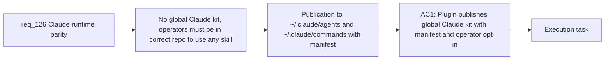

## item_229_publish_global_claude_kit_to_claude_agents_and_commands_directories - Publish global Claude kit to ~/.claude agents and commands directories
> From version: 1.21.1+item229
> Schema version: 1.0
> Status: Done
> Understanding: 98%
> Confidence: 91%
> Progress: 100%
> Complexity: High
> Theme: Claude and Codex runtime parity
> Reminder: Update status/understanding/confidence/progress and linked task references when you edit this doc.

Derived from `logics/request/req_126_achieve_claude_runtime_parity_with_the_codex_overlay_and_launcher_model.md`

# Problem

There is no global Claude kit equivalent to the Codex global kit published to `~/.codex/skills/`. Claude operators must be in the correct repository with working bridge files to access any Logics skill — they cannot launch Claude from an arbitrary directory the way Codex operators can.

# Scope
- In: publication of Logics skills to `~/.claude/agents/` and `~/.claude/commands/` using the same format already produced by `claudeBridgeSupport.ts`; manifest file `~/.claude/logics-global-kit-claude.json` mirroring the Codex manifest contract; explicit operator opt-in required before first publication.
- Out: health status model and launcher check (item_230), plugin UI symmetry (item_231), shared publication lifecycle abstraction (item_235 / req_127).

# Acceptance criteria
- AC1: The plugin can publish a global Claude kit to `~/.claude/agents/` and `~/.claude/commands/` using the Logics skills available in the current repository. Publication uses the same format already produced by `claudeBridgeSupport.ts` for repo-local bridge files. A manifest (`logics-global-kit-claude.json`) is written to `~/.claude/` to track version, source revision, and publication timestamp, mirroring the `logics-global-kit.json` contract used for Codex. Publication requires explicit operator opt-in before first run.

# AC Traceability
- AC1 -> Maps to req_126 AC1. Proof: after opt-in and publication, `~/.claude/agents/` contains agent markdown files for each Logics skill and `~/.claude/logics-global-kit-claude.json` exists with correct version and timestamp fields.

# Decision framing
- Product framing: Not needed
- Architecture framing: Not needed

# Links
- Product brief(s): (none yet)
- Architecture decision(s): (none yet)
- Request: `logics/request/req_126_achieve_claude_runtime_parity_with_the_codex_overlay_and_launcher_model.md`
- Primary task(s): `logics/tasks/task_112_orchestration_delivery_for_req_124_to_req_128_across_hybrid_efficiency_claude_parity_and_mermaid_skill.md`

# AI Context
- Summary: Implement global Claude kit publication to ~/.claude/agents/ and ~/.claude/commands/ using the existing claudeBridgeSupport.ts format, with a manifest file mirroring the Codex global kit contract and an explicit operator opt-in before first publication.
- Keywords: global Claude kit, ~/.claude/agents, ~/.claude/commands, logics-global-kit-claude.json, manifest, publication, opt-in, claudeBridgeSupport, logicsCodexWorkspace
- Use when: Implementing the Claude global kit publication lifecycle in src/logicsCodexWorkspace.ts or a new parallel module.
- Skip when: Work is about health status and launcher alignment (item_230), plugin UI (item_231), or the shared abstraction refactoring (item_235).

# Priority
- Impact: High — removes the biggest asymmetry between Claude and Codex operator experience
- Urgency: Normal — prerequisite for items 230 and 231
