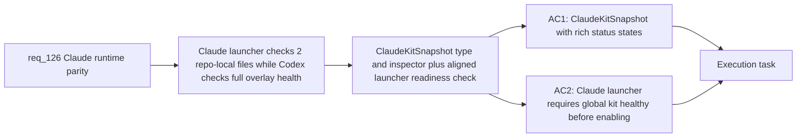

## item_230_claude_global_kit_health_status_model_and_aligned_launcher_readiness_check - Claude global kit health status model and aligned launcher readiness check
> From version: 1.21.1
> Schema version: 1.0
> Status: Draft
> Understanding: 90%
> Confidence: 87%
> Progress: 0%
> Complexity: Medium
> Theme: Claude and Codex runtime parity
> Reminder: Update status/understanding/confidence/progress and linked task references when you edit this doc.

Derived from `logics/request/req_126_achieve_claude_runtime_parity_with_the_codex_overlay_and_launcher_model.md`

# Problem

The Claude launcher in `src/runtimeLaunchers.ts` checks only whether two repo-local bridge files exist (`claudeBridge?.available`), while the Codex launcher checks full overlay health (`codexOverlay.status === "healthy"`). With the global Claude kit introduced in item_229, the Claude launcher must check global kit health equivalently, and the plugin must expose a rich status model (healthy/stale/missing) instead of a boolean.

# Scope
- In: `ClaudeKitSnapshot` type with `healthy`, `stale`, `missing-overlay`, `missing-manager`, and `unavailable` states (equivalent to `CodexOverlaySnapshot`); Claude launcher updated to require global kit healthy before enabling; `inspectClaudeGlobalKit()` function derived from the Codex manifest inspection pattern; health status surfaced in environment check output and tools panel.
- Out: global kit publication (item_229), plugin UI symmetry (item_231), shared abstraction (item_235).

# Acceptance criteria
- AC1: The plugin exposes a health status for the global Claude kit equivalent to `CodexOverlaySnapshot` in `src/logicsCodexWorkspace.ts`: `healthy`, `stale`, `missing-overlay`, `missing-manager`, or `unavailable`. This status is reported in the environment check output and in the plugin tools panel alongside the existing Codex overlay status.
- AC2: The Claude launcher in `src/runtimeLaunchers.ts` checks the global Claude kit health status (analogous to `codexOverlay.status`) in addition to CLI availability, so it becomes ready only when the global kit is published and current — not just when two repo-local bridge files are present.

# AC Traceability
- AC1 -> Maps to req_126 AC3. Proof: `checkEnvironment` output includes a `claudeGlobalKit` section with a status value from the valid set; stale manifest produces `stale`; missing manifest produces `missing-overlay`.
- AC2 -> Maps to req_126 AC2. Proof: Claude launcher button is disabled when global kit status is `stale` or `missing-overlay`; it is enabled only when `healthy`.

# Decision framing
- Product framing: Not needed
- Architecture framing: Not needed

# Links
- Product brief(s): (none yet)
- Architecture decision(s): (none yet)
- Request: `logics/request/req_126_achieve_claude_runtime_parity_with_the_codex_overlay_and_launcher_model.md`
- Primary task(s): `logics/tasks/task_112_orchestration_delivery_for_req_124_to_req_128_across_hybrid_efficiency_claude_parity_and_mermaid_skill.md`

# AI Context
- Summary: Add a ClaudeKitSnapshot type with rich health states (healthy/stale/missing-overlay/missing-manager/unavailable) mirroring CodexOverlaySnapshot, update the Claude launcher to check global kit health instead of two repo-local files, and surface the status in environment check and tools panel.
- Keywords: ClaudeKitSnapshot, CodexOverlaySnapshot, health status, launcher readiness, runtimeLaunchers.ts, claudeBridge, global Claude kit, environment check
- Use when: Implementing the Claude global kit health inspection and launcher alignment after item_229 publication is in place.
- Skip when: Work is about global kit publication (item_229), plugin UI symmetry (item_231), or the shared abstraction (item_235).

# Priority
- Impact: High — makes the Claude launcher trustworthy and equivalent to Codex
- Urgency: Normal — depends on item_229 being implemented first
