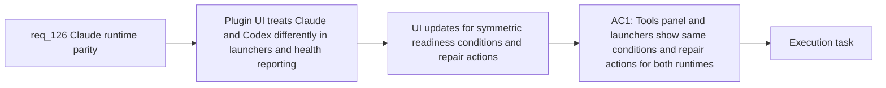

## item_231_symmetric_plugin_ui_for_claude_and_codex_launchers_and_health_reporting - Symmetric plugin UI for Claude and Codex launchers and health reporting
> From version: 1.21.1+item231
> Schema version: 1.0
> Status: Done
> Understanding: 96%
> Confidence: 90%
> Progress: 100%
> Complexity: Medium
> Theme: Claude and Codex runtime parity
> Reminder: Update status/understanding/confidence/progress and linked task references when you edit this doc.

Derived from `logics/request/req_126_achieve_claude_runtime_parity_with_the_codex_overlay_and_launcher_model.md`

# Problem

The plugin tools panel, environment check output, and launcher buttons treat Claude and Codex differently. Codex shows rich health status and repair actions; Claude shows a basic available/unavailable boolean. After items 229 and 230 establish the global Claude kit and its health model, the UI must be updated to present both runtimes with the same structure and repair options.

# Scope
- In: tools panel, environment check, and launcher button updates to show the same readiness conditions (CLI on PATH + global kit healthy) and same repair actions (publish, repair, refresh) for both runtimes; assistant-agnostic labels where behaviour is identical, assistant-specific labels only where implementations differ (e.g. `~/.codex` vs `~/.claude`).
- Out: global kit publication (item_229), health status model (item_230), shared abstraction (item_235).

# Acceptance criteria
- AC1: The plugin UI (tools panel, environment check, launcher buttons) treats Claude and Codex symmetrically: both launchers show the same readiness conditions (CLI on PATH + global kit healthy); both show the same categories of repair action when the kit is stale or missing; wording uses assistant-agnostic labels where the behavior is identical and assistant-specific labels only where the implementation genuinely differs (for example, `~/.codex` versus `~/.claude`).

# AC Traceability
- AC1 -> Maps to req_126 AC5. Proof: visual review confirms both Claude and Codex launcher buttons have equivalent readiness indicators, repair buttons, and environment check entries; no Codex-specific language appears for behavior that is identical across both runtimes.

# Decision framing
- Product framing: Not needed
- Architecture framing: Not needed

# Links
- Product brief(s): (none yet)
- Architecture decision(s): (none yet)
- Request: `logics/request/req_126_achieve_claude_runtime_parity_with_the_codex_overlay_and_launcher_model.md`
- Primary task(s): `logics/tasks/task_112_orchestration_delivery_for_req_124_to_req_128_across_hybrid_efficiency_claude_parity_and_mermaid_skill.md`

# AI Context
- Summary: Update the plugin tools panel, environment check output, and launcher buttons to present Claude and Codex runtimes symmetrically with the same readiness conditions, health indicators, and repair actions after the global Claude kit (item_229) and health model (item_230) are in place.
- Keywords: plugin UI, tools panel, launcher buttons, environment check, symmetric, Claude, Codex, readiness conditions, repair actions, assistant-agnostic labels
- Use when: Updating the VSCode extension UI to reflect Claude runtime parity after items 229 and 230 are complete.
- Skip when: Work is about global kit publication (item_229), health status model (item_230), or the shared abstraction (item_235).

# Priority
- Impact: Medium — improves operator experience and removes confusing asymmetry
- Urgency: Low — depends on items 229 and 230 being implemented first
