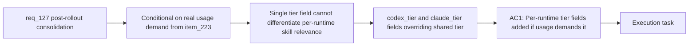

## item_232_per_runtime_skill_tier_fields_codex_tier_and_claude_tier_if_usage_demands_it - Per-runtime skill tier fields codex_tier and claude_tier if usage demands it
> From version: 1.21.1
> Schema version: 1.0
> Status: Draft
> Understanding: 85%
> Confidence: 80%
> Progress: 0%
> Complexity: Low
> Theme: Hybrid assist and kit publication consolidation
> Reminder: Update status/understanding/confidence/progress and linked task references when you edit this doc.

Derived from `logics/request/req_127_consolidate_deferred_hybrid_and_kit_publication_improvements_after_initial_rollout.md`

# Problem

The single `tier` field (`core` / `optional`) introduced in item_223 applies uniformly to both Codex and Claude kit publication. If real production usage reveals that a skill is essential for one runtime but noisy for the other (e.g. a Python-heavy skill useful in Codex sessions but irrelevant in Claude sessions), there is no way to express per-runtime tier preferences without changing the shared field.

**This item is conditional** — it must only be implemented if real production usage of item_223 produces this specific need. Do not implement speculatively.

# Scope
- In: `codex_tier` and `claude_tier` optional fields in `agents/openai.yaml` that override the shared `tier` field for each runtime independently; shared `tier` remains the default when neither per-runtime field is set.
- Out: redesigning the tier system itself; changing the shared `tier` field semantics; any implementation before production usage evidence materialises.

# Acceptance criteria
- AC1 (conditional): If production usage of item_223 reveals that operators need different tier assignments per runtime, the `agents/openai.yaml` skill contract is extended with `codex_tier` and `claude_tier` fields that override the shared `tier` field for each runtime independently. The shared `tier` field remains the default when neither per-runtime field is set. This AC is skipped entirely if no real usage demand materialises.

# AC Traceability
- AC1 -> Maps to req_127 AC1. Proof: a skill with `codex_tier: core` and `claude_tier: optional` is included in the Codex global kit and excluded from the Claude global kit by default.

# Decision framing
- Product framing: Not needed
- Architecture framing: Not needed

# Links
- Product brief(s): (none yet)
- Architecture decision(s): (none yet)
- Request: `logics/request/req_127_consolidate_deferred_hybrid_and_kit_publication_improvements_after_initial_rollout.md`
- Primary task(s): `logics/tasks/task_112_orchestration_delivery_for_req_124_to_req_128_across_hybrid_efficiency_claude_parity_and_mermaid_skill.md`

# AI Context
- Summary: Conditionally add codex_tier and claude_tier fields to agents/openai.yaml that allow per-runtime tier overrides when the shared tier field proves insufficient, only if real production usage of item_223 demonstrates the need.
- Keywords: per-runtime tier, codex_tier, claude_tier, agents openai.yaml, skill overlay, conditional, production usage
- Use when: Extending the tier system after item_223 is live in production and operators have reported the need for per-runtime differentiation.
- Skip when: item_223 has not shipped yet, or no real usage demand has been reported.

# Priority
- Impact: Low — conditional on usage evidence; do not implement speculatively
- Urgency: Low — gated on item_223 shipping and real usage materialising
