## item_233_execute_mode_for_hybrid_authoring_flows_request_draft_spec_first_pass_backlog_groom - Execute mode for hybrid authoring flows request-draft spec-first-pass backlog-groom
> From version: 1.21.1 (refreshed)
> Schema version: 1.0
> Status: Done
> Understanding: 100% (refreshed)
> Confidence: 96%
> Progress: 100% (refreshed)
> Complexity: Medium
> Theme: Hybrid assist and kit publication consolidation
> Reminder: Update status/understanding/confidence/progress and linked task references when you edit this doc.

Derived from `logics/request/req_127_consolidate_deferred_hybrid_and_kit_publication_improvements_after_initial_rollout.md`

# Problem

The authoring hybrid flows introduced in items 226-227 (`request-draft`, `spec-first-pass`, `backlog-groom`) are strictly `proposal-only` — they return validated JSON but do not write files. Operators must manually take the output and create the actual logics doc. A `--execution-mode execute` path that creates the doc from the validated proposal would close the loop, mirroring the pattern already in `commit-all` and `prepare-release`.

**Gated on** items 226-227 being live in production and their contracts validated with real operator input.

# Scope
- In: `--execution-mode execute` flag for `request-draft`, `spec-first-pass`, and `backlog-groom` that creates the actual logics doc on disk from the validated proposal output; explicit operator confirmation step before file is written; `proposal-only` mode remains the default.
- Out: the proposal-only flows themselves (items 226-227); redesigning the flow contracts; silent file mutation without operator confirmation.

```mermaid
%% logics-kind: backlog
%% logics-signature: backlog|execute-mode-for-hybrid-authoring-flows-|req-127-consolidate-deferred-hybrid-and-|the-authoring-hybrid-flows-introduced-in|ac1-the-hybrid-authoring-flows-request-d
flowchart LR
    Request[req_127_consolidate_deferred_hybrid_and_ki] --> Problem[The authoring hybrid flows introduced in]
    Problem --> Scope[Execute mode for hybrid authoring flows]
    Scope --> Acceptance[AC1: The hybrid authoring flows request-dr]
    Acceptance --> Tasks[task_112_orchestration_delivery_for_req_12]
```

# Acceptance criteria
- AC1: The hybrid authoring flows (`request-draft`, `spec-first-pass`, `backlog-groom`) gain a `--execution-mode execute` path that creates the actual logics doc on disk from the validated proposal output, equivalent to the execution mode already available for `commit-all` and `prepare-release`. The operator must explicitly confirm the output before the file is written — silent execution is not acceptable. The proposal-only mode remains the default; execute mode requires an explicit flag.

# AC Traceability
- AC1 -> Maps to req_127 AC2. Proof: `python3 logics/skills/logics.py request-draft --intent "..." --execution-mode execute` prompts for confirmation and writes the logics doc to `logics/request/` on acceptance; proposal-only mode (default) returns JSON without writing.

# Decision framing
- Product framing: Not needed
- Architecture framing: Not needed

# Links
- Product brief(s): (none yet)
- Architecture decision(s): (none yet)
- Request: `logics/request/req_127_consolidate_deferred_hybrid_and_kit_publication_improvements_after_initial_rollout.md`
- Primary task(s): `logics/tasks/task_112_orchestration_delivery_for_req_124_to_req_128_across_hybrid_efficiency_claude_parity_and_mermaid_skill.md`

# AI Context
- Summary: Add --execution-mode execute to the request-draft, spec-first-pass, and backlog-groom hybrid flows so they can optionally create the actual logics doc from a validated proposal, with explicit operator confirmation before any file is written.
- Keywords: execute mode, execution-mode, request-draft, spec-first-pass, backlog-groom, proposal-only, operator confirmation, file creation, hybrid flow
- Use when: Extending the authoring hybrid flows with file-writing capability after items 226-227 have been validated in production.
- Skip when: The authoring flows (items 226-227) are not yet live or their contracts have not been validated.

# Priority
- Impact: High — eliminates the manual copy-paste step from proposal to logics doc
- Urgency: Low — gated on items 226-227 production validation

# Notes
