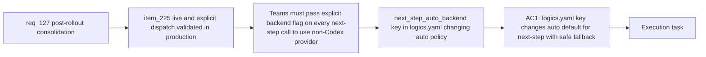

## item_234_next_step_auto_backend_opt_in_via_logics_yaml_next_step_auto_backend_key - next-step auto backend opt-in via logics.yaml next_step_auto_backend key
> From version: 1.21.1
> Schema version: 1.0
> Status: Done
> Understanding: 100%
> Confidence: 96%
> Progress: 100%
> Complexity: Low
> Theme: Hybrid assist and kit publication consolidation
> Reminder: Update status/understanding/confidence/progress and linked task references when you edit this doc.

Derived from `logics/request/req_127_consolidate_deferred_hybrid_and_kit_publication_improvements_after_initial_rollout.md`

# Problem

After item_225 ships, teams can route `next-step` to OpenAI or Gemini using `--backend openai` or `--backend gemini` explicitly. Teams that use OpenAI or Gemini as their primary provider must pass `--backend` on every `next-step` call — there is no way to change the `auto` default for their setup without modifying the source. A `logics.yaml` opt-in key would let these teams change the default once.

**Gated on** item_225 being live and explicit dispatch having been validated in production.

# Scope
- In: `next_step_auto_backend` key in `logics.yaml` (e.g. `next_step_auto_backend: openai`) that changes the `auto` policy for `next-step` from `codex-first` to the specified provider; key is ignored with a logged warning if the specified provider is not configured or not healthy, falling back to `codex`.
- Out: changing `next-step` contract validation; applying the opt-in to other flows; silent behaviour change without documentation.

# Acceptance criteria
- AC1: The `logics.yaml` configuration supports a `next_step_auto_backend` key (e.g. `next_step_auto_backend: openai`) that changes the `auto` policy for `next-step` from `codex-first` to the specified provider for teams that have validated explicit `--backend` dispatch in production. The key is ignored if the specified provider is not configured or not healthy, falling back to `codex` with a logged warning.

# AC Traceability
- AC1 -> Maps to req_127 AC3. Proof: `logics.yaml` with `next_step_auto_backend: openai` causes `next-step` (without `--backend` flag) to dispatch to OpenAI; if OpenAI is unhealthy, falls back to Codex and logs a warning; removing the key restores `codex-first` default.

# Decision framing
- Product framing: Not needed
- Architecture framing: Not needed

# Links
- Product brief(s): (none yet)
- Architecture decision(s): (none yet)
- Request: `logics/request/req_127_consolidate_deferred_hybrid_and_kit_publication_improvements_after_initial_rollout.md`
- Primary task(s): `logics/tasks/task_112_orchestration_delivery_for_req_124_to_req_128_across_hybrid_efficiency_claude_parity_and_mermaid_skill.md`

# AI Context
- Summary: Add next_step_auto_backend key to logics.yaml that lets teams change the auto policy for next-step from codex-first to OpenAI or Gemini, with safe fallback to Codex when the specified provider is unavailable.
- Keywords: next_step_auto_backend, logics.yaml, auto policy, next-step, codex-first, openai, gemini, opt-in, config key
- Use when: Extending logics_flow_config.py and the next-step routing logic to read and apply the logics.yaml opt-in key after item_225 is validated in production.
- Skip when: item_225 has not shipped yet or explicit dispatch has not been validated in production.

# Priority
- Impact: Medium — quality-of-life improvement for teams that use OpenAI/Gemini as primary
- Urgency: Low — gated on item_225 production validation
