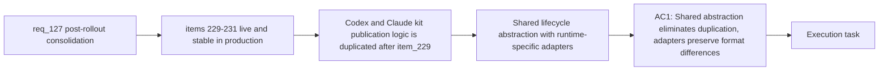

## item_235_shared_publication_lifecycle_abstraction_for_codex_and_claude_global_kit - Shared publication lifecycle abstraction for Codex and Claude global kit
> From version: 1.21.1+traceability
> Schema version: 1.0
> Status: Done
> Understanding: 100%
> Confidence: 94%
> Progress: 100%
> Complexity: High
> Theme: Hybrid assist and kit publication consolidation
> Reminder: Update status/understanding/confidence/progress and linked task references when you edit this doc.

Derived from `logics/request/req_127_consolidate_deferred_hybrid_and_kit_publication_improvements_after_initial_rollout.md`

# Problem

Item_229 (global Claude kit) deliberately duplicates the publication lifecycle logic from `logicsCodexWorkspace.ts` to avoid touching the stable Codex path during first delivery. Once both paths are live and validated, this duplication becomes tech debt. The same inspect → publish → manifest → report lifecycle is implemented twice, increasing maintenance risk whenever the lifecycle changes.

**Gated on** items 229-231 (Claude kit) being live and stable in production.

# Scope
- In: shared internal abstraction (inspect → publish → manifest → report) serving both `~/.codex` and `~/.claude`; runtime-specific adapters for file format differences (skill directories for Codex, agent and command markdown files for Claude); regression test coverage for both paths before refactor ships.
- Out: forcing a common file format; changing the Codex overlay format or targets; changing the Claude kit format introduced in item_229.

# Acceptance criteria
- AC1: The publication lifecycle for the Codex global kit (`~/.codex`) and the Claude global kit (`~/.claude`) is refactored into a shared internal abstraction (inspect → publish → manifest → report) that eliminates the temporary duplication introduced in item_229. The abstraction accepts a runtime-specific adapter for the file format (skill directories for Codex, agent and command markdown files for Claude) so neither path is forced into the other's format. Existing behaviour for both runtimes must be covered by regression tests before the refactor ships.

# AC Traceability
- AC4 -> Maps to req_126 AC4 and req_127 AC4. Proof: the shared abstraction module replaces duplicated publication lifecycle code only after the initial Claude delivery is stable.
- AC1 -> Maps to req_127 AC4. Proof: the shared abstraction module replaces duplicated publication code; regression tests for both `~/.codex` and `~/.claude` publication pass after the refactor; no behavioural change for either runtime.

# Decision framing
- Product framing: Not needed
- Architecture framing: Not needed

# Links
- Product brief(s): (none yet)
- Architecture decision(s): (none yet)
- Request: `logics/request/req_127_consolidate_deferred_hybrid_and_kit_publication_improvements_after_initial_rollout.md`
- Primary task(s): `logics/tasks/task_112_orchestration_delivery_for_req_124_to_req_128_across_hybrid_efficiency_claude_parity_and_mermaid_skill.md`

# AI Context
- Summary: Refactor the duplicated Codex and Claude global kit publication lifecycle into a shared inspect-publish-manifest-report abstraction with runtime-specific adapters for file format differences, after both paths are live and stable.
- Keywords: shared publication lifecycle, abstraction, Codex overlay, Claude kit, inspect, publish, manifest, report, adapter, tech debt, regression tests
- Use when: Eliminating the temporary duplication between logicsCodexWorkspace.ts and the Claude kit publication module introduced in item_229.
- Skip when: Items 229-231 are not yet stable in production, or any of the publication paths are still changing.

# Priority
- Impact: Medium — reduces maintenance risk for future lifecycle changes
- Urgency: Low — gated on items 229-231 being stable in production
