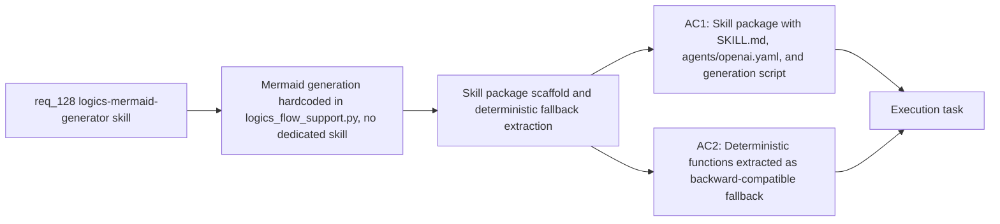

## item_236_logics_mermaid_generator_skill_package_with_deterministic_fallback - logics-mermaid-generator skill package with deterministic fallback
> From version: 1.21.1
> Schema version: 1.0
> Status: Draft
> Understanding: 93%
> Confidence: 88%
> Progress: 0%
> Complexity: Medium
> Theme: Logics kit skills and Mermaid quality
> Reminder: Update status/understanding/confidence/progress and linked task references when you edit this doc.

Derived from `logics/request/req_128_add_a_logics_mermaid_generator_skill_with_hybrid_ai_and_deterministic_fallback.md`

# Problem

Mermaid diagram generation for Logics workflow docs is hardcoded inside `logics_flow_support.py` (`_render_request_mermaid`, `_render_backlog_mermaid`, `_render_task_mermaid`, `_render_workflow_mermaid`). There is no dedicated skill package, making it impossible to invoke independently, test in isolation, or call from other skills. The deterministic template functions must be extracted into a self-contained skill before a hybrid AI path can be added.

# Scope
- In: `logics/skills/logics-mermaid-generator/` directory with `SKILL.md`, `agents/openai.yaml` (tier: core, default_prompt), and a generation script; deterministic fallback functions extracted from `logics_flow_support.py` and re-exported so the flow manager can still call them (backward-compatible); skill callable independently of the flow manager for testing.
- Out: hybrid AI generation mode (item_237), wiring into flow manager call sites (item_238).

# Acceptance criteria
- AC1: A `logics-mermaid-generator` skill package is created under `logics/skills/logics-mermaid-generator/` with a `SKILL.md`, an `agents/openai.yaml` (declaring `tier: core` and a `default_prompt`), and a generation script callable independently of the flow manager for testing or standalone use.
- AC2: The deterministic template functions (`_render_request_mermaid`, `_render_backlog_mermaid`, `_render_task_mermaid`, `_render_workflow_mermaid`) are extracted from `logics_flow_support.py` into the skill's generation script and re-exported so the flow manager can still import them without breaking existing generation. The fallback is backward-compatible and the result is indistinguishable from current output.
- AC3 (maps to req_128 AC6): The `agents/openai.yaml` declares `tier: core` so the skill is included in all global kit publications by default.

# AC Traceability
- AC1 -> Maps to req_128 AC1. Proof: `logics/skills/logics-mermaid-generator/SKILL.md`, `agents/openai.yaml`, and `scripts/generate_mermaid.py` all exist; the script can be invoked standalone and returns a valid Mermaid block.
- AC2 -> Maps to req_128 AC3. Proof: existing flow manager tests that generate Mermaid blocks still pass without modification after the extraction.
- AC3 -> Maps to req_128 AC6. Proof: `agents/openai.yaml` contains `tier: core` and `default_prompt` fields.

# Decision framing
- Product framing: Not needed
- Architecture framing: Not needed

# Links
- Product brief(s): (none yet)
- Architecture decision(s): (none yet)
- Request: `logics/request/req_128_add_a_logics_mermaid_generator_skill_with_hybrid_ai_and_deterministic_fallback.md`
- Primary task(s): `logics/tasks/task_112_orchestration_delivery_for_req_124_to_req_128_across_hybrid_efficiency_claude_parity_and_mermaid_skill.md`

# AI Context
- Summary: Create the logics-mermaid-generator skill package with SKILL.md, agents/openai.yaml (tier:core), and a generation script that extracts the deterministic Mermaid template functions from logics_flow_support.py as the backward-compatible fallback.
- Keywords: logics-mermaid-generator, skill package, SKILL.md, agents openai.yaml, tier core, deterministic fallback, _render_request_mermaid, _render_backlog_mermaid, _render_task_mermaid, extraction
- Use when: Creating the skill package scaffold and extracting the deterministic Mermaid functions from logics_flow_support.py into the new skill.
- Skip when: Work is about the hybrid AI generation mode (item_237) or wiring the skill into the flow manager call sites (item_238).

# Priority
- Impact: High — foundational prerequisite for items 237 and 238
- Urgency: Normal
